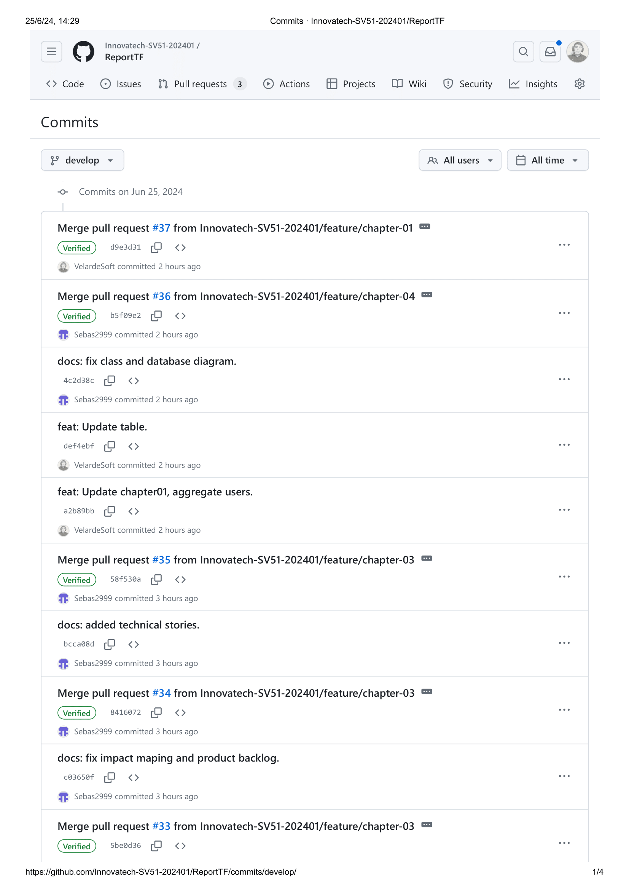
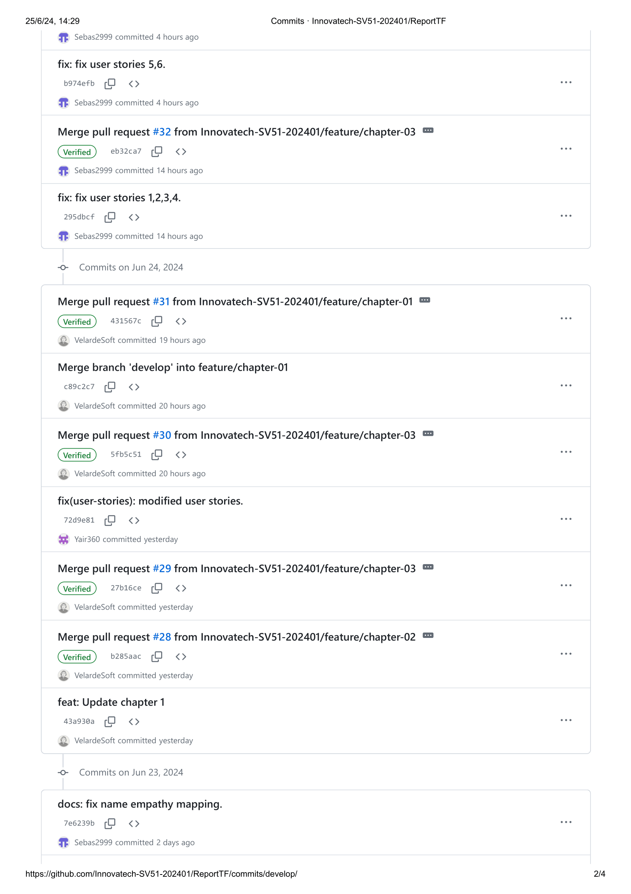
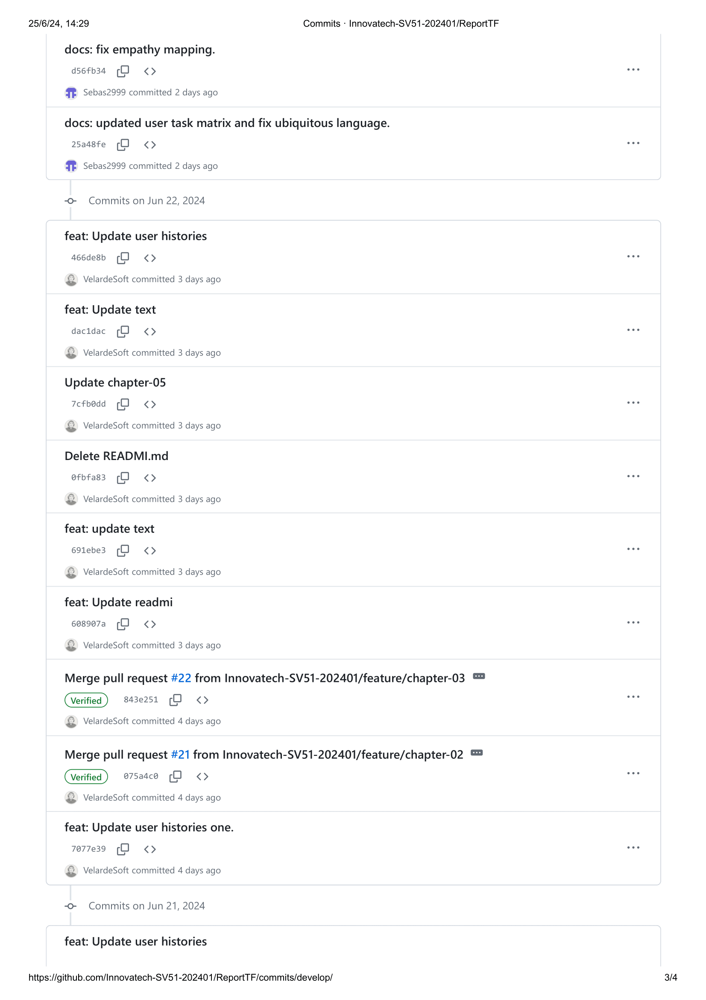
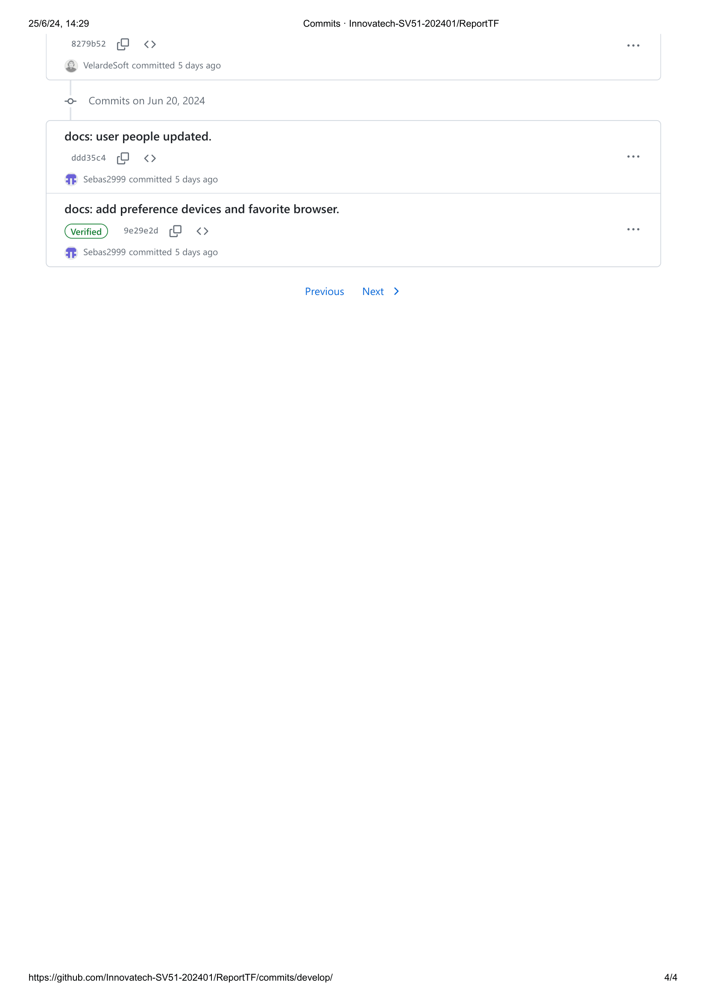

  

 

### 
 Universidad Peruana de Ciencias Aplicadas 

### 
 **Ingeniería de software** 

### 
 **Ciclo:** Quinto 

### 
 **CURSO:** SI730 Aplicaciones Web 

### 
 **SECCIÓN:** SV51 

### 
 **Profesor:** Velasquez Nuñez, Angel Augusto 
  
## 
 **Informe de Trabajo Final** 
  
### 
 **Nombre del startup:** InnovaTech 

### 
 **Nombre del producto:** GlideGo 

## 
 **Integrantes** 

<table align="center", border="1">
	<tbody>
		<tr>
			<td><strong>Apellidos, Nombres</strong></td>
			<td><strong>Código</strong></td>
		</tr>
		<tr>
			<td>Jara Benites Quique Vladimir</td>
			<td>U202022365</td>
		</tr>
		<tr>
			<td>Velarde Gonzales Nestor H</td>
			<td>U20211C221</td>
		</tr>
		<tr>
			<td>Aru Acevedo, Yair Christofer</td>
			<td>U202125984</td>
		</tr>
		<tr>
			<td>Flores Manrique Sebastian Enrique</td>
			<td>U201611430</td>
		</tr>
		<tr>
			<td>Hurtado Palomino, Francisco Juan</td>
			<td>U202117498</td>
		</tr>
		<tr>
			<td>Omar Christian Berrocal Ramirez</td>
			<td>U20201b529</td>
		</tr>
	</tbody>
</table>

 

##  
  **Junio, 2024** 

 
 

# Registro de Versiones del Informe

| Version | Fecha      | Autor                              | Descripcion de Modificacion                      |
|---------|------------|------------------------------------|--------------------------------------------------|
| 0.0     | 29/03/2024 | Jara Benites Quique Vladimir       | Creé el repositor MarkDown                       |
| 1.0     | 29/03/2024 | Velarde Gonzales Nestor            | Busqueda de antecendetes y problemática          |
| 1.1     | 04/04/2024 | Aru Acevedo, Yair Christofer       | Entrevistas y analisis competitivo               |
| 1.2     | 05/04/2024 | Sebastian Flores Manrique          | Agregué definición, antecedentes y problemática  |
| 1.3     | 07/04/2024 | Velarde Gonzales Nestor            | Agregué el lean ux process                       |
| 1.4     | 07/04/2024 | Sebastian Flores Manrique          | Agregué el segmento objetivo                     |
| 2.0     | 07/04/2024 | Velarde Gonzales Nestor            | Agregué los competidores y el análisis           |
| 2.2     | 09/04/2024 | Jara Benites Quique Vladimir       | Agregué el needfinding y ubiquitous language     |
| 2.3     | 09/04/2024 | Velarde Gonzales Nestor            | Agregué el Scenario mapping y user stories       |
| 2.4     | 09/04/2024 | Sebastian Flores Manrique          | Agregué el impact mapping y product backlog      |
| 3.0     | 10/04/2024 | Hurtado Palomino, Francisco Juan   | Agregué los style guidelines                     |
| 3.1     | 10/04/2024 | Aru Acevedo, Yair Christofer       | Agregué information architecture                 |
| 3.2     | 10/04/2024 | Velarde Gonzales Nestor            | Agregué el landing page                          |
| 3.3     | 10/04/2024 | Hurtado Palomino, Francisco Juan   | Agregué los wireframes y mockups                 |
| 3.4     | 10/04/2024 | Velarde Gonzales Nestor            | Agregué el diagrama de base de datos y de clases |
| 4.0     | 10/04/2024 | Hurtado Palomino, Francisco Juan   | Agregué el software configuration managment      |
| 4.1     | 10/04/2024 | Hurtado Palomino, Francisco Juan   | Agregué sprint número 1                          |
| 4.2.1   | 29/04/2024 | Flores Manrique, Sebastian Enrique | Corregí los Antecedentes y problemáticas         |
| 4.2.2   | 29/04/2024 | Jara Benites Quique Vladimir       | Corregí parte del Lean Ux Process                |
| 4.2.3   | 29/04/2024 | Flores Manrique, Sebastian Enrique | Corregí para del Lean UX Process                 |
| 4.2.4   | 29/04/2024 | Flores Manrique, Sebastian Enrique | Corregí el diseño de entrevistas                 |
| 4.2.5   | 29/04/2024 | Jara Benites Quique Vladimir       | Corregí el needfinding                           |
| 4.2.6   | 29/04/2024 | Flores Manrique, Sebastian Enrique | Corregí la redacción de algunas user storres     |
| 5.0.    | 02/05/2024 | Jara Benites Quique Vladimir       | Creé un repositorio para el landing page         |
| 5.0.1   | 02/06/2024 | Flores Manrique, Sebastian Enrique | Desarrollé la parte de about del landing page    |
| 5.0.2   | 02/06/2024 | Velarde Gonzales Nestor            | Desarrollé los servicios y contactos en landing  |
| 5.0.3   | 02/06/2024 | Hurtado Palomino, Francisco Juan   | Apoyé en los diseños del landing page            |
| 5.1.1   | 02/06/2024 | Jara Benites Quique Vladimir       | Creé un repositorio para el Front-End en GitHub  |
| 5.1.2   | 02/06/2024 | Hurtado Palomino, Francisco Juan   | Hice mi primera versión de header en front-end   |
| 5.1.3   | 02/06/2024 | Flores Manrique, Sebastian Enrique | Desarrollé el Front del lado Owner               |
| 5.1.4   | 02/06/2024 | Velarde Gonzales Nestor            | Mi colaboración fue en el desarrollo del mechanic|
| 5.1.5   | 02/06/2024 | Jara Benites Quique Vladimir       | Realicé el deploy de primera version del App     |
| 5.1.6   | 02/06/2024 | Flores Manrique, Sebastian Enrique | Validé los datos de Fake Api en App Web          |
| 5.2.1   | 02/06/2024 | Velarde Gonzales Nestor            | Hice los requerimientos para el Sprint 3         |
| 5.2.2   | 02/06/2024 | Jara Benites Quique Vladimir       | Creé el repositorio para el Back-End en GitHub   |
| 5.2.3   | 02/06/2024 | Velarde Gonzales Nestor            | Implementé la primera versión del Back-End       |

# **Project Report Collaboration Insights**

Link de Repositorio: [Click Aquí](https://github.com/Innovatech-SV51-202401/ReportTF.git)

Commits del reporte de avance del trabajo final: 

# **Tabla de Contenido**

- [Student Outcome](#student-outcome)

- [Capítulo I: Introducción](https://github.com/Innovatech-SV51-202401/ReportTF/blob/main/docs/chapter-01.md#Capitulo-I:-Introducción)
  - [1.1 Startup Profile](https://github.com/Innovatech-SV51-202401/ReportTF/blob/main/docs/chapter-01.md##1.1.-Startup-Profile) 
    - [1.1.1. Descripción de la Startup](https://github.com/Innovatech-SV51-202401/ReportTF/blob/main/docs/chapter-01.md###1.1.1.-Descripción-del-startup)
    - [1.1.2. Perfiles de integrantes del equipo](https://github.com/Innovatech-SV51-202401/ReportTF/blob/main/docs/chapter-01.md###1.1.2.-Perfiles-de-integrantes-del-negocio)
  - [1.2. Solution Profile](https://github.com/Innovatech-SV51-202401/ReportTF/blob/main/docs/chapter-01.md##1.2.-Solution-Profile)  
    - [1.2.1 Antecedentes y problemática](https://github.com/Innovatech-SV51-202401/ReportTF/blob/main/docs/chapter-01.md###1.2.1-Antecedentes-y-problemática)  
    - [1.2.2 Lean UX Process.](https://github.com/Innovatech-SV51-202401/ReportTF/blob/main/docs/chapter-01.md###1.2.2-Lean-UX-Process.)  
      - [1.2.2.1. Lean UX Problem Statements.](https://github.com/Innovatech-SV51-202401/ReportTF/blob/main/docs/chapter-01.md####1.2.2.1.-Lean-UX-Problem-Statements.)  
      - [1.2.2.2. Lean UX Assumptions.](https://github.com/Innovatech-SV51-202401/ReportTF/blob/main/docs/chapter-01.md####1.2.2.2.-Lean-UX-Assumptions.)  
      - [1.2.2.3. Lean UX Hypothesis Statements.](https://github.com/Innovatech-SV51-202401/ReportTF/blob/main/docs/chapter-01.md####-1.2.2.3.-Lean-UX-Hypothesis-Statements.)  
      - [1.2.2.4. Lean UX Canvas.](https://github.com/Innovatech-SV51-202401/ReportTF/blob/main/docs/chapter-01.md####-1.2.2.4.-Lean-UX-Canvas.)
  - [1.3. Segmentos objetivo.](https://github.com/Innovatech-SV51-202401/ReportTF/blob/main/docs/chapter-01.md#1.3.-Segmentos-objetivo.)
- [Capítulo II: Requirements Elicitation & Analysis](https://github.com/Innovatech-SV51-202401/ReportTF/blob/main/docs/chapter-02.md#Capítulo-II:-Requirements-Elicitation-&-Analysis)
  - [2.1. Competidores](https://github.com/Innovatech-SV51-202401/ReportTF/blob/main/docs/chapter-02.md##2.1.-Competidores.)  
    - [2.1.1. Análisis competitivo](https://github.com/Innovatech-SV51-202401/ReportTF/blob/main/docs/chapter-02.md###2.1.1.-Análisis-competitivo.)  
    - [2.1.2. Estrategias y tácticas frente a competidores](https://github.com/Innovatech-SV51-202401/ReportTF/blob/main/docs/chapter-02.md###2.1.2.-Estrategias-y-tácticas-frente-a-competidores.)
  - [2.2. Entrevistas](https://github.com/Innovatech-SV51-202401/ReportTF/blob/main/docs/chapter-02.md##2.2.-Entrevistas.)  
    - [2.2.1. Diseño de entrevistas](https://github.com/Innovatech-SV51-202401/ReportTF/blob/main/docs/chapter-02.md###2.2.1.-Diseño-de-entrevistas.)    
    - [2.2.2. Registro de entrevistas](https://github.com/Innovatech-SV51-202401/ReportTF/blob/main/docs/chapter-02.md###2.2.1.-Diseño-de-entrevistas.) 
    - [2.2.3. Análisis de entrevistas](https://github.com/Innovatech-SV51-202401/ReportTF/blob/main/docs/chapter-02.md###2.2.2.-Registro-de-entrevistas.)
  - [2.3. Needfinding](https://github.com/Innovatech-SV51-202401/ReportTF/blob/main/docs/chapter-02.md##2.3.-Needfinding.)  
    - [2.3.1. User Personas](https://github.com/Innovatech-SV51-202401/ReportTF/blob/main/docs/chapter-02.md###2.3.1.-User-Personas.)  
    - [2.3.2. User Task Matrix](https://github.com/Innovatech-SV51-202401/ReportTF/blob/main/docs/chapter-02.md###2.3.2.-User-Task-Matrix.)  
    - [2.3.3. User Journey Mapping](https://github.com/Innovatech-SV51-202401/ReportTF/blob/main/docs/chapter-02.md###2.3.3.-User-Journey-Mapping.)  
    - [2.3.4. Empathy Mapping](https://github.com/Innovatech-SV51-202401/ReportTF/blob/main/docs/chapter-02.md###2.3.4.-Empathy-Mapping.)  
    - [2.3.5. As-is Scenario Mapping](https://github.com/Innovatech-SV51-202401/ReportTF/blob/main/docs/chapter-02.md###2.3.5.-As-is-Scenario-Mapping.)
  - [2.4. Ubiquitous Language](https://github.com/Innovatech-SV51-202401/ReportTF/blob/main/docs/chapter-02.md##2.4.-Ubiquitous-Language.)
- [Capítulo III: Requirements Specification](https://github.com/Innovatech-SV51-202401/ReportTF/blob/main/docs/chapter-03.md#CAPÍTULO-III:-Requirements-Specification)
  - [3.1. To-Be Scenario Mapping](https://github.com/Innovatech-SV51-202401/ReportTF/blob/main/docs/chapter-03.md##3.1.-To-Be-Scenario-Mapping.)
  - [3.2. User Stories](https://github.com/Innovatech-SV51-202401/ReportTF/blob/main/docs/chapter-03.md##3.2.-User-Stories.)
  - [3.3. Impact Mapping](https://github.com/Innovatech-SV51-202401/ReportTF/blob/main/docs/chapter-03.md##3.3.-Impact-Mapping.)
  - [3.4. Product Backlog](https://github.com/Innovatech-SV51-202401/ReportTF/blob/main/docs/chapter-03.md##3.4.-Product-Backlog.)
- [Capítulo IV: Product Design](https://github.com/Innovatech-SV51-202401/ReportTF/blob/main/docs/chapter-04.md#Capitulo-IV:-Product-Design)
  - [4.1. Style Guidelines](https://github.com/Innovatech-SV51-202401/ReportTF/blob/main/docs/chapter-04.md##4.1.-Style-Guidelines.)  
    - [4.1.1. General Style Guidelines](https://github.com/Innovatech-SV51-202401/ReportTF/blob/main/docs/chapter-01.md###4.1.1.-General-Style-Guidelines.)  
    - [4.1.2. Web Style Guidelines](https://github.com/Innovatech-SV51-202401/ReportTF/blob/main/docs/chapter-01.md###4.1.2.-Web-Style-Guidelines.)
  - [4.2. Information Architecture](https://github.com/Innovatech-SV51-202401/ReportTF/blob/main/docs/chapter-01.md##4.2.-information-architecture.)  
    - [4.2.1. Organization Systems](https://github.com/Innovatech-SV51-202401/ReportTF/blob/main/docs/chapter-01.md###4.2.1.-Organization-Systems.)  
    - [4.2.2. Labeling Systems](https://github.com/Innovatech-SV51-202401/ReportTF/blob/main/docs/chapter-01.md###4.2.2.-Labeling-ystems.)  
    - [4.2.3. SEO Tags and Meta Tag](https://github.com/Innovatech-SV51-202401/ReportTF/blob/main/docs/chapter-01.md###4.2.3.-SEO-Tags-and-Meta-Tags)  
    - [4.2.4. Searching Systems](https://github.com/Innovatech-SV51-202401/ReportTF/blob/main/docs/chapter-01.md###4.2.4.-Searching-Systems.)   
    - [4.2.5. Navigation Systems](https://github.com/Innovatech-SV51-202401/ReportTF/blob/main/docs/chapter-04.md###4.2.5.-Navigation-Systems.)
  - [4.3. Landing Page UI Design](https://github.com/Innovatech-SV51-202401/ReportTF/blob/main/docs/chapter-04.md##4.3.-Landing-Page-UI-Design.)   
    - [4.3.1. Landing Page Wireframe](https://github.com/Innovatech-SV51-202401/ReportTF/blob/main/docs/chapter-04.md###4.3.1.-Landing-Page-Wireframe.)  
    - [4.3.2. Landing Page Mock-up](https://github.com/Innovatech-SV51-202401/ReportTF/blob/main/docs/chapter-04.md###4.3.2-Landing-Page-Mock-up.)
  - [4.4. Web Applications UX/UI Design](https://github.com/Innovatech-SV51-202401/ReportTF/blob/main/docs/chapter-04.md##4.4.-Web-Applications-UX/UI-Design)  
    - [4.4.1. Web Applications Wireframes](https://github.com/Innovatech-SV51-202401/ReportTF/blob/main/docs/chapter-04.md###4.4.1.-Web-Applications-Wireframes)  
    - [4.4.2. Web Applications Wireflow Diagrams](https://github.com/Innovatech-SV51-202401/ReportTF/blob/main/docs/chapter-04.md###4.4.2.-Web-Applications-Wireflow-Diagram)  
    - [4.4.3. Web Applications Mock-ups](https://github.com/Innovatech-SV51-202401/ReportTF/blob/main/docs/chapter-04.md###4.4.3.-Web-Applications-Mock-ups)   
    - [4.4.4. Web Applications User Flow Diagrams](https://github.com/Innovatech-SV51-202401/ReportTF/blob/main/docs/chapter-04.md###4.4.4.-Web-Applications-User-Flow-Diagrams)
  - [4.5. Web Applications Prototyping](https://github.com/Innovatech-SV51-202401/ReportTF/blob/main/docs/chapter-04.md##4.5.-Web-Applications-Prototyping)
  - [4.6. Domain-Driven Software Architecture](https://github.com/Innovatech-SV51-202401/ReportTF/blob/main/docs/chapter-04.md##4.6.-Domain-Driven-Software-Architecture)  
    - [4.6.1. Software Architecture Context Diagram](https://github.com/Innovatech-SV51-202401/ReportTF/blob/main/docs/chapter-04.md###4.6.1.-Software-Architecture-Context-Diagram)  
    - [4.6.2. Software Architecture Container Diagrams](https://github.com/Innovatech-SV51-202401/ReportTF/blob/main/docs/chapter-04.md###4.6.2.-Software-Architecture-Container-Diagrams)
  - [4.7. Software Object-Oriented Design](https://github.com/Innovatech-SV51-202401/ReportTF/blob/main/docs/chapter-04.md##4.7.-Software-Object-Oriented-Design)  
    - [4.7.1. Class Diagrams](https://github.com/Innovatech-SV51-202401/ReportTF/blob/main/docs/chapter-04.md###4.7.1.-Class-Diagrams)  
    - [4.7.2. Class Dictionary](https://github.com/Innovatech-SV51-202401/ReportTF/blob/main/docs/chapter-04.md###4.7.2.-Class-Dictionary)
  - [4.8. Database Design](https://github.com/Innovatech-SV51-202401/ReportTF/blob/main/docs/chapter-04.md##4.8.-Database-Design)  
    - [4.8.1. Database Diagram](https://github.com/Innovatech-SV51-202401/ReportTF/blob/main/docs/chapter-04.md###4.8.1.-Database-Diagram)
- [Capítulo V: Product Implementation, Validation & Deploymen](https://github.com/Innovatech-SV51-202401/ReportTF/blob/main/docs/chapter-05.md#Capítulo-V:-Product-Implementation,-Validation-&-Deployment.)
  - [5.1. Software Configuration Management](https://github.com/Innovatech-SV51-202401/ReportTF/blob/main/docs/chapter-05.md##5.1.-Software-Configuration-Management.)  
    - [5.1.1. Software Development Environment Configuration](https://github.com/Innovatech-SV51-202401/ReportTF/blob/main/docs/chapter-05.md####5.1.1.-Software-Development-Environment-Configuration.)  
    - [5.1.2. Source Code Management](https://github.com/Innovatech-SV51-202401/ReportTF/blob/main/docs/chapter-05.md####5.1.2.-Source-Code-Management.)  
    - [5.1.3. Source Code Style Guide & Conventions](https://github.com/Innovatech-SV51-202401/ReportTF/blob/main/docs/chapter-05.md####5.1.3.-Source-code-Style-Guide-&-Conventions.)  
    - [5.1.4. Software Deployment Configuration](https://github.com/Innovatech-SV51-202401/ReportTF/blob/main/docs/chapter-05.md####5.1.4.-Software-Deployment-Configuration.)
  - [5.2. Landing Page, Services & Applications Implementation](https://github.com/Innovatech-SV51-202401/ReportTF/blob/main/docs/chapter-05.md)  
    - [5.2.1. Sprint 1]()  
      - [5.2.1.1. Sprint Planning n](https://github.com/Innovatech-SV51-202401/ReportTF/blob/main/docs/chapter-05.md)  
      - [5.2.1.2. Sprint Backlog n](https://github.com/Innovatech-SV51-202401/ReportTF/blob/main/docs/chapter-05.md)  
      - [5.2.1.3. Development Evidence for Sprint Review](https://github.com/Innovatech-SV51-202401/ReportTF/blob/main/docs/chapter-05.md)  
      - [5.2.1.4. Testing Suite Evidence for Sprint Review](https://github.com/Innovatech-SV51-202401/ReportTF/blob/main/docs/chapter-05.md)  
      - [5.2.1.5. Execution Evidence for Sprint Review](https://github.com/Innovatech-SV51-202401/ReportTF/blob/main/docs/chapter-05.md)  
      - [5.2.1.6. Services Documentation Evidence for Sprint Review](https://github.com/Innovatech-SV51-202401/ReportTF/blob/main/docs/chapter-05.md)  
      - [5.2.1.7. Software Deployment Evidence for Sprint Review](https://github.com/Innovatech-SV51-202401/ReportTF/blob/main/docs/chapter-05.md)  
      - [5.2.1.8. Team Collaboration Insights during Sprint](https://github.com/Innovatech-SV51-202401/ReportTF/blob/main/docs/chapter-05.md)
    - [5.2.2. Sprint 2]()  
      - [5.2.2.1. Sprint Planning n](https://github.com/Innovatech-SV51-202401/ReportTF/blob/main/docs/chapter-05.md)  
      - [5.2.2.2. Sprint Backlog n](https://github.com/Innovatech-SV51-202401/ReportTF/blob/main/docs/chapter-05.md)  
      - [5.2.2.3. Development Evidence for Sprint Review](https://github.com/Innovatech-SV51-202401/ReportTF/blob/main/docs/chapter-05.md)  
      - [5.2.2.4. Testing Suite Evidence for Sprint Review](https://github.com/Innovatech-SV51-202401/ReportTF/blob/main/docs/chapter-05.md)  
      - [5.2.2.5. Execution Evidence for Sprint Review](https://github.com/Innovatech-SV51-202401/ReportTF/blob/main/docs/chapter-05.md)  
      - [5.2.2.6. Services Documentation Evidence for Sprint Review](https://github.com/Innovatech-SV51-202401/ReportTF/blob/main/docs/chapter-05.md)  
      - [5.2.2.7. Software Deployment Evidence for Sprint Review](https://github.com/Innovatech-SV51-202401/ReportTF/blob/main/docs/chapter-05.md)  
      - [5.2.2.8. Team Collaboration Insights during Sprint](https://github.com/Innovatech-SV51-202401/ReportTF/blob/main/docs/chapter-05.md)
    - [5.2.3. Sprint 3]()  
      - [5.2.3.1. Sprint Planning n](https://github.com/Innovatech-SV51-202401/ReportTF/blob/main/docs/chapter-05.md)  
      - [5.2.3.2. Sprint Backlog n](https://github.com/Innovatech-SV51-202401/ReportTF/blob/main/docs/chapter-05.md)  
      - [5.2.3.3. Development Evidence for Sprint Review](https://github.com/Innovatech-SV51-202401/ReportTF/blob/main/docs/chapter-05.md)  
      - [5.2.3.4. Testing Suite Evidence for Sprint Review](https://github.com/Innovatech-SV51-202401/ReportTF/blob/main/docs/chapter-05.md)  
      - [5.2.3.5. Execution Evidence for Sprint Review](https://github.com/Innovatech-SV51-202401/ReportTF/blob/main/docs/chapter-05.md)  
      - [5.2.3.6. Services Documentation Evidence for Sprint Review](https://github.com/Innovatech-SV51-202401/ReportTF/blob/main/docs/chapter-05.md)  
      - [5.2.3.7. Software Deployment Evidence for Sprint Review](https://github.com/Innovatech-SV51-202401/ReportTF/blob/main/docs/chapter-05.md)  
      - [5.2.3.8. Team Collaboration Insights during Sprint](https://github.com/Innovatech-SV51-202401/ReportTF/blob/main/docs/chapter-05.md)
  - [5.3. Validation Interviews](https://github.com/Innovatech-SV51-202401/ReportTF/blob/main/docs/chapter-05.md)  
    - [5.3.1. Diseño de Entrevistas](https://github.com/Innovatech-SV51-202401/ReportTF/blob/main/docs/chapter-05.md)  
    - [5.3.2. Registro de Entrevistas](https://github.com/Innovatech-SV51-202401/ReportTF/blob/main/docs/chapter-05.md)  
    - [5.3.3. Evaluaciones según heurísticas](https://github.com/Innovatech-SV51-202401/ReportTF/blob/main/docs/chapter-05.md)
  - [5.4. Video About-the-Product](https://github.com/Innovatech-SV51-202401/ReportTF/blob/main/docs/chapter-05.md)
- [Conclusiones]()
  - [Conclusiones y recomendaciones]()
- [Video About-the-Team]()
- [Bibliografía]()
- [Anexos]()  
 
# Student Outcome
Criterio: La capacidad de funcionar efectivamente en un equipo cuyos miembros
juntos proporcionan liderazgo, crean un entorno de colaboración e inclusivo,
establecen objetivos, planifican tareas y cumplen objetivos.
En el siguiente cuadro se describe las acciones realizadas y enunciados de
conclusiones por parte del grupo, que permiten sustentar el haber alcanzado el logro
del ABET – EAC - Student Outcome 5.

<table align="center", border="1px">
  <tbody>
    <tr>
      <td><b>Criterio  específico</b></td>
      <td><b>Acciones realizadas</b></td>
      <td><b>Conclusiones</b></td>
    </tr>
    <tr>
      <td>Particia en  equipos multidiciplinarios   con eficacia,  eficiencia y  objetividad, en  el marco de un  proyecto en  soluciones de  ingeniería de  software.</td>
      <td>
        <ul>
          <li>
            <b>Flores Manrique, Sebastian Enrique 
            TB1</b> 
            Participé en reuniones con frecuencia para acordar la asignación y revisión del trabajo 
            <b>TP1</b> 
            Realicé la correción de los artefactos previamente presentados y la elaboración de algunos components en el frontend según algunos ideas de mojoras que dió mi equipo.   </b>
            <b>TB2</b>  
            Para la dicha entrega del TB2, me reuní con todos mis integrantes del equipo para realizar un trabajo eficiente, dicha reunión mis aportes fueron relevantes en ideas y opiniones para el desarrollo del Back-End.  </b>
            <b>TF</b>  
            Realicé los deploy del Back-End a un servidor de nuestro proyecto y las integranciones con el Front-End y Back-End, antes de la entrega final, hice mejoras del TB2 tanto el informe y el desarollo de código. 
          </li>  
          <li>
            <b>Jara Benites, Quique Vladimir 
            TB1</b> 
            Organización y coordinación para el desarrollo del Lean UX junto con los miembros 
            <b>TP1</b> 
            Implementación del las cards para la visualización de vehículos en vite y vue.
              </b>
            <b>TB2</b>  
            Realizé una parte de mejora en el Front de nuestra aplicación, las reuniones constantes con mi equipo ha dado algunas opiniones de mejoras. Por otro lado, desarrollé la primera versión de nuestro Back-End junto a mi equipo.
              
            <b>TF</b>  
            Participé en las ultimas reuniones de nuestro equipo con el onjetivo nde terminar al 100%, mi participación fue en el desarrollo del Back-End y el deploy a un servidor.  
          </li>  
          <li>
            <b>Velarde Gonzales, Nestor Hernán 
            TB1</b> 
            Junto a todo mi equipo hice las primera pauta de reunirme y debatir sobre las técnicas a implementar en el landing page, mi participación fue el desarrollo del landing page y finalmente desplegado a la nube con fin de que se visualize para el público.  
            <b>TP1</b> 
            Desarrollo del Front-End con buenas técnicas en algoritmos y según acordado con mi equipos hemos basado a usar las mismas técnicas de tipo de textos, colores y guiarse del prototipo (Figma). 
              </b>
            <b>TB2</b>  
            Realizé una parte de mejora en el Front de nuestra aplicación, participé en las reuniones acordadas por mi lider del equipo. Finalmente, apoyé en el desarrollo del Back-End. 
              
            <b>TF</b>  
            Una primera parte mi colaboración con el equipo fue terminar al 100% el informe a presentar y convocar a una reunión exclusiva para revisar nuestro trabajo final del curso.   
          </li>  
          <li>
            <b>Aru Acevedo, Yair Christofer 
            TB1</b> 
            Participe en las reuniones del equipo para la asignación del trabajo.  Realice algunos puntos en el capítulo 4 del informe y colaboré en el desarrollo del landing page. <b>
            TP1</b> 
            Corregí el informe según las indicaciones de la rúbrica, mis aportes del Front fue desarrollado la parte del diseños.  
            <b>TB2 & TF</b> 
            (No llegó a participar por retiro del curso)
          </li>  
          <li>
            <b>Hurtado Palomino, Francisco Juan 
            TB1</b> 
            Realice el desarrollo de las user stories, product backlog, impact maps en el informe y por otro lado realizé el desarrollo de la sección about en el landing page junto con colaboración con mi equipo. <b>
            TP1</b> 
            Realice la corrección completa del Sprint 1, ademas realicé algunos cambios en el informe.  
            <b>TB2 & TF</b> 
            (No llegó a participar por retiro del curso)
          </li>  
          <li>
            <b>Omar Christian Berrocal Ramirez 
            TB2</b> 
            Para la dicha entrega del TB2, me reuní con todos mis integrantes del equipo para realizar un trabajo eficiente, dicha reunión mis aportes fueron relevantes en ideas y opiniones para el desarrollo del Back-End.  
            <b>TF</b> 
            Realicé los deploy del Back-End a un servidor de nuestro proyecto y las integranciones con el Front-End y Back-End, antes de la entrega final, hice mejoras del TB2 tanto el informe y el desarollo de código.
          </li>  
        </ul>
      </td>
      <td>Durante el trabajo en  equipo y multidisciplinario  nos ha proporcionado  una mejor comprensión  sólida de cómo  trabajar en equipo  para desarrollar  software de alta  calidad que satisfaga  las necesidades  de los usuarios  y del negocio.
      </td>
    </tr>
    <tr>
      <td>Conoce al  menos  un sector  empresarial o  dominio de  aplicación de  soluciones de  software.</td>
      <td>
        <ul>
        <li>
          <b>Flores Manrique, Sebastian Enrique 
          TB1</b> 
          Realicé una investigación exhaustiva del sector de alquiler de vehículos ligeros para comprender sus necesidades y desafíos. 
          <b>TP1</b> 
          Para el desarrollo del front-End he investigado los frameword de VUE para realizar una aplicación eficas.  
          <b>
          TB2</b> 
          He analizado profundamente la programación de C# para implementar el desarrollo del Back-End de nuestro Proyecto.  
          <b>
          TF</b> 
          Validé nuestro software con nuestros usuarios finales, para ello nuestra aplicación cumple con los parametros de las funcionalidades del negocio. 
        </li>  
        <li> 
          <b>Jara Benites, Quique Vladimir 
          TB1</b> 
          Realizé las entrevistas para buscar nesecidades de nuestro segmento objetivo, por ello basamos a investigar nuestro proyecto antes del desarrollo 
          <b>TP1</b> 
          Implementación de cards en el Front para mejorar la experiencia de usuario y seguir las tendencias de mercado con los vehiculos. 
           
          <b>TB2</b> 
          Analicé los parametros de negocio en los alquileres de vehiculos menores y finalmente nuestros usuarios finales puedan optar las diferentes suscripciones en nuestra aplicaciones web.   
          <b>TF</b> 
          Realizé los deploy de nuestro software para que esté disponible para nuestros usuarios finales.  
        </li>  
        <li>
          <b>Velarde Gonzales, Nestor Hernán 
          TB1</b> 
          Organicé una reunión exclusiva para analizar sobre nuestro proyecto y las oportunidades en nuestro contexto real, tambien participé en entrevistas con partes interesadas y clave para recopilar información sobre requisitos y expectativas. 
          <b>TP1</b> 
          Desarrollé y colaboré con mis compañeros en el capítulo 05, realicé mejoras en el Cap. 04 sobre los diseños de wireframes y Mock-Ups de landing y aplicaciones web, por otro lado implementamos el desarrollo de Front-End basado en nuestro negocio y las suscripciones. 
           <b>
          TB2</b> 
          Analicé los parametros de negocio en los alquileres de vehiculos menores y finalmente nuestros usuarios finales puedan optar las diferentes suscripciones en nuestra aplicaciones web.   
          <b>
          TF</b> 
          Realizé los deploy de nuestro software para que esté disponible para nuestros usuarios finales.  
        </li>  
        <li>
          <b>Aru Acevedo, Yair Christofer 
          TB1</b> 
          Realicé las entrevistas a posibles usuarios de nuestro servicio. 
          <b>TP1</b> 
          Realicé algunos puntos del landing page.
            <b>
          TB2 & TF</b> 
          (No llegó a participar por retiro del curso)  
        </li>  
        <li>
          <b>Hurtado Palomino, Francisco Juan 
          TB1</b> 
          Realicé una recolección de información para la creación de las 31 user stories presentadas. 
          <b>TP1</b> 
          Estuve al tanto del desarrollo y la creación de los repositorios presentados para su correcta presentación, además corregí varios errores presentados en la anterior entrega.  
          <b>TB2 & TF</b> 
          (No llegó a participar por retiro del curso)
        </li>  
        <li>
          <b>Omar Christian Berrocal Ramirez 
          TB2</b> 
          Mi primer paso fue validar nuestro negocio con los usuarios finales mediante entrevistas y conocer sus perspertivas de nuestros segmentos objetivos. 
          <b>TF</b> 
          Realizé los deploy de nuestro software para que esté disponible para nuestros usuarios finales.
        </li>
      </ul>
            </td>
            <td>La experiencia en  la investigación  del negocio demostró  nuestra capacidad  para comprender y  aplicar conocimientos  específicos del sector  en la creación  de soluciones  tecnológicas efectivas.</td>
          </tr>
        </tbody>
</table>

# Conclusiones

Analizando nuestro progreso desde el inicio del proyecto, nuestro trabajo en equipo a reflejado buen resultado, de hecho hubo muchas dificultades que se afrontó pero con una comunicación constante entre los integrantes y el uso de múltiples herramientas nos hemos ayudado, durante el proceso de nuestro trabajo fue que nos fuimos conociendo de a poco a poco, las reuniones constantes nunca faltarón por que teniamos en objetivo de hacer buen trabajom final. 
Finalmente, nuestro proyecto cumple con los parametros de negocio y el desarrollo del software está estructurada con buenas técnicas de implementación, el domain drive desing ha sido fundamental para este proceso de desarrollo y de hecho como equipo estamos muy acuerdo de seguír aprendiendo el vue y el back-End con C# & .NET. 

# Video About-the-Team.

- Video de about the team: [Ver aquí](https://upcedupe-my.sharepoint.com/:v:/r/personal/u20211c221_upc_edu_pe/Documents/About%20the%20team.mp4?csf=1&web=1&e=tG1Pc0)

# Bibliografia 

- Valdivieso Infante, J., & Sosa Delgado, D. (2011). La tecnología en los vehículos híbridos y su impacto ecológico (Doctoral dissertation, ESPOL. FADCOM).

- Lucidchart (Lucid). (s.f.). Lucidchart: Diagramming and Visual
Communication Made Easy. Lucid. Recuperado de
https://www.lucidchart.com [Consulta: 02 de Marzo de 2024].

- GitHub. (s.f.). Recuperado de https://github.com [Consulta: 24 de
Marzo de 2024].

- Berné, M. (2023, 8 marzo). Criterios de aceptación: ejemplos para elaborarlos. Blog. https://www.scrummanager.com/blog/2023/03/criterios-de-aceptacion-definicion-y-ejemplos/ 

- Conventional commits. (s. f.). Conventional Commits. https://www.conventionalcommits.org/en/v1.0.0/ 

- Markdown - La guía definitiva en español. (2022, 14 febrero). Markdown. https://markdown.es/ 

- Tune, N. (2018, 1 agosto). Domain-Driven Architecture Diagrams - Strategy, Architecture, Continuous Delivery, and DDD Medium. Medium. 

# Anexos

- Repositorio en GitHub: [Click aquí](https://github.com/Innovatech-SV51-202401) 

- Repositorio del Landing Page: [Click aquí](https://github.com/Innovatech-SV51-202401/Innovatech-LandingPage.git)

- Landing Page Desplegado: [Click aquí](https://innovatech-sv51-202401.github.io/Innovatech-LandingPage/)

- Repositorio de AppWeb: [Click Aquí](https://github.com/Innovatech-SV51-202401/innovatech-front-end.git)

- AppWeb desplegada: [Click Aquí](https://innovatech-sv51-202401.github.io/innovatech-front-end/)

- Repositorio del Back-End (API): [Click Aquí](https://github.com/Innovatech-SV51-202401/GlideGo-Backend.git)

- Figma App Web, Diseño wireframes, MockUps: [Click Aquí](https://www.figma.com/design/zI2Ms3m44qqaav0cmkBFEp/INNOVATECH?node-id=0-1&t=au24yqRfkYJnaJ46-1)

- VIDEO ABOUT THE TEAM: [Click Aquí](https://upcedupe-my.sharepoint.com/:v:/r/personal/u20211c221_upc_edu_pe/Documents/About%20the%20team.mp4?csf=1&web=1&e=tG1Pc0)

- VIDEO ABOUT THE PRODUCT: [Click Aquí](https://upcedupe-my.sharepoint.com/:v:/r/personal/u20211c221_upc_edu_pe/Documents/About%20the%20Product.mp4?csf=1&web=1&e=cirHKy)
