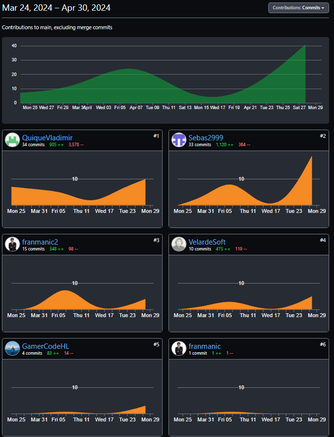

  

 

### 
 Universidad Peruana de Ciencias Aplicadas 

### 
 **Ingeniería de software** 

### 
 **Ciclo:** Quinto 

### 
 **CURSO:** SI730 Aplicaciones Web 

### 
 **SECCIÓN:** SV51 

### 
 **Profesor:** Velasquez Nuñez, Angel Augusto 
  
## 
 **Informe de Trabajo Final** 
  
### 
 **Nombre del startup:** InnovaTech 

### 
 **Nombre del producto:** GlideGo 

## 
 **Integrantes** 

<table align="center">
	<tbody>
		<tr>
			<td><strong>Apellidos, Nombres</strong></td>
			<td><strong>Código</strong></td>
		</tr>
		<tr>
			<td>Jara Benites Quique Vladimir</td>
			<td>U202022365</td>
		</tr>
		<tr>
			<td>Velarde Gonzales Nestor H</td>
			<td>U20211C221</td>
		</tr>
		<tr>
			<td>Aru Acevedo, Yair Christofer</td>
			<td>U202125984</td>
		</tr>
		<tr>
			<td>Flores Manrique Sebastian Enrique</td>
			<td>U201611430</td>
		</tr>
		<tr>
			<td>Hurtado Palomino, Francisco Juan</td>
			<td>u202117498</td>
		</tr>
		<tr>
			<td>Omar Christian Berrocal Ramirez</td>
			<td>u20201b529</td>
		</tr>
	</tbody>
</table>

 

## 
 **Junio, 2024** 

      

# Registro de Versiones del Informe
| Version | Fecha      | Autor                              | Descripcion de Modificacion                      |
|---------|------------|------------------------------------|--------------------------------------------------|
| 0.0     | 29/03/2024 | Jara Benites Quique Vladimir       | Creé el documento                                |
| 1.0     | 29/03/2024 | Velarde Gonzales Nestor            | Busqueda de antecendetes                         |
| 1.1     | 04/04/2024 | Aru Acevedo, Yair Christofer       | Entrevistas y analsiis competitivo               |
| 1.2     | 05/04/2024 | Sebastian Flores Manrique          | Agregué definición, antecedentes y problemática  |
| 1.3     | 07/04/2024 | Velarde Gonzales Nestor            | Agregué el lean ux process                       |
| 1.4     | 07/04/2024 | Sebastian Flores Manrique          | Agregué el segmento objetivo                     |
| 2.0     | 07/04/2024 | Velarde Gonzales Nestor            | Agregué los competidores y el análisis           |
| 2.1     | 07/04/2024 | Hurtado Palomino, Francisco Juan   | Agregué las entrevistas y el análisis            |
| 2.2     | 09/04/2024 | Jara Benites Quique Vladimir       | Agregué el needfinding y ubiquitous language     |
| 2.3     | 09/04/2024 | Velarde Gonzales Nestor            | Agregué el Scenario mapping y user stories       |
| 2.4     | 09/04/2024 | Sebastian Flores Manrique          | Agregué el impact mapping y product backlog      |
| 3.0     | 10/04/2024 | Hurtado Palomino, Francisco Juan   | Agregué los style guidelines                     |
| 3.1     | 10/04/2024 | Aru Acevedo, Yair Christofer       | Agregué information architecture                 |
| 3.2     | 10/04/2024 | Velarde Gonzales Nestor            | Agregué el landing page                          |
| 3.3     | 10/04/2024 | Hurtado Palomino, Francisco Juan   | Agregué los wireframes y mockups                 |
| 3.4     | 10/04/2024 | Velarde Gonzales Nestor            | Agregué el diagrama de base de datos y de clases |
| 4.0     | 10/04/2024 | Hurtado Palomino, Francisco Juan   | Agregué el software configuration managment      |
| 4.1     | 10/04/2024 | Hurtado Palomino, Francisco Juan   | Agregué sprint número 1                          |
| 4.2.1   | 29/04/2024 | Flores Manrique, Sebastian Enrique | Corregí los Antecedentes y problemáticas         |
| 4.2.2   | 29/04/2024 | Jara Benites Quique Vladimir       | Corregí parte del Lean Ux Process                |
| 4.2.3   | 29/04/2024 | Flores Manrique, Sebastian Enrique | Corregí para del Lean UX Process                 |
| 4.2.4   | 29/04/2024 | Flores Manrique, Sebastian Enrique | Corregí el diseño de entrevistas                 |
| 4.2.5   | 29/04/2024 | Jara Benites Quique Vladimir       | Corregí el needfinding                           |
| 4.2.6   | 29/04/2024 | Flores Manrique, Sebastian Enrique | Corregí la redacción de algunas user storres     |

# **Project Report Collaboration Insights**

Commits del reporte de avance del TP1:

# **Tabla de Contenido**

- [Student Outcome](#student-outcome)

- [Capítulo I: Introducción](https://github.com/Innovatech-SV51-202401/ReportTF/blob/main/docs/chapter-01.md#Capitulo-I:-Introducción)
  - [1.1 Startup Profile](https://github.com/Innovatech-SV51-202401/ReportTF/blob/main/docs/chapter-01.md##1.1.-Startup-Profile) 
    - [1.1.1. Descripción de la Startup](https://github.com/Innovatech-SV51-202401/ReportTF/blob/main/docs/chapter-01.md###1.1.1.-Descripción-del-startup)
    - [1.1.2. Perfiles de integrantes del equipo](https://github.com/Innovatech-SV51-202401/ReportTF/blob/main/docs/chapter-01.md###1.1.2.-Perfiles-de-integrantes-del-negocio)
  - [1.2. Solution Profile](https://github.com/Innovatech-SV51-202401/ReportTF/blob/main/docs/chapter-01.md##1.2.-Solution-Profile)  
    - [1.2.1 Antecedentes y problemática](https://github.com/Innovatech-SV51-202401/ReportTF/blob/main/docs/chapter-01.md###1.2.1-Antecedentes-y-problemática)  
    - [1.2.2 Lean UX Process.](https://github.com/Innovatech-SV51-202401/ReportTF/blob/main/docs/chapter-01.md###1.2.2-Lean-UX-Process.)  
      - [1.2.2.1. Lean UX Problem Statements.](https://github.com/Innovatech-SV51-202401/ReportTF/blob/main/docs/chapter-01.md####1.2.2.1.-Lean-UX-Problem-Statements.)  
      - [1.2.2.2. Lean UX Assumptions.](https://github.com/Innovatech-SV51-202401/ReportTF/blob/main/docs/chapter-01.md####1.2.2.2.-Lean-UX-Assumptions.)  
      - [1.2.2.3. Lean UX Hypothesis Statements.](https://github.com/Innovatech-SV51-202401/ReportTF/blob/main/docs/chapter-01.md####-1.2.2.3.-Lean-UX-Hypothesis-Statements.)  
      - [1.2.2.4. Lean UX Canvas.](https://github.com/Innovatech-SV51-202401/ReportTF/blob/main/docs/chapter-01.md####-1.2.2.4.-Lean-UX-Canvas.)
  - [1.3. Segmentos objetivo.](https://github.com/Innovatech-SV51-202401/ReportTF/blob/main/docs/chapter-01.md#1.3.-Segmentos-objetivo.)
- [Capítulo II: Requirements Elicitation & Analysi](https://github.com/Innovatech-SV51-202401/ReportTF/blob/main/docs/chapter-02.md#Capítulo-II:-Requirements-Elicitation-&-Analysis)
  - [2.1. Competidores](https://github.com/Innovatech-SV51-202401/ReportTF/blob/main/docs/chapter-02.md##2.1.-Competidores.)  
    - [2.1.1. Análisis competitivo](https://github.com/Innovatech-SV51-202401/ReportTF/blob/main/docs/chapter-02.md###2.1.1.-Análisis-competitivo.)  
    - [2.1.2. Estrategias y tácticas frente a competidores](https://github.com/Innovatech-SV51-202401/ReportTF/blob/main/docs/chapter-02.md###2.1.2.-Estrategias-y-tácticas-frente-a-competidores.)
  - [2.2. Entrevistas](https://github.com/Innovatech-SV51-202401/ReportTF/blob/main/docs/chapter-02.md##2.2.-Entrevistas.)  
    - [2.2.1. Diseño de entrevistas](https://github.com/Innovatech-SV51-202401/ReportTF/blob/main/docs/chapter-02.md###2.2.1.-Diseño-de-entrevistas.)    
    - [2.2.3. Análisis de entrevistas](https://github.com/Innovatech-SV51-202401/ReportTF/blob/main/docs/chapter-02.md###2.2.2.-Registro-de-entrevistas.)
  - [2.3. Needfinding](https://github.com/Innovatech-SV51-202401/ReportTF/blob/main/docs/chapter-02.md##2.3.-Needfinding.)  
    - [2.3.1. User Personas](https://github.com/Innovatech-SV51-202401/ReportTF/blob/main/docs/chapter-02.md###2.3.1.-User-Personas.)  
    - [2.3.2. User Task Matrix](https://github.com/Innovatech-SV51-202401/ReportTF/blob/main/docs/chapter-02.md###2.3.2.-User-Task-Matrix.)  
    - [2.3.3. User Journey Mapping](https://github.com/Innovatech-SV51-202401/ReportTF/blob/main/docs/chapter-02.md###2.3.3.-User-Journey-Mapping.)  
    - [2.3.4. Empathy Mapping](https://github.com/Innovatech-SV51-202401/ReportTF/blob/main/docs/chapter-02.md###2.3.4.-Empathy-Mapping.)  
    - [2.3.5. As-is Scenario Mapping](https://github.com/Innovatech-SV51-202401/ReportTF/blob/main/docs/chapter-02.md###2.3.5.-As-is-Scenario-Mapping.)
  - [2.4. Ubiquitous Language](https://github.com/Innovatech-SV51-202401/ReportTF/blob/main/docs/chapter-02.md##2.4.-Ubiquitous-Language.)
- [Capítulo III: Requirements Specificatio](https://github.com/Innovatech-SV51-202401/ReportTF/blob/main/docs/chapter-03.md#CAPÍTULO-III:-Requirements-Specification)
  - [3.1. To-Be Scenario Mapping](https://github.com/Innovatech-SV51-202401/ReportTF/blob/main/docs/chapter-03.md##3.1.-To-Be-Scenario-Mapping.)
  - [3.2. User Stories](https://github.com/Innovatech-SV51-202401/ReportTF/blob/main/docs/chapter-03.md##3.2.-User-Stories.)
  - [3.3. Impact Mapping](https://github.com/Innovatech-SV51-202401/ReportTF/blob/main/docs/chapter-03.md##3.3.-Impact-Mapping.)
  - [3.4. Product Backlog](https://github.com/Innovatech-SV51-202401/ReportTF/blob/main/docs/chapter-03.md##3.4.-Product-Backlog.)
- [Capítulo IV: Product Desig](https://github.com/Innovatech-SV51-202401/ReportTF/blob/main/docs/chapter-04.md#Capitulo-IV:-Product-Design)
  - [4.1. Style Guidelines](https://github.com/Innovatech-SV51-202401/ReportTF/blob/main/docs/chapter-04.md##4.1.-Style-Guidelines.)  
    - [4.1.1. General Style Guidelines](https://github.com/Innovatech-SV51-202401/ReportTF/blob/main/docs/chapter-01.md###4.1.1.-General-Style-Guidelines.)  
    - [4.1.2. Web Style Guidelines](https://github.com/Innovatech-SV51-202401/ReportTF/blob/main/docs/chapter-01.md###4.1.2.-Web-Style-Guidelines.)
  - [4.2. Information Architecture](https://github.com/Innovatech-SV51-202401/ReportTF/blob/main/docs/chapter-01.md##4.2.-information-architecture.)  
    - [4.2.1. Organization Systems](https://github.com/Innovatech-SV51-202401/ReportTF/blob/main/docs/chapter-01.md###4.2.1.-Organization-Systems.)  
    - [4.2.2. Labeling Systems](https://github.com/Innovatech-SV51-202401/ReportTF/blob/main/docs/chapter-01.md###4.2.2.-Labeling-ystems.)  
    - [4.2.3. SEO Tags and Meta Tag](https://github.com/Innovatech-SV51-202401/ReportTF/blob/main/docs/chapter-01.md###4.2.3.-SEO-Tags-and-Meta-Tags)  
    - [4.2.4. Searching Systems](https://github.com/Innovatech-SV51-202401/ReportTF/blob/main/docs/chapter-01.md###4.2.4.-Searching-Systems.)   
    - [4.2.5. Navigation Systems](https://github.com/Innovatech-SV51-202401/ReportTF/blob/main/docs/chapter-04.md###4.2.5.-Navigation-Systems.)
  - [4.3. Landing Page UI Design](https://github.com/Innovatech-SV51-202401/ReportTF/blob/main/docs/chapter-04.md##4.3.-Landing-Page-UI-Design.)   
    - [4.3.1. Landing Page Wireframe](https://github.com/Innovatech-SV51-202401/ReportTF/blob/main/docs/chapter-04.md###4.3.1.-Landing-Page-Wireframe.)  
    - [4.3.2. Landing Page Mock-up](https://github.com/Innovatech-SV51-202401/ReportTF/blob/main/docs/chapter-04.md###4.3.2-Landing-Page-Mock-up.)
  - [4.4. Web Applications UX/UI Design](https://github.com/Innovatech-SV51-202401/ReportTF/blob/main/docs/chapter-04.md##4.4.-Web-Applications-UX/UI-Design)  
    - [4.4.1. Web Applications Wireframes](https://github.com/Innovatech-SV51-202401/ReportTF/blob/main/docs/chapter-04.md###4.4.1.-Web-Applications-Wireframes)  
    - [4.4.2. Web Applications Wireflow Diagrams](https://github.com/Innovatech-SV51-202401/ReportTF/blob/main/docs/chapter-04.md###4.4.2.-Web-Applications-Wireflow-Diagram)  
    - [4.4.3. Web Applications Mock-ups](https://github.com/Innovatech-SV51-202401/ReportTF/blob/main/docs/chapter-04.md###4.4.3.-Web-Applications-Mock-ups)   
    - [4.4.4. Web Applications User Flow Diagrams](https://github.com/Innovatech-SV51-202401/ReportTF/blob/main/docs/chapter-04.md###4.4.4.-Web-Applications-User-Flow-Diagrams)
  - [4.5. Web Applications Prototyping](https://github.com/Innovatech-SV51-202401/ReportTF/blob/main/docs/chapter-04.md##4.5.-Web-Applications-Prototyping)
  - [4.6. Domain-Driven Software Architecture](https://github.com/Innovatech-SV51-202401/ReportTF/blob/main/docs/chapter-04.md##4.6.-Domain-Driven-Software-Architecture)  
    - [4.6.1. Software Architecture Context Diagram](https://github.com/Innovatech-SV51-202401/ReportTF/blob/main/docs/chapter-04.md###4.6.1.-Software-Architecture-Context-Diagram)  
    - [4.6.2. Software Architecture Container Diagrams](https://github.com/Innovatech-SV51-202401/ReportTF/blob/main/docs/chapter-04.md###4.6.2.-Software-Architecture-Container-Diagrams)
  - [4.7. Software Object-Oriented Design](https://github.com/Innovatech-SV51-202401/ReportTF/blob/main/docs/chapter-04.md##4.7.-Software-Object-Oriented-Design)  
    - [4.7.1. Class Diagrams](https://github.com/Innovatech-SV51-202401/ReportTF/blob/main/docs/chapter-04.md###4.7.1.-Class-Diagrams)  
    - [4.7.2. Class Dictionary](https://github.com/Innovatech-SV51-202401/ReportTF/blob/main/docs/chapter-04.md###4.7.2.-Class-Dictionary)
  - [4.8. Database Design](https://github.com/Innovatech-SV51-202401/ReportTF/blob/main/docs/chapter-04.md##4.8.-Database-Design)  
    - [4.8.1. Database Diagram](https://github.com/Innovatech-SV51-202401/ReportTF/blob/main/docs/chapter-04.md###4.8.1.-Database-Diagram)
- [Capítulo V: Product Implementation, Validation & Deploymen](https://github.com/Innovatech-SV51-202401/ReportTF/blob/main/docs/chapter-05.md#Capítulo-V:-Product-Implementation,-Validation-&-Deployment.)
  - [5.1. Software Configuration Management](https://github.com/Innovatech-SV51-202401/ReportTF/blob/main/docs/chapter-05.md##5.1.-Software-Configuration-Management.)  
    - [5.1.1. Software Development Environment Configuration](https://github.com/Innovatech-SV51-202401/ReportTF/blob/main/docs/chapter-05.md####5.1.1.-Software-Development-Environment-Configuration.)  
    - [5.1.2. Source Code Management](https://github.com/Innovatech-SV51-202401/ReportTF/blob/main/docs/chapter-05.md####5.1.2.-Source-Code-Management.)  
    - [5.1.3. Source Code Style Guide & Conventions](https://github.com/Innovatech-SV51-202401/ReportTF/blob/main/docs/chapter-05.md####5.1.3.-Source-code-Style-Guide-&-Conventions.)  
    - [5.1.4. Software Deployment Configuration](https://github.com/Innovatech-SV51-202401/ReportTF/blob/main/docs/chapter-05.md####5.1.4.-Software-Deployment-Configuration.)
  - [5.2. Landing Page, Services & Applications Implementation](https://github.com/Innovatech-SV51-202401/ReportTF/blob/main/docs/chapter-05.md)  
    - [5.2.X. Sprint ]()  
      - [5.2.X.1. Sprint Planning n](https://github.com/Innovatech-SV51-202401/ReportTF/blob/main/docs/chapter-05.md)  
      - [5.2.X.2. Sprint Backlog n](https://github.com/Innovatech-SV51-202401/ReportTF/blob/main/docs/chapter-05.md)  
      - [5.2.X.3. Development Evidence for Sprint Review](https://github.com/Innovatech-SV51-202401/ReportTF/blob/main/docs/chapter-05.md)  
      - [5.2.X.4. Testing Suite Evidence for Sprint Review](https://github.com/Innovatech-SV51-202401/ReportTF/blob/main/docs/chapter-05.md)  
      - [5.2.X.5. Execution Evidence for Sprint Review](https://github.com/Innovatech-SV51-202401/ReportTF/blob/main/docs/chapter-05.md)  
      - [5.2.X.6. Services Documentation Evidence for Sprint Review](https://github.com/Innovatech-SV51-202401/ReportTF/blob/main/docs/chapter-05.md)  
      - [5.2.X.7. Software Deployment Evidence for Sprint Review](https://github.com/Innovatech-SV51-202401/ReportTF/blob/main/docs/chapter-05.md)  
      - [5.2.X.8. Team Collaboration Insights during Sprint](https://github.com/Innovatech-SV51-202401/ReportTF/blob/main/docs/chapter-05.md)
  - [5.3. Validation Interviews](https://github.com/Innovatech-SV51-202401/ReportTF/blob/main/docs/chapter-05.md)  
    - [5.3.1. Diseño de Entrevistas](https://github.com/Innovatech-SV51-202401/ReportTF/blob/main/docs/chapter-05.md)  
    - [5.3.2. Registro de Entrevistas](https://github.com/Innovatech-SV51-202401/ReportTF/blob/main/docs/chapter-05.md)  
    - [5.3.3. Evaluaciones según heurísticas](https://github.com/Innovatech-SV51-202401/ReportTF/blob/main/docs/chapter-05.md)
  - [5.4. Video About-the-Product](https://github.com/Innovatech-SV51-202401/ReportTF/blob/main/docs/chapter-05.md)
- [Conclusiones](-)
  - [Conclusiones y recomendaciones]()
- [Video About-the-Team]()
- [Bibliografía]()
- [Anexos]()  

- - -
# Student Outcome
Criterio: La capacidad de funcionar efectivamente en un equipo cuyos miembros
juntos proporcionan liderazgo, crean un entorno de colaboración e inclusivo,
establecen objetivos, planifican tareas y cumplen objetivos.
En el siguiente cuadro se describe las acciones realizadas y enunciados de
conclusiones por parte del grupo, que permiten sustentar el haber alcanzado el logro
del ABET – EAC - Student Outcome 5.

<table>
  <tbody>
    <tr>
      <td><b>Criterio  específico</b></td>
      <td><b>Acciones realizadas</b></td>
      <td><b>Conclusiones</b></td>
    </tr>
    <tr>
      <td>Particia en  equipos multidiciplinarios   con eficacia,  eficiencia y  objetividad, en  el marco de un  proyecto en  soluciones de  ingeniería de  software.</td>
      <td>
        <ul>
          <li>
            <b>Flores Manrique, Sebastian Enrique 
            TB1</b> 
            Participé en reuniones con frecuencia para acordar la asignación y revisión del trabajo 
            <b>TP1</b> 
            Realicé la correción de los artefactos previamente presentados y la elaboración de algunos components en el frontend.
          </li>  
          <li>
            <b>Jara Benites, Quique Vladimir 
            TB1</b> 
            Organización y coordinación para el desarrollo del Lean UX junto con los miembros 
            <b>TP1</b> 
            Implementación del las cards para la visualización de vehículos en vite y vue.
          </li>  
          <li>
            <b>Velarde Gonzales, Nestor Hernán TB1</b> 
            Desarrollo de la landing page 
            <b>TP1</b> 
            Desarrollo del front end
          </li>  
          <li>
          <b>Aru Acevedo, Yair Christofer TB1</b> 
          Participe en las reuniones del equipo para la asignación del trabajo.  Realice algunos puntos en el capítulo 4. 
          <b>TP1</b> Se corrigió diferentes puntos del capítulo 4 y 5. Se añadió nuevas historias de usuario y otras se modificaron.
          </li>  
          <li>
            <b>Hurtado Palomino, Francisco Juan TB1</b> 
            Realice el desarrollo de las user stories, product backlog, impact maps y la sección about de el landing page  
            <b>TP1</b> Realice la corrección completa del Sprint 1, ademas se colocó una versión temprana del Sprint 2
          </li>  
        </ul>
      </td>
      <td>Esta experiencia  nos ha proporcionado  una comprensión  sólida de cómo  trabajar en equipo  para desarrollar  software de alta  calidad que satisfaga  las necesidades  de los usuarios  y del negocio.</td>
    </tr>
    <tr>
      <td>Conoce al  menos  un sector  empresarial o  dominio de  aplicación de  soluciones de  software.</td>
      <td>
        <ul>
  <li>
    <b>Flores Manrique, Sebastian Enrique 
    TB1</b> 
    Realicé una investigación exhaustiva del sector de alquiler de vehículos ligeros para comprender sus necesidades y desafíos. 
    <b>TP1</b> 
    Leí la documentación de las herramientas a usar como PrimeVue y PrimeFlex.
  </li>  
  <li> 
    <b>Jara Benites, Quique Vladimir 
    TB1</b> 
    Estudié a los competidores para identificar mejores prácticas y oportunidades de mejora. 
    <b>TP1</b> 
    Implementación de cards para mejorar la experiencia de usuario y seguir las tendencias de mercado
  </li>  
  <li>
    <b>Velarde Gonzales, Nestor Hernán 
    TB1</b> 
    Organicé y participé en entrevistas con partes interesadas clave para recopilar información sobre requisitos y expectativas. 
    <b>TP1</b> 
    Desarrollé y colaboré con mis compañeros en el capítulo 05, realicé mejoras en el Cap. 04 sobre los diseños de wireframes y Mock-Ups de landing y aplicaciones web.
  </li>  
  <li>
    <b>Aru Acevedo, Yair Christofer 
    TB1</b> 
    Realicé las entrevistas a posibles usuarios de nuestro servicio. 
    <b>TP1</b> 
    Realicé algunos puntos del landing page.
  </li>  
  <li>
    <b>Hurtado Palomino, Francisco Juan 
    TB1</b> 
    Realicé una recolección de información para la creación de las 31 user stories presentadas. 
    <b>TP1</b> 
    Estuve al tanto del desarrollo y la creación de los repositorios presentados para su correcta presentación, además corregí varios errores presentados en la anterior entrega.
  </li>
</ul>
      </td>
      <td>La experiencia en  la investigación  del negocio demostró  nuestra capacidad  para comprender y  aplicar conocimientos  específicos del sector  en la creación  de soluciones  tecnológicas efectivas.</td>
    </tr>
  </tbody>
</table>