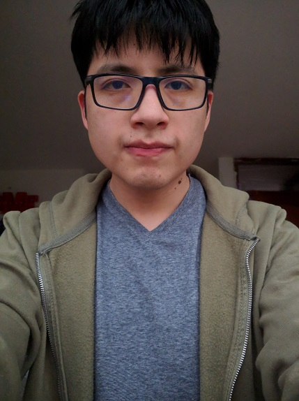
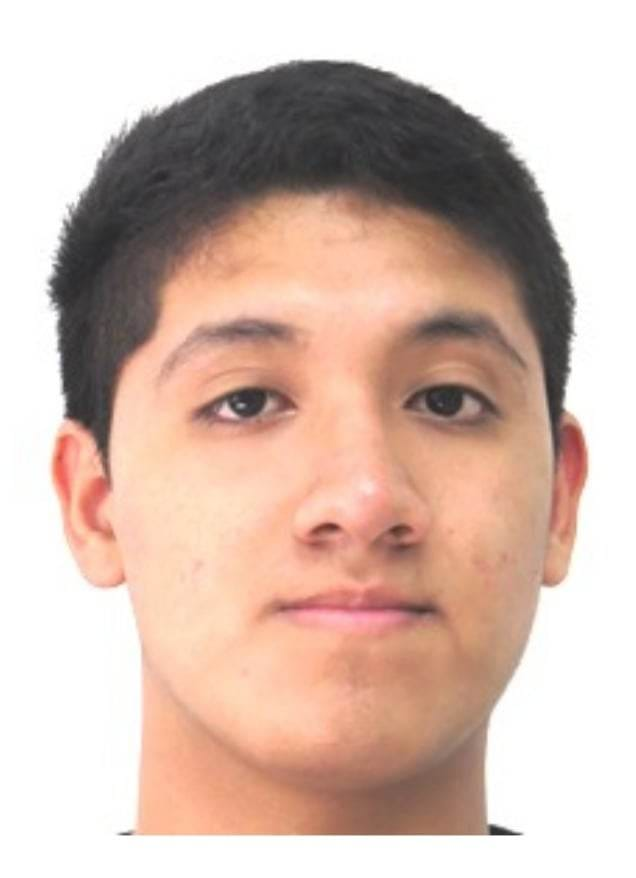
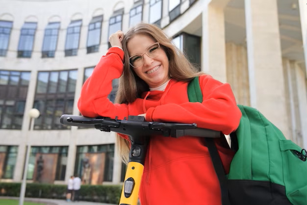
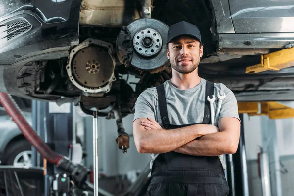
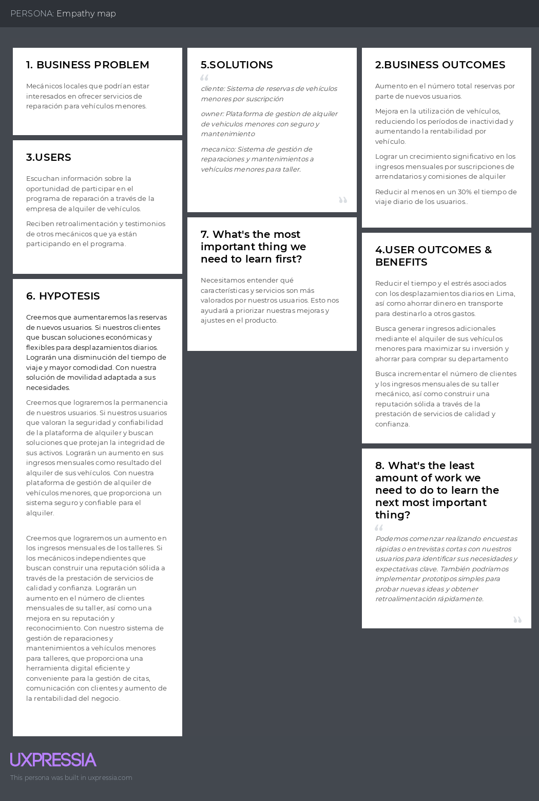

# Capitulo I: Introducción
## 1.1. Startup Profile
### 1.1.1. Descripción del startup
Somos InnovaTech, un startup conformado por estudiantes de la Universidad Peruana de Ciencias Aplicadas (UPC), que trabajará en el desarrollo del producto GlideGo, dedicada a facilitar la movilidad a las personas a través de 
la reserva y mantenimiento de vehículos menores o ligeros como bicicletas, Skateboards, scooters y motos eléctricos. Nuestro enfoque se centra en brindar 
soluciones tanto para usuarios que buscan vehículos para fines de actividades deportivas o para personas que los utilizan en su día a día, nuestra objetivo 
es facilitar el acceso a vehículos ligeros de forma segura y conveniente para nuestros usuarios, nuestro sitio web ofrecerá una experiencia excepcional, 
garantizando la disponibilidad, seguridad y mantenimiento óptimo de sus vehículos. 

|                                                     Misión                                                    	|                                                     Visión                                                     	|                                                           Valores                                                          	|
|:-------------------------------------------------------------------------------------------------------------:	|:--------------------------------------------------------------------------------------------------------------:	|:--------------------------------------------------------------------------------------------------------------------------:	|
| Transformar la movilidad urbana y recreativa con un acceso conveniente y seguro a vehículos menores o ligeros 	| Ser líderes en el mercado de movilidad sostenible ofreciendo una amplia gama de opciones de vehículos menores. 	| Innovación: La innovación constante para ofrecer soluciones creativas. Calidad: Buscamos la exelencia en nuestro producto. 	|

### 1.1.2. Perfiles de integrantes del negocio

| 	                                                                                   | Miembros del equipo               	| Código de estudiante 	| Carrera                	| Conocimientos/Habilidades                                                                                                                                                                                                                                                                                                                                                      	                                                              |
|-------------------------------------------------------------------------------------|-----------------------------------	|----------------------	|------------------------	|-----------------------------------------------------------------------------------------------------------------------------------------------------------------------------------------------------------------------------------------------------------------------------------------------------------------------------------------------------------------------------------------------------------------------------------------------|
| 	  | Velarde Gonzales Néstor Hernán    	| u20211c221	| Ingeniería de Software 	| Estudiante de la carrera de Ingeniería de Software, actualmente cursando el Quinto ciclo con especialización en el desarrollo de software y la automatización industrial, poseo habilidades avanzadas en diversos lenguajes de programación y base de datos SQL. Tengo la capacidad demostrada para colaborar eficazmente en proyectos multidiciplinarios y trabajo en equipo. 	                                                              |
| 	 | Aru Acevedo Yair Christofer       	| u202125984           	| Ingeniería de Software 	| Manejo intermedio de C++ y manejo básico de Html, Python y Java. Conocimientos en SQL y MongoDB.	                                                                                                                                                                                                                                                                                                                                             |
| 	     | Jara Benites Quique Vladimir      	| u202022365           	| Ingeniería de Software 	| Conocimientos tecnicos en javascript, php, NodeJs, SQL y MongoDB. Asimismo, para el desarrollo del trabajo en equipo  cuento con habilidades como participación comunicativa, creatividad, resolucion de problemas, adaptavilidad y toma de decisiones.                                                                                                                                                                                     	 |
| 	    | Hurtado Palomino Francisco Juan   	| u202117498           	| Ingeniería de Software 	| Conocimiento intermedio en lenguajes de C++, HTML y CSS. Para aportación al equipo cuenta con conocimientos en edición de videos y exposiciones.                                                                                                                                                                                                                               	                                                              |
| 	 | Flores Manrique Sebastian Enrique 	| u201611430           	| Ingeniería de Software 	| Soy estudiante de la carrera de Ingeniería de software. Actualmente cursando el quinto ciclo de la carrera. Me considero una persona responsable y dispuesto a ayudar en lo que haga falta. Tengo conocimientos en lenguaje de programación de C++, Python y un poco de conocimiento en desarrollo web.                                                                        	                                                              |

## 1.2. Solution Profile
### 1.2.1 Antecedentes y problemática

Nuestra capital Lima, es una de las ciudades con mayor tráfico del mundo, lo que genera grandes costos económicos para las millones de personas que transitan diariamente por la ciudad de lima y callao, el sistema de transporte se encuentran notablemente retrasados. En el 2023 nuestra ciudad de Lima pasó del quinto al segundo país en el ranking de ciudades con mayor tráfico a nivel mundial.

Según TomTom Traffic, trasladarse 10 kilómetros (distancia entre plaza San Martín y el Óvalo Naranjal al norte o al Larcomar al sur) demora 24 a 30 minutos en promedio.

#### What (Qué)

El problema identificado radica en el tráfico de Lima, que es uno de los más congestionados del mundo, generando costos económicos significativos y afectando la calidad de vida de millones de personas.

#### When (Cuándo)

¿Cuándo estamos viendo el problema? 
El problema del tráfico se experimenta diariamente, especialmente durante las horas pico de la mañana y la tarde, afectando los desplazamientos laborales y personales.

#### Where (Dónde)

¿Dónde estamos viendo los problemas? 
El tráfico congestionado se encuentra generalmente en las avenidas principales, intersecciones críticas y puntos de entrada y salida de la ciudad.

#### Who (Quienes)

¿A quien le sucede? 
El problema afecta a todos los residentes y usuarios de Lima, que dependen del transporte terrestre para sus actividades diarias, incluidos trabajadores, estudiantes y visitantes.

#### Why (Por qué)

¿Por qué sucede el problema? 
La congestion vehicular se debe a una combinación de factores, como el crecimiento poblacional, la falta de infraestructura vial adecuada, el aumento del parque automotor, la falta de sistemas de transporte público eficientes y sobre todo el desconocimiento de transportes alternativos.

#### How (Cómo)

¿Cómo se diferencia el problema del estado normal? 
Como una congestión constante en las vías principales, causando retrasos significativos en los tiempos de viaje y aumentando el estrés y la frustración de los usuarios. La congestión tiende a empeorar durante las horas pico y en días laborables.

#### How much (Cuánto)

¿Cuánto dinero están implicando?  
La congestión vehicular causa un impacto diario a millones de personas, provocando retraso en sus actividades diarias, pérdida de productividad y el aumento en el coste de transporte que asciende a mas de 500 soles anuales por manejar en horas pico o la alza de pasajes en el transporte público que a aumentado en casi 100 soles mensuales desde 2010.

### 1.2.2 Lean UX Process.
#### 1.2.2.1. Lean UX Problem Statements.

En el estado actual de el alquiler de vehiculos menores, se ha centrado principalmente en los usuarios que necesitan un transporte alternativo con garantia o usuarios que deseen generar un ingreso extra alquilando sus vehiculos.

Lo que los servicios existentes no logran abordan es el seguimiento de uso, cobertura amplia, mantenimiento y la posbilidad de un ingreso de dinero adicional.

Nuestro servicio abordara esta brecha al ofrecer un producto web enfocado en la reserva de vehiculos menores.

Nuestro enfoque inicial sera el segmento de personas que desean alquilar un vehiculo menor para sus actividades diarias o recreativas.

Sabremos que tenemos exito cuando veamos una reduccion en el gasto mensual de transporte de nuestros usuarios de un 30% y una reduccion de tiempo de al menos 6 horas semanales.

#### 1.2.2.2. Lean UX Assumptions.
##### Business outcomes: 

Utilizando la tecnica de Metrics Mountain se obtuvo lo siguiente:

1. Adquisicion:
- Porcentaje de nuevos usuarios registrados como arrendatarios que se suscriben a un plan mensual.
- Porcentaje de propietarios que publican al menos un vehiculo en la plataforma
- Porcentaje de mecanicos que completan su registro en la plataforma
2. Activacion:
- Porcentaje de usuarios que completan el proceso de reserva de un vehiculo en los primeros 7 dias de registro.
- Porcentaje de vehiclulos registrados que reciben al menos una solicitud de alquiler.
- Porcentaje de mecanicos que completan su primer servicio dentro de los 7 dias de registro.
3. Retencion:
- Porcentaje de usuarios que realizan al menos 3 solicitudes de alquiler por semana.
- Porcentaje de propietarios que mantienen al menos un vehiculo activo en la plataforma durante tres meses consecutivos.
- Porcentaje de mecanicos que reciben por lo menos 5 solicitudes de reparacion a la semana
4. Ingresos:
- Ingresos mensuales por suscripciones de arrendatarios
- Ingresos mensuales por comisiones de alquiler
- Ingresos mensuales por comisiones de servicios de reparaciones

Usando estas metricas se evaluaron los siguientes outcomes:
- Aumento en el número total reservas por parte de nuevos usuarios.
- Mejora en la utilización de vehículos, reduciendo los períodos de inactividad y aumentando la rentabilidad por vehículo.
- Lograr un crecimiento significativo en los ingresos mensuales por suscripciones de arrendatarios y comisiones de alquiler
- Reducir al menos en un 30% el tiempo de viaje diario de los usuarios.

##### User assumptions 

Proto persona cliente

<table>
    <tbody>
        <tr>
            <td> Nombre: Maria Gonzales  Ocupacion: estudiante universitaria</td>
            <td>Demografia: Edad:23 años Ubicacion: Surco, Lima  Psicografia:  Estilo de vida activo, siempre entre su hogar, la universidad y trabajo a tiempo parcial Actitudes: Preocupada por el medio ambiente y sostenibilidad</td>
        </tr>
        <tr>
            <td colspan="2">Metas: Reducir el tiempo y el estres asociados con los desplazamientos diarios en Lima.  Ahorrar dinero de transporte para destinarlo a otros gastos. Necesidades: Acceso a opciones de trasnporte flexibles y economicas que se adapten a su horario universitario laboral.  Un medio de transporte confiable y seguro que le permita llegar puntualmente a sus compromisos. Resultados Deseados: Disminucion del tiempo de viaje y aumento de la eficiencia. Obstaculos: Limitaciones financieras que podrian dificultarle acceder a soluciones de transporte mas comodas o menos estresantes Preocupaciones sobre disponibildiad y confiabilidad de opciones de transporte alternativas en Lima</td>
        </tr>
    </tbody>
</table>

Assumtions:
- Los estudiantes universitarios como maria valoran la economia y la flexibilidad en las opciones de transporte.
- Los jovenes como Maria estan interesados en opciones de transporte que les ayude en reducir el tiempo y el estres al movilizarse .

Proto persona Owner

<table>
    <tbody>
        <tr>
            <td> Nombre: Juana Lopez   Ocupacion: Teleoperadora  Rol: Propietaria de uno o mas vehiculos menores</td>
            <td>Demografia Edad:27 años Ubicacion: San Miguel,Lima  Psicografia: Estilo de vida activo y ocupado, equilibrando el trabajo y la vida personal Actitudes: Interesada en maximizar sus ingresos y buscar oportunidades de inversion rentables sin sacrificar tiempo</td>
        </tr> 
        <tr>
            <td colspan="2">Metas: Generar ingresos adicionales a traves del alquiler de sus vehiculos. Aprovechar al maximo la inversion en su vehiculo para ahorrar y comprar su departamento.  Necesidades: Acceso a una plataforma segura que le permita gestionar el proceso de alquiler y garantizar la seguridad de su propiedad.  Soporte y asistencia para resolver sus dudas. Resultados Deseados: Incremento de los ingresos mensuales a traves del alquiler de sus vehiculos. Obstaculos: Preocupaciones sobre la seguridad y mantenimiento de sus vehiculos durante el proceso de alquiler</td>
        </tr>
    </tbody>
</table>

Assumtions:
- Personas como Juana buscan maximizar el valor de sus activos mediante el alquiler para generar ingresos adicionales.
- Las personas interesadas en el alquiler de vehiculos menores valoran la seguridad y confiabilidad de la plataforma de alquiler.
- Las personas interesadas en el  alquiler buscan soluciones que protejan la integridad de sus activos y aseguren una experiencia positiva para sus arrendatarios. 

Proto persona mecanico

<table>
    <tbody>
        <tr>
            <td> Nombre: Luis Torres  Ocupacion: Mecanico independiente</td>
            <td>Demografia: Edad:36 años Ubicacion: San Borja, Lima  Psicografia:  Estilo de vida activo y enfocado en su negocio, dedicando tiempo tanto al trabajo como a la familia Actitudes: Profesional comprometido con la calidad del servicio y la satisfaccion del cliente</td>
        </tr>
        <tr>
            <td colspan="2">Metas: Incrementar el numero de clientes y los ingresos mensuales a traves de la prestacion de servicios en su taller Construir una reputacion solida a traves de un servicio de calidad y confianza. Necesidades:  Acceso a herramientas digitales que le permitan llegar a nuevos usuarios de manera efectiva  Herramientas digitales que le permita gestionar sus citas y comunicarse con los clientes de manera efectiva. Resultados Deseados: Aumento de la rentabilidad de su negocio a traves de la generacion de nuevos leads y la satisfaccion de los clientes. Reconocmineto y reputacion como un mecanico confiable y de confianza Obstaculos: Competencia en el mercado de servicios de mantenimiento y reparacion de vehiculos que por lo general esta liderado por empresas grandes</td>
        </tr>
    </tbody>
</table>

Assumtions:
- La disponibilidad de un sistema de reserva y programación en línea es crucial para los mecánicos independientes como Luis, ya que aumenta la comodidad y la accesibilidad para los clientes.
- Los mecanicos independientes valoran que los clientes tengan facilidades para llegar a ellos y poder probar su servicio y la posibildiad de generar fidelizacion con el cliente.  

#### User outcomes

Cliente 
¿Qué está intentando lograr el usuario? 
- Reducir el tiempo y el estrés asociados con los desplazamientos diarios en Lima, así como ahorrar dinero en transporte para destinarlo a otros gastos.

¿Cómo quiere sentirse el usuario durante y después de este proceso? 
- Desea sentirse aliviado y menos estresado durante sus viajes diarios, así como satisfecho por haber encontrado una solución económica y confiable para sus necesidades de transporte.

¿Cómo acerca nuestro producto o servicio al usuario a una meta o sueño de vida? 
- Nuestro servicio de transporte le permite al usuario ahorrar tiempo y dinero, contribuyendo a una mayor eficiencia en su vida diaria y liberando recursos para otros aspectos de su vida.

¿Por qué buscaría su usuario su producto? 
- El usuario busca nuestro producto porque valora la economía y la flexibilidad en las opciones de transporte, y está interesada en soluciones que reduzcan el tiempo y el estrés al movilizarse.

¿Qué cambio de comportamiento podemos observar que indique que han logrado su objetivo? 
- Utiliza regularmente nuestro servicio de transporte para sus desplazamientos diarios, experimentando una disminución en el tiempo de viaje y una mayor sensación de calma y comodidad durante sus trayectos.

Owner 

¿Qué está intentando lograr el usuario?
- Busca generar ingresos adicionales mediante el alquiler de sus vehículos menores para maximizar su inversión y ahorrar para comprar su departamento.

¿Cómo quiere sentirse el usuario durante y después de este proceso?
- Desea sentirse seguro y confiado en la gestión del proceso de alquiler, así como satisfecho con el incremento de sus ingresos mensuales como resultado de esta actividad.

¿Cómo acerca nuestro producto o servicio al usuario a una meta o sueño de vida?
- Nuestra plataforma de alquiler le permite al usuario maximizar el valor de sus activos, brindándole una oportunidad rentable para generar ingresos adicionales y alcanzar sus objetivos financieros.

¿Por qué buscaría su usuario su producto?
- Busca nuestra plataforma de alquiler porque valora la seguridad, confiabilidad y soporte que proporcionamos, así como nuestra capacidad para proteger la integridad de sus activos y garantizar una experiencia positiva para sus arrendatarios.

¿Qué cambio de comportamiento podemos observar que indique que han logrado su objetivo?
- Experimenta un aumento en sus ingresos mensuales como resultado del alquiler de sus vehículos, y se siente segura y confiada en la gestión del proceso de alquiler a través de nuestra plataforma.

Mecanico

¿Qué está intentando lograr el usuario?
- El usuario busca incrementar el número de clientes y los ingresos mensuales de su taller mecánico, así como construir una reputación sólida a través de la prestación de servicios de calidad y confianza.

¿Cómo quiere sentirse el usuario durante y después de este proceso?
- El usuario desea sentirse satisfecho y exitoso al alcanzar sus metas de negocio, así como reconocido y respetado como un mecánico confiable y de confianza por parte de sus clientes.

¿Cómo acerca nuestro producto o servicio al usuario a una meta o sueño de vida?
- Nuestra herramienta digital le permite a Luis llegar a nuevos usuarios de manera efectiva, gestionar sus citas y comunicarse con los clientes de manera eficiente, contribuyendo así al aumento de la rentabilidad de su negocio y a la construcción de una reputación sólida.

¿Por qué buscaría su usuario su producto?
- El usuario busca nuestra herramienta digital porque valora la conveniencia y accesibilidad que ofrece para los clientes, así como la posibilidad de generar fidelización y satisfacción entre ellos.

¿Qué cambio de comportamiento podemos observar que indique que han logrado su objetivo?
- El usuario experimenta un aumento en el número de clientes y los ingresos mensuales de su taller mecánico, así como una mejora en su reputación y reconocimiento como un mecánico confiable y de confianza en su comunidad.

#### Solutions

Para el planteamiento de las soluciones, se utilizo la herramienta affinity mapping

| Owner                                                            | cliente                                                              | mecanico                                                |
|------------------------------------------------------------------|----------------------------------------------------------------------|---------------------------------------------------------|
| Plataforma de gestión de alquiler de vehículos menores	          | Aplicación de reserva de vehículos menores por suscripcion           | Plataforma de gestión de mantenimiento y reparacion     | 
| Servicio de inspección y mantenimiento	                          | Aplicacion de reserva de bicitaxi	                                   | Servicio de recogida y entrega                        |  
| Programa de seguro y asistencia en carretera	                    | Programa de fidelización y descuentos en buses de transporte publico	 | Programa de referidos y testimonios                     |
| Sistema de alertas para mantenimiento preventivo	                | Servicio de asistencia en carretera	                                 | Servicio de diagnóstico remoto                          |
| Herramientas de seguimiento de ingresos y gastos	                | Rastreo de buses en tiempo real	                                     | Programa de capacitación para propietarios de vehículos |
| Programa de incentivos para arrendatarios 	                      | Aplicacion de trafico en tiempo real	                                | Sistema de gestión de clientes y seguimiento          |          
| Asesoramiento legal y administrativo para alquiler de vehiculos	 | 	                                                                    | Herramientas de marketing digital                       |

Despues de la votacion las soluciones que se eligieron fueron:

cliente:
Sistema de reservas de vehiculos menores por suscripcion

owner:
Plataforma de gestion de alquiler de vehiculos menores con seguro y mantenimiento

mecanico:
Sistema de gestion de reparaciones y mantenimientos a vehiculos menores para taller.

#### 1.2.2.3. Lean UX Hypothesis Statements.

Utilizando los bussines outcomes, proto-persona, user outcomes y solutions se formularon las siguientes hipotesis:

Cliente: 
Creemos que aumentaremos las reservas de nuevos usuarios. 
Si clientes como María buscan soluciones económicas y flexibles para desplazamientos diarios. 
Lograrán una disminución del tiempo de viaje y mayor comodidad. 
Con nuestra solución de movilidad adaptada a sus necesidades.

Owner: 
Creemos que lograremos la permanencia de nuestros usuarios 
Si nuestros usuarios que valoran la seguridad y confiabilidad de la plataforma de alquiler y buscan soluciones que protejan la integridad de sus activos 
Lograrán un aumento en sus ingresos mensuales como resultado del alquiler de sus vehículos 
Con nuestra plataforma de gestión de alquiler de vehículos menores, que proporciona un sistema seguro y confiable para el alquiler.

Mecanico: 
Creemos que lograremos un aumento en lso ingresos mensuales de los talleres 
Si los mecánicos independientes que buscan construir una reputación sólida a través de la prestación de servicios de calidad y confianza. 
Lograrán un aumento en el número de clientes mensuales de su taller, así como una mejora en su reputación y reconocimiento 
Con nuestro sistema de gestión de reparaciones y mantenimientos a vehículos menores para talleres, que proporciona una herramienta digital eficiente y conveniente para la gestión de citas, comunicación con clientes y aumento de la rentabilidad del negocio. 

#### 1.2.2.4. Lean UX Canvas.

## 1.3. Segmentos objetivo.
**Segmento 1**
Segmento arrendatario (Owner): Se refiere a todos los individuos que posean algún vehículo ligero y deseen ponerlo en alquiler para ganar algo de dinero. 

**Segmento 2**
Segmento arrendador (User): Se refiere a todos los individuos que requieran movilizarse diariamente en Lima metropolitana ya sea por el trabajo, estudios o simplemente ocio.

**Segmento 3**
Segmento mecánico (Mechanic): Se refiere a las personas capaces de reparar y dar mantenimiento a vehiculos menores

