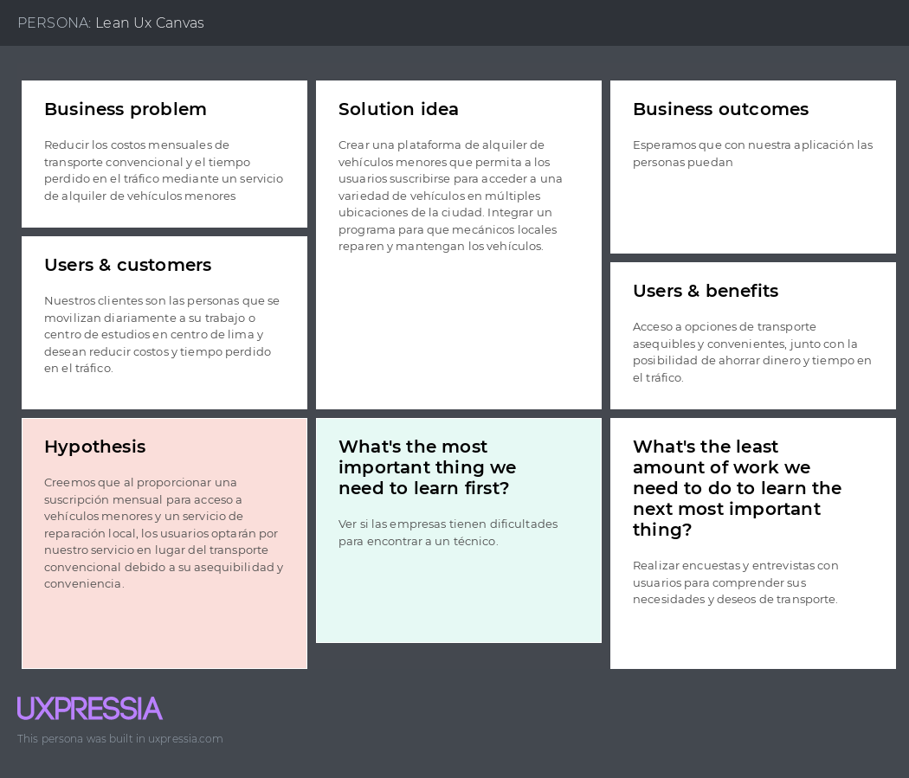

# Capitulo I: Introducción
## 1.1. Startup Profile
### 1.1.1. Descripción del startup
Somos InnovaTech, un startup conformado por estudiantes de la Universidad Peruana de Ciencias Aplicadas (UPC), que trabajará en el desarrollo del producto GlideGo, dedicada a facilitar la movilidad a las personas a través de 
la reserva y mantenimiento de vehículos menores o ligeros como bicicletas, Skateboards, scooters y motos eléctricos. Nuestro enfoque se centra en brindar 
soluciones tanto para usuarios que buscan vehículos para fines de actividades deportivas o para personas que los utilizan en su día a día, nuestra objetivo 
es facilitar el acceso a vehículos ligeros de forma segura y conveniente para nuestros usuarios, nuestro sitio web ofrecerá una experiencia excepcional, 
garantizando la disponibilidad, seguridad y mantenimiento óptimo de sus vehículos. 

|                                                     Misión                                                    	|                                                     Visión                                                     	|                                                           Valores                                                          	|
|:-------------------------------------------------------------------------------------------------------------:	|:--------------------------------------------------------------------------------------------------------------:	|:--------------------------------------------------------------------------------------------------------------------------:	|
| Transformar la movilidad urbana y recreativa con un acceso conveniente y seguro a vehículos menores o ligeros 	| Ser líderes en el mercado de movilidad sostenible ofreciendo una amplia gama de opciones de vehículos menores. 	| Innovación: La innovación constante para ofrecer soluciones creativas. Calidad: Buscamos la exelencia en nuestro producto. 	|

### 1.1.2. Perfiles de integrantes del negocio

| 	                                                                                   | Miembros del equipo               	| Código de estudiante 	| Carrera                	| Conocimientos/Habilidades                                                                                                                                                                                                                                                                                                                                                      	 |
|-------------------------------------------------------------------------------------|-----------------------------------	|----------------------	|------------------------	|----------------------------------------------------------------------------------------------------------------------------------------------------------------------------------------------------------------------------------------------------------------------------------------------------------------------------------------------------------------------------------|
| 	  | Velarde Gonzales Néstor Hernán    	| u20211c221	| Ingeniería de Software 	| Estudiante de la carrera de Ingeniería de Software, actualmente cursando el Quinto ciclo con especialización en el desarrollo de software y la automatización industrial, poseo habilidades avanzadas en diversos lenguajes de programación y base de datos SQL. Tengo la capacidad demostrada para colaborar eficazmente en proyectos multidiciplinarios y trabajo en equipo. 	 |
| 	 | Aru Acevedo Yair Christofer       	| u202125984           	| Ingeniería de Software 	| Manejo intermedio del lenguaje de programación y manejo básico de los lenguajes de Java, Python y HTML. |
| 	     | Jara Benites Quique Vladimir      	| u202022365           	| Ingeniería de Software 	| Conocimiento intermedio en el lenguaje de programación C++, Java, HTML, y UML. Habilidades que puede aportar en el equipo: participación comunicativa, creatividad, análisis de problemas.                                                                                                                                                                                     	 |
| 	    | Hurtado Palomino Francisco Juan   	| u202117498           	| Ingeniería de Software 	| Conocimiento intermedio en lenguajes de C++, HTML y CSS. Para aportación al equipo cuenta con conocimientos en edición de videos y exposiciones.                                                                                                                                                                                                                               	 |
| 	 | Flores Manrique Sebastian Enrique 	| u201611430           	| Ingeniería de Software 	| Soy estudiante de la carrera de Ingeniería de software. Actualmente cursando el quinto ciclo de la carrera. Me considero una persona responsable y dispuesto a ayudar en lo que haga falta. Tengo conocimientos en lenguaje de programación de C++, Python y un poco de conocimiento en desarrollo web.                                                                        	 |

## 1.2. Solution Profile
### 1.2.1 Antecedentes y problemática

Nuestra capital Lima, es una de las ciudades con mayor tráfico del mundo, lo que genera grandes costos económicos para las millones de personas que transitan diariamente por la ciudad de lima y callao, el sistema de transporte se encuentran notablemente retrasados. En el 2023 nuestra ciudad de Lima pasó del quinto al segundo país en el ranking de ciudades con mayor tráfico a nivel mundial.

Según TomTom Traffic, trasladarse 10 kilómetros (distancia entre plaza San Martín y el Óvalo Naranjal al norte o al Larcomar al sur) demora 24 a 30 minutos en promedio.

#### What (Qué)

El problema identificado radica en el tráfico de Lima, que es uno de los más congestionados del mundo, generando costos económicos significativos y afectando la calidad de vida de millones de personas.

#### When (Cuándo)

¿Cuándo estamos viendo el problema? 
El problema del tráfico se experimenta diariamente, especialmente durante las horas pico de la mañana y la tarde, afectando los desplazamientos laborales y personales.

#### Where (Dónde)

¿Dónde estamos viendo los problemas? 
El tráfico congestionado se encuentra generalmente en las avenidas principales, intersecciones críticas y puntos de entrada y salida de la ciudad.

#### Who (Quienes)

¿A quien le sucede? 
El problema afecta a todos los residentes y usuarios de Lima, que dependen del transporte terrestre para sus actividades diarias, incluidos trabajadores, estudiantes y visitantes.

#### Why (Por qué)

¿Por qué sucede el problema? 
La congestion vehicular se debe a una combinación de factores, como el crecimiento poblacional, la falta de infraestructura vial adecuada, el aumento del parque automotor, la falta de sistemas de transporte público eficientes y sobre todo el desconocimiento de transportes alternativos.

#### How (Cómo)

¿Cómo se diferencia el problema del estado normal? 
Como una congestión constante en las vías principales, causando retrasos significativos en los tiempos de viaje y aumentando el estrés y la frustración de los usuarios. La congestión tiende a empeorar durante las horas pico y en días laborables.

#### How much (Cuánto)

¿Cuánto dinero están implicando?  
La congestión vehicular causa un impacto diario a millones de personas, provocando retraso en sus actividades diarias, pérdida de productividad y el aumento en el coste de transporte que asciende a mas de 500 soles anuales por manejar en horas pico o la alza de pasajes en el transporte público que a aumentado en casi 100 soles mensuales desde 2010.

### 1.2.2 Lean UX Process.
#### 1.2.2.1. Lean UX Problem Statements.

#### Problem Statement 1
En nuestra ciudad de Lima, el tráfico se ha convertido en un problema crítico que afecta la calidad de vida y pérdida de tiempo de muchos usuarios principalmente en horas puntas del día.
Según el diario el comercio menciona, a nivel general, en los últimos años los niveles de congestión vehicular se elevaron en comparación con el año anterior, como consecuencia del paulatino retorno a las actividades presenciales en todo el mundo post pandemia.
“Del mismo modo, el dinero que gasta en combustible por manejar en las horas más congestionadas suma S/ 2,231 al año, de los cuales S/ 582 es el gasto adicional causado por la congestión. Además, las emisiones de CO2 producidas anualmente por un auto que se moviliza en hora punta es de 990 kg., de los cuales 258 kg corresponde al tiempo adicional que se genera por la congestión”, así lo señaló Alberto Morisaki.

¿Cómo podemos implementar un sistema de transporte alternativo eficiente, y moderno en nuestra ciudad de Lima?

#### Problem Statement 2
Según un informe de Cuore, hay un gran sector de la población que no ve futuro a este tipo de transporte debido a que no creen en la revolución de los micro movilidad. Eso se ve reflejado en que el porcentaje de interés en adquirir o rentar un vehículo liviano o eléctrico entre los años 2021 y 2022 ha crecido muy levemente mostrando el poco interés de las personas por este tipo de vehículos livianos. Asimismo, el porcentaje de personas que rechazan más este tipo de vehículos livianos, son las personas mayores mostrando que mientras más años tenga una persona, más rechazo tiene a la idea ya que tienden a preferir utilizar transporte público o vehículos privado donde la mayor parte de ellos se encuentra.
¿Cómo podemos lograr que las personas opten por usar este medio de transporte?

#### Problem Statement 3
Según un informe de Datum 5 de cada 10 peruanos sufren para llegar a fin de mes. El alza del costo de vida se ve reflejado en el costo promedio diario de pasajes en el transporte que actualmente es de más de 12 soles. Asimismo, el pasaje todos los años sube un 5.5%. Según un informe de Infobae de 2023 el gasto mensual en pasajes se ha aumentado en casi 100 soles desde 2010

¿Cómo podemos ayudar a las personas de Lima metropolitana a reducir sus gastos en transporte público?

#### 1.2.2.2. Lean UX Assumptions.
##### Business outcomes: 

- Los usuarios de la aplicación están dispuestos a rentar el servicio.
- Los usuarios deben poder visualizar la distancia y tiempo recorrido.
- Los usuarios de la aplicación están dispuestos a usar las medidas de seguridad al transportarse.

- Los usuarios pueden visualizar cuánto han ahorrado en transporte.

- Los usuarios son notificados cuando llegan el limite de su suscripción. 

- Los usuarios pueden visualizar qué calles tienen mayor afluencia de tráfico.

- Los mecánicos pueden recibir notificaciones de reportes de fallas de vehículos menores por parte de usuarios. 

- Los usuarios pueden reportar fallas mecánicas en tiempo real mediante la aplicación web. 

- La aplicación debe ser compatible con múltiples plataformas.

 - Los usuarios pueden visualizar los vehículos disponibles. 
 
##### User assumptions 

- ¿Quién es el usuario? 
Estudiantes y trabajadores que se transportan diariamente en lima metropolitana 
- ¿Dónde encaja nuestro producto en su trabajo o vida? 
El sistema está disponible en actividades de trabajos diarios o de relajamiento de cada persona. 
- ¿Qué problema tiene nuestro producto? ¿Cómo se resuelve? 
No es muy bien recibido por las personas mayores. 

- ¿Cuándo y cómo es usado nuestro producto? 
Se puede usar por diferentes razones como actividades de trabajos, estudios, casuales o en actividades del deporte. 
 
- ¿Qué características son importantes? 
El ahorro de tiempo y dinero. 
- ¿Cómo debe verse nuestro producto y comportarse? 
Como un tipo de transporte amigable con el medio ambiente y económico a largo plazo.

#### 1.2.2.3. Lean UX Hypothesis Statements.
| Assumption priorizado: |  (Business Assumptions)                                                                                                                                                                                                                                                                                                                                                                                                                                                                  |
|------------------------|-------------------------------------------------------------------------------------------------------------------------------------------------------------------------------------------------------------------------------------------------------------------------------------------------------------------------------------------------------------------------------------------------------------------------------------------------------------------------------------------|
| Hypothesis:            | 1                                                                                                                                                                                                                                                                                                                                                                                                                                                                                         |
| Descripcion:           | Creemos que implementar un sistema eficiente y económico, como lo son los vehículos menores, en Lima reducirá significativamente la congestión vehicular, mejorará la calidad de vida de los ciudadanos y reducirá significativamente el tiempo que pasan en el tráfico, al ofrecer una alternativa atractiva y confiable para desplazarse en la ciudad. Sabremos que hemos tenido éxito cuando las personas opten más por usar nuestro servicio en lugar del transporte público y privado |
| Metrica                |Porcentaje de usuarios que optan por el servicio de vehículos menores en lugar del transporte público y privado.|

| Assumption priorizado: |  (Business Assumptions)                                                                                                                                                                                                                                                                                                                                                                                                                                                                                                                                                                                                              |
|------------------------|---------------------------------------------------------------------------------------------------------------------------------------------------------------------------------------------------------------------------------------------------------------------------------------------------------------------------------------------------------------------------------------------------------------------------------------------------------------------------------------------------------------------------------------------------------------------------------------------------------------------------------------|
| Hypothesis:            | 2                                                                                                                                                                                                                                                                                                                                                                                                                                                                                                                                                                                                                                     |
| Descripcion:           | Creemos que implementar estrategias de educación y concienciación sobre los beneficios ambientales, económicos y de movilidad de los vehículos livianos y eléctricos aumentará la aceptación y adopción de este tipo de transporte, especialmente entre los segmentos de la población que muestran mayor escepticismo, como los adultos mayores, creando así una cultura favorable hacia la micro movilidad y fomentando su uso como una alternativa viable y sostenible en el transporte urbano. Sabremos que hemos tenido exito cuando la aceptación del uso de vehículos menores en personas mayores de 30 años aumente en un 20%. |
| Metrica                | Incremento porcentual en la aceptación del uso de vehículos menores en personas mayores de 30 años.                                                                                                                                                                                                                                                                                                                                                                                                                                                                                                                                   |

| Assumption priorizado: |  (Business Assumptions)                                                                                                                                                                                                                                                                                                                                                                                                                                                                                                                                                                                                             |
|------------------------|--------------------------------------------------------------------------------------------------------------------------------------------------------------------------------------------------------------------------------------------------------------------------------------------------------------------------------------------------------------------------------------------------------------------------------------------------------------------------------------------------------------------------------------------------------------------------------------------------------------------------------------|
| Hypothesis:            | 3                                                                                                                                                                                                                                                                                                                                                                                                                                                                                                                                                                                                                                    |
| Descripcion:           | Creemos que fomentar el uso de vehículos menores, como bicicletas, scooters eléctricos y patinetes, a través de la implementación de infraestructura adecuada, políticas de promoción y educación vial, así como incentivos financieros, permitirá a los residentes de Lima Metropolitana reducir significativamente sus gastos en transporte, al tiempo que disminuye la dependencia de los servicios de transporte tradicionales y contribuye a una movilidad más sostenible y económica. Sabremos que hemos tenido éxito cuando las personas opten por usar nuestro servicio para economizar en vez del  transporte convencional. |
| Metrica                | Porcentaje de usuarios que eligen nuestro servicio de vehículos menores como forma de transporte para economizar en comparación con el transporte convencional.                                                                                                                                                                                                                                                                                                                                                                                                                                                                      |

#### 1.2.2.4. Lean UX Canvas.

## 1.3. Segmentos objetivo.
**Segmento 1**
Segmento arrendatario (Owner): Se refiere a todos los individuos que posean algún vehículo ligero y deseen ponerlo en alquiler para ganar algo de dinero. 

**Segmento 2**
Segmento arrendador (User): Se refiere a todos los individuos que requieran movilizarse diariamente en Lima metropolitana ya sea por el trabajo, estudios o simplemente ocio.

**Segmento 3**
Segmento mecánico (Mechanic): Se refiere a las personas capaces de reparar y dar mantenimiento a vehiculos menores

