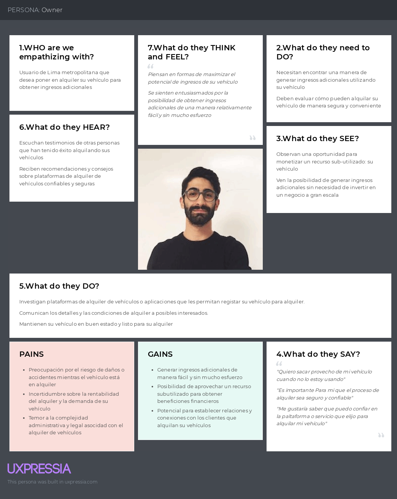
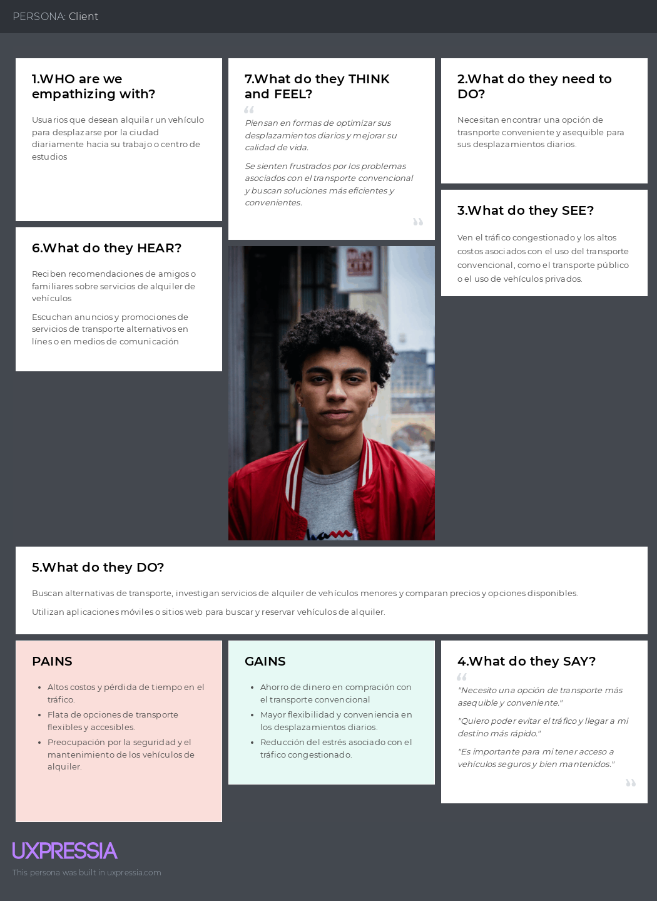
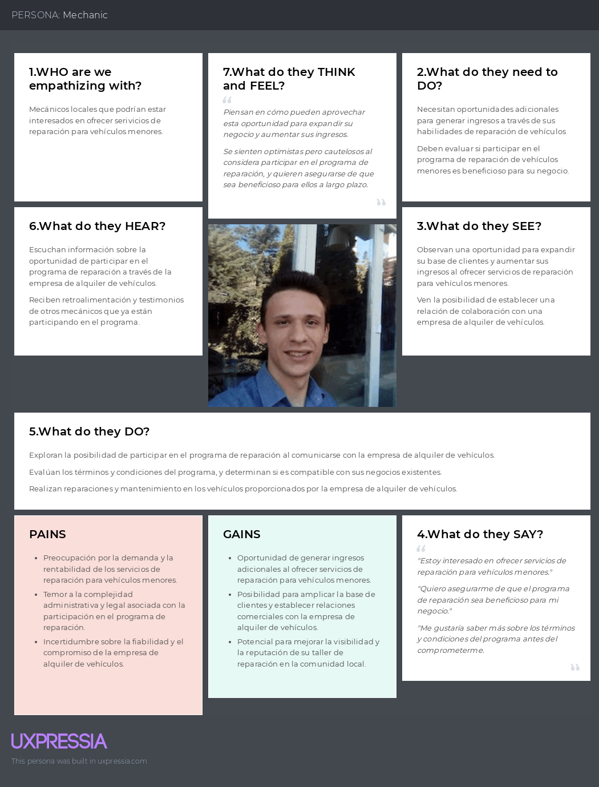

# Capítulo II: Requirements Elicitation & Analysis
## 2.1. Competidores.
### 2.1.1. Análisis competitivo.

<table>
  <tr>
    <th colspan="6" valign="top">Competitive Analysis Landscape</th>
  </tr>
  <tr>
    <td colspan="2" valign="top">¿Por qué llevar a cabo este análisis?</td>
    <td colspan="4" valign="top">El objetivo de este análisis es identificar las características de los competidores y encontrar maneras de diferenciarnos.</td>
  </tr>
  <tr>
    <td colspan="2" rowspan="2" valign="top">Startup y Competidores</td>
    <td valign="top">Glidego</td>
    <td valign="top">City Bike</td>
    <td valign="top">Grin</td>
    <td valign="top">Emove</td>
  </tr>
  <tr>
    <td valign="top"></td>
    <td valign="top"></td>
    <td valign="top"></td>
    <td valign="top"></td>
  </tr>
  <tr>
    <td rowspan="2" valign="top">Perfil</td>
    <td valign="top">Overview</td>
    <td valign="top">Servicio de alquiler de bicicletas, Skateboards, scooters y motos eléctricas para la ciudad de Lima metropolitana.</td>
    <td valign="top">Servicio de alquiler de bicicletas en Miraflores, Lima.</td>
    <td valign="top">Servicio de alquiler de scooters  para Lima metropolitana.</td>
    <td valign="top">Servicio de alquiler de vehículos, servicios de reparaciones, venta de equipos y accesorios.</td>

  </tr>
  <tr>
    <td valign="top">Ventaja competitiva ¿Qué valor ofrece a los clientes?</td>
    <td valign="top">Crear una cuenta en GlideGo y acceder a diferentes opciones de suscripciones y equipos según preferible de cada usuario, también incluye el mantenimiento de cada equipo por fallas técnicas.</td>
    <td valign="top">La forma de alquiler es mediante registros por plataforma web o móvil, la suscripción está disponible desde pase diario, mensual y anual. </td>
    <td valign="top">Permite a los usuarios alquilar mediante suscripción sus scooters. Además , ofrece mantenimiento gratuito.</td>
    <td valign="top">Permite a los usuarios el alquiler de vehículos, la compra y venta de accesorios nuevos como de segunda mano, a través de su sitio web. </td>
  </tr>
  <tr>
    <td rowspan="2" valign="top">Perfil de Marketing</td>
    <td valign="top">Mercado objetivo</td>
    <td valign="top">Personas mayores a 18 años que requieren los servicios solo para ciudad de Lima. </td>
    <td valign="top">Personas mayores a 18 años, para habitantes de Lima, visitantes y turistas. </td>
    <td valign="top">Personas mayores de 15 años que se deben movilizar por Lima Metropolitana diariamente.</td>
    <td valign="top">Personas mayores de 18 años que busquen promover los vehículos de micromovilidad.</td>
  </tr>
  <tr>
    <td valign="top">Estrategias de marketing</td>
    <td valign="top">Publicidad por redes sociales y anuncios en plataformas (YouTube).</td>
    <td valign="top">Publicidad en redes sociales.</td>
    <td valign="top">Publicidad en redes sociales y afiches</td>
    <td valign="top">Publicidad en redes sociales.</td>
  </tr>
  <tr>
    <td rowspan="3" valign="top">Perfil de Producto</td>
    <td valign="top">Productos & Servicios</td>
    <td valign="top">Alquiler de vehículos menores</td>
    <td valign="top">Alquiler de bicicletas.</td>
    <td valign="top">Alquiler de scooters y mantenimiento.</td>
    <td valign="top">Alquiler de vehículos y servicio de reparaciones.</td>
  </tr>
  <tr>
    <td valign="top">Precios & Costos</td>
    <td valign="top">Planes de suscripción: 
    - Plan base: s/.130 
    - Plan premium: s/.230
</td>
    <td valign="top">Planes de suscripción:  
- Diario: s/4.33     
- Mensual: s/19.50  
- Anual: s/ 151.73   
</td>
    <td valign="top">Planes de suscripción: 
- Mensual: S/. 139 
- Bimestral: S/239 
- Trimestral: S/329 
</td>
    <td valign="top">Costo de alquiler: 
- 2 horas: s/. 60 
- 4 horas: s/. 80 
- 1 día: s/. 120 
</td>
  </tr>
  <tr>
    <td valign="top">Canales de distribución (Web y/o Móvil)</td>
    <td valign="top">Principalmente a través de su sitio web oficial</td>
    <td valign="top">Principalmente a través de su sitio web, con posibilidad de acceso móvil. </td>
    <td valign="top">Principalmente a través de su sitio web oficial.</td>
    <td valign="top">Principalmente a través de su sitio web oficial.</td>
  </tr>
  <tr>
    <td rowspan="4" valign="top">Análisis SWOT</td>
    <td valign="top">Fortalezas</td>
    <td valign="top">
    	Contar con un sistema confiable y seguro para el alquiler de vehículos menores.
    </td>
    <td valign="top">
      Posibilidad para personas que optan por un transporte eficiente y sano. 
    </td>
    <td valign="top">
        Base de clientes establecida, está presente en lugares con mayor afluencia de tráfico 
    </td>
    <td valign="top">
        -Variedad de servicios 
        -Movilidad sostenible 
        -Flexibilidad de precios 
    </td>
  </tr>
  <tr>
    <td valign="top">Debilidades</td>
    <td valign="top">
        No contamos con un sistema de rastreo sofisticado
    </td>
    <td valign="top">
        No cuenta con servicio de mantenimiento. 
    </td>
    <td valign="top">
        No cuenta con aplicación móvil, costos elevados. Poca publicidad
    </td>
    <td valign="top">
        -Dependencia tecnológica 
        -Competencia 
        -Costos de mantenimiento 
        -Dependencia climática 
    </td>
  </tr>
  <tr>
    <td valign="top">Oportunidades</td>
    <td valign="top">
        Es innovador y no afecta al medio ambiente. Asimismo, tiene un impacto positivo en la economía y salud de los usuarios.
    </td>
    <td valign="top">
        La ciudad de Miraflores cuenta con vías exclusivas para bicicletas y posibilidad para expandir a más distritos Limeños.
    </td>
    <td valign="top">
        Expandir su base de usuarios ya sea con mayor publicidad o mas alcance a zonas de cobertura del servicio.
    </td>
    <td valign="top">
        -Expansión de mercado 
        -Alianzas estratégicas 
        -Diversificación de servicios 
        -Tendencia de movilidad urbana 
    </td>
  </tr>
  <tr>
    <td valign="top">Amenazas</td>
    <td valign="top">
        Las personas no confían en el servicio
    </td>
    <td valign="top">
        Las invasiones de motorizados a ciclovías y los robos de equipos (bicicletas) en lugares con poca seguridad. 
    </td>
    <td valign="top">
        Cambios en la regulación del transporte.
    </td>
    <td valign="top">
        Cambios en la regulación, críticas negativas y avances tecnológicos representan amenazas potenciales para la operación y la reputación de Samma en el mercado.
    </td>
  </tr>
</table>

### 2.1.2. Estrategias y tácticas frente a competidores.
* Ofrece una amplia gama de vehículos menores para alquilar, incluyendo bicicletas, scooters y otros. Esto te permitirá capturar a una audiencia más amplia y satisfacer las necesidades de diferentes tipos de usuarios.
* Aprovecha la oportunidad de expandir nuestro servicio a otras áreas metropolitanas y turísticas, más allá de la ubicación actual de nuestros competidores. Esto nos permitirá alcanzar a una base de usuarios más amplia y capturar nuevos mercados.
* Incluir a nuestra producto características como navegación GPS, notificaciones en tiempo real sobre disponibilidad de vehículos y opciones de pago seguras.
* Ofrecer servicios de mantenimiento gratuitos o con descuento como parte de un programa de fidelización para los usuarios frecuentes.
- - -
## 2.2. Entrevistas.
### 2.2.1. Diseño de entrevistas.

#### Entrevistas segmento 01: Owner(Ofrece vehiculos menores)
1. ¿Cual es tu nombre? ¿Cuántos años tienes? ¿Dónde vives actualmente?
2. ¿Qué dispositivos de escritorio y móvil usas mayormente? ¿Y cuál consideraría su navegador favorito?
3. ¿Cuántos y qué tipos de vehículos posees actualmente?
4. ¿Cuál sería tu presupuesto para alquilar cada tipo de vehículo?
5. ¿Tienes experiencia previa en el alquiler de vehículos o servicios similares?
6. ¿Cómo te gustaría que sean las tarifas de alquiler?
7. ¿Con qué medios de pago te gustaría que contemos?
8. ¿Tienes un límite de tiempo o distancia para el alquiler?
9. Si el vehículo se daña durante el uso ¿Cómo reaccionarías?
10. ¿Qué te parecería poder visualizar la identidad del cliente?
11. ¿Qué te parecería poder visualizar el historial de rentas del cliente?
12. ¿Qué medidas de seguridad deben tener en cuenta los usuarios al usar los vehículos?
13. ¿Cuentas con algún tipo de seguro?
14. ¿Te gustaría que ofrezcamos algún tipo de seguro?
15. ¿Dónde te gustaría entregar tus vehículos?
16. ¿Cuáles son tus expectativas en cuanto a la cantidad de reservas a través de la aplicación?
17. ¿Con qué frecuencia te gustaría alquilar tus vehículos?
18. ¿Hay alguna mejora o característica adicional que te gustaría ver en la aplicación en el futuro?

#### Entrevistas segmento 2: Client(Harán uso del servicio)
1. ¿Cual es tu nombre? ¿Cuántos años tienes? ¿Dónde vives actualmente? ¿A qué te dedicas?
2. ¿Qué dispositivos de escritorio usas mayormente? ¿Y de móvil?
3. ¿Qué medios de transporte utilizas con mayor frecuencia?
4. ¿Cuánto tiempo dedicas a desplazarte en el transporte diariamente?¿Qué tipo de transporte es?
5. ¿Cuáles son los mayores desafíos que enfrentas con tu transporte actual?
6. ¿Cuánto dinero aproximadamente gasta al mes en transporte convencional?¿Qué tan satisfecho estás con el servicio que este te ofrece?
7. ¿Qué te parecería contar con un servicio de vehículos alternativos como las bicicletas o scooters?
8. ¿Qué tipo de vehículos preferirías alquilar (bicicletas, scooters, patinetas eléctricas, etc.)?
9. ¿Qué aspectos consideras más importantes al elegir un servicio de alquiler de vehículos?
10. ¿Estarías dispuesto(a) a pagar una suscripción mensual por este servicio?
11. ¿Qué te parece la idea de incluir el mantenimiento del vehículo en la suscripción?
12. ¿Crees que este servicio podría ayudarte a reducir tus costos mensuales de transporte y el tiempo perdido en el tráfico?
13. ¿Con qué frecuencia crees que utilizarías este servicio de alquiler de vehículos?
14. ¿Qué tan importante es para ti la disponibilidad de vehículos en distintos puntos de la ciudad?
15. ¿Hay alguna mejora o característica adicional que te gustaría ver en la aplicación en el futuro?

#### Entrevistas segmento 3: Mantenimiento(Mecánicos que darán mantenimiento)
1. ¿Cual es tu nombre? ¿Cuántos años tienes? ¿Dónde vives actualmente?¿En qué distrito se encuentra su centro de labores?
2. ¿Qué dispositivos de escritorio usas mayormente? ¿Y de móvil?
3. ¿Con qué frecuencia recibe vehículos menores para su reparación o mantenimiento?
4. ¿Qué tipo de reparaciones o mantenimiento haces mayormente?
5. ¿Cuánto es el tiempo aproximado que le toma realizar un mantenimiento?
6. ¿Qué servicios adicionales relacionados con la reparación o mantenimiento de vehículos valorarías?
7. ¿Cómo te gustaría que sean las tarifas de mantenimiento y/o reparaciones?
8. ¿Actualmente cómo le comunicas a propietarios o clientes al finalizar el mantenimiento?
9. ¿Qué tipo de servicios de reparación prefieres realizar en vehículos menores?
10. ¿Qué incentivos considera más atractivos para participar en un programa de mantenimiento de vehículos menores dentro de un servicio de alquileres?
11. ¿Hay alguna característica que te gustaría ver implementado en la aplicación?

- - -
### 2.2.2. Registro de entrevistas.
En esta sección se presentan las entrevistas realizadas a los segmentos objetivo.
### Entrevistas segmento 1: Owners
### Entrevista 1:

* Nombres: Francisco 
* Apellidos: Mogollon Murray
* Edad: 34
* Distrito: Barranco
* Enlace a la entrevista: [https://upcedupe-my.sharepoint.com/personal/u202022365_upc_edu_pe/_layouts/15/stream.aspx?id=%2Fpersonal%2Fu202022365%5Fupc%5Fedu%5Fpe%2FDocuments%2FRegistr%2Dentrevistas%2Dinnovatech%2Emp4&nav=eyJyZWZlcnJhbEluZm8iOnsicmVmZXJyYWxBcHAiOiJTdHJlYW1XZWJBcHAiLCJyZWZlcnJhbFZpZXciOiJTaGFyZURpYWxvZy1MaW5rIiwicmVmZXJyYWxBcHBQbGF0Zm9ybSI6IldlYiIsInJlZmVycmFsTW9kZSI6InZpZXcifX0&ga=1&referrer=StreamWebApp%2EWeb&referrerScenario=AddressBarCopied%2Eview%2E224149ab%2Dac1e%2D44c3%2Da777%2Dfece3bb200dd](https://upcedupe-my.sharepoint.com/personal/u202022365_upc_edu_pe/_layouts/15/stream.aspx?id=%2Fpersonal%2Fu202022365%5Fupc%5Fedu%5Fpe%2FDocuments%2FRegistr%2Dentrevistas%2Dinnovatech%2Emp4&nav=eyJyZWZlcnJhbEluZm8iOnsicmVmZXJyYWxBcHAiOiJTdHJlYW1XZWJBcHAiLCJyZWZlcnJhbFZpZXciOiJTaGFyZURpYWxvZy1MaW5rIiwicmVmZXJyYWxBcHBQbGF0Zm9ybSI6IldlYiIsInJlZmVycmFsTW9kZSI6InZpZXcifX0&ga=1&referrer=StreamWebApp%2EWeb&referrerScenario=AddressBarCopied%2Eview%2E224149ab%2Dac1e%2D44c3%2Da777%2Dfece3bb200dd)
* Inicio de entrevista: 00:01 
* Duración de la entrevista: 11:23

 

**Informe del resumen de la entrevista:**

Francisco Mogollon es un adulto de 34 años que vive en Barranco, el cuenta actualmente con un vehículo motorizado y una bicicleta, a el le gustaria alquilar vehiculos menores tomando en cuenta el precio de los vehículos y le gustaría cobrar por hora, el no cuenta con una experiencia previa pero le gustaría entrar en este sector. El nos comenta que sería bueno que la aplicación cuente con un sistema de tarifas que se ofrezcan a los owners por sus vehículos y que cuente con un sector de análisis de mercado, en el cual se muestre cuales son los vehículos con más demanda para quizás, en un futuro, poder invertir. Además, nos comenta que sería bueno que se limite el rango de uso del vehículo, osea, que este dentro de un límite de distancia al sector donde se alquila. El también estaría de acuerdo con que la aplicación cubra los gastos de mantenimiento y que la aplicación pueda mostrar quien es el cliente y cuál es su historial. A él le gustaría que la aplicación sea intuitiva para el owner y el usuario para su fácil manejo.

### Entrevista 2:

* Nombres: David 
* Apellidos: Beltran Burgos
* Edad: 23
* Distito: San Borja
* Enlace a la entrevista: [https://upcedupe-my.sharepoint.com/personal/u202022365_upc_edu_pe/_layouts/15/stream.aspx?id=%2Fpersonal%2Fu202022365%5Fupc%5Fedu%5Fpe%2FDocuments%2FRegistr%2Dentrevistas%2Dinnovatech%2Emp4&nav=eyJyZWZlcnJhbEluZm8iOnsicmVmZXJyYWxBcHAiOiJTdHJlYW1XZWJBcHAiLCJyZWZlcnJhbFZpZXciOiJTaGFyZURpYWxvZy1MaW5rIiwicmVmZXJyYWxBcHBQbGF0Zm9ybSI6IldlYiIsInJlZmVycmFsTW9kZSI6InZpZXcifX0&ga=1&referrer=StreamWebApp%2EWeb&referrerScenario=AddressBarCopied%2Eview%2E224149ab%2Dac1e%2D44c3%2Da777%2Dfece3bb200dd](https://upcedupe-my.sharepoint.com/personal/u202022365_upc_edu_pe/_layouts/15/stream.aspx?id=%2Fpersonal%2Fu202022365%5Fupc%5Fedu%5Fpe%2FDocuments%2FRegistr%2Dentrevistas%2Dinnovatech%2Emp4&nav=eyJyZWZlcnJhbEluZm8iOnsicmVmZXJyYWxBcHAiOiJTdHJlYW1XZWJBcHAiLCJyZWZlcnJhbFZpZXciOiJTaGFyZURpYWxvZy1MaW5rIiwicmVmZXJyYWxBcHBQbGF0Zm9ybSI6IldlYiIsInJlZmVycmFsTW9kZSI6InZpZXcifX0&ga=1&referrer=StreamWebApp%2EWeb&referrerScenario=AddressBarCopied%2Eview%2E224149ab%2Dac1e%2D44c3%2Da777%2Dfece3bb200dd)
* Inicio de entrevista: 11:24
* Duración de la entrevista: 05:51

 

**Informe del resumen de la entrevista:**

La entrevista fue realizada a David Beltrán, residente de San Borja. Beltrán posee una bicicleta y un patinete eléctrico como vehículos menores y no tiene experiencia previa en el alquiler de estos. Considera que las tarifas de alquiler deberían depender del tiempo de uso de cada equipo y prefiere los pagos a través de transferencias bancarias o aplicativos móviles como YAPE o Plin. Sugiere que el límite de tiempo o distancia para el alquiler debería restringirse solo a Lima. En caso de daños durante el uso del vehículo, espera una compensación por parte de la empresa. Valora la posibilidad de visualizar la identidad y el historial de rentas de los clientes. Recomienda medidas de seguridad como el uso de casco y respetar las normas de tránsito. No tiene seguro vehicular y estaría interesado en que se le ofrezca uno. Prefiere entregar los vehículos en módulos con supervisión. Inicialmente, espera pocas reservas, pero prevé un aumento con el tiempo. Le gustaría alquilar sus vehículos a diario y considera útil tener un historial de mantenimiento y la capacidad de limitar el uso de ciertas rutas en la aplicación. La entrevista concluyó con la posibilidad de requerir feedback en el futuro y agradecimientos mutuos.

### Entrevista 3:

* Nombres: Erick 
* Apellidos: Alfaro Meneses
* Edad: 34
* Distrito: San Borja
* Enlace a la entrevista: [https://upcedupe-my.sharepoint.com/personal/u202022365_upc_edu_pe/_layouts/15/stream.aspx?id=%2Fpersonal%2Fu202022365%5Fupc%5Fedu%5Fpe%2FDocuments%2FRegistr%2Dentrevistas%2Dinnovatech%2Emp4&nav=eyJyZWZlcnJhbEluZm8iOnsicmVmZXJyYWxBcHAiOiJTdHJlYW1XZWJBcHAiLCJyZWZlcnJhbFZpZXciOiJTaGFyZURpYWxvZy1MaW5rIiwicmVmZXJyYWxBcHBQbGF0Zm9ybSI6IldlYiIsInJlZmVycmFsTW9kZSI6InZpZXcifX0&ga=1&referrer=StreamWebApp%2EWeb&referrerScenario=AddressBarCopied%2Eview%2E224149ab%2Dac1e%2D44c3%2Da777%2Dfece3bb200dd](https://upcedupe-my.sharepoint.com/personal/u202022365_upc_edu_pe/_layouts/15/stream.aspx?id=%2Fpersonal%2Fu202022365%5Fupc%5Fedu%5Fpe%2FDocuments%2FRegistr%2Dentrevistas%2Dinnovatech%2Emp4&nav=eyJyZWZlcnJhbEluZm8iOnsicmVmZXJyYWxBcHAiOiJTdHJlYW1XZWJBcHAiLCJyZWZlcnJhbFZpZXciOiJTaGFyZURpYWxvZy1MaW5rIiwicmVmZXJyYWxBcHBQbGF0Zm9ybSI6IldlYiIsInJlZmVycmFsTW9kZSI6InZpZXcifX0&ga=1&referrer=StreamWebApp%2EWeb&referrerScenario=AddressBarCopied%2Eview%2E224149ab%2Dac1e%2D44c3%2Da777%2Dfece3bb200dd)
* Inicio de entrevista: 17:16
* Duración de la entrevista: 09:12

 

**Informe del resumen de la entrevista:**

La entrevista fue realizada a Eric Alfaro, residente de San Borja y poseedor de un scooter eléctrico. Eric menciona que su presupuesto para alquilar cada tipo de vehículo sería de 20 soles diarios. Tiene experiencia previa en el alquiler de vehículos por aplicaciones, incluyendo scooters y autos. Sugiere que las tarifas de alquiler de scooters podrían basarse en el tiempo recorrido por minuto. Prefiere medios de pago como billeteras electrónicas y pagos con tarjeta. Propone un límite de tiempo para el alquiler, con un máximo de 8 horas. En caso de daño durante el uso, espera un acuerdo que lo proteja como propietario del vehículo. Considera importante visualizar la identidad del cliente y recomienda medidas de seguridad como el uso de casco y luces. Está interesado en que la aplicación ofrezca un seguro para cubrir posibles daños y desgaste por el tiempo de uso. Prefiere entregar sus vehículos en su espacio laboral en San Borja. Estima que podría haber al menos 20 personas por día que alquilen su vehículo. Prefiere alquilar sus vehículos de lunes a viernes. Sugiere mejoras en la aplicación, como la incorporación de un botón de reporte de accidentes o averías. La entrevista concluyó con agradecimientos mutuos.

---
### Entrevistas segmento 2: Clientes
### Entrevista 1:

* Nombres: Arturo 
* Apellidos: Reyes Rodriguez
* Edad: 21
* Distrito: San Juan de Miraflores
* Enlace a la entrevista: [https://upcedupe-my.sharepoint.com/personal/u202022365_upc_edu_pe/_layouts/15/stream.aspx?id=%2Fpersonal%2Fu202022365%5Fupc%5Fedu%5Fpe%2FDocuments%2FRegistr%2Dentrevistas%2Dinnovatech%2Emp4&nav=eyJyZWZlcnJhbEluZm8iOnsicmVmZXJyYWxBcHAiOiJTdHJlYW1XZWJBcHAiLCJyZWZlcnJhbFZpZXciOiJTaGFyZURpYWxvZy1MaW5rIiwicmVmZXJyYWxBcHBQbGF0Zm9ybSI6IldlYiIsInJlZmVycmFsTW9kZSI6InZpZXcifX0&ga=1&referrer=StreamWebApp%2EWeb&referrerScenario=AddressBarCopied%2Eview%2E224149ab%2Dac1e%2D44c3%2Da777%2Dfece3bb200dd](https://upcedupe-my.sharepoint.com/personal/u202022365_upc_edu_pe/_layouts/15/stream.aspx?id=%2Fpersonal%2Fu202022365%5Fupc%5Fedu%5Fpe%2FDocuments%2FRegistr%2Dentrevistas%2Dinnovatech%2Emp4&nav=eyJyZWZlcnJhbEluZm8iOnsicmVmZXJyYWxBcHAiOiJTdHJlYW1XZWJBcHAiLCJyZWZlcnJhbFZpZXciOiJTaGFyZURpYWxvZy1MaW5rIiwicmVmZXJyYWxBcHBQbGF0Zm9ybSI6IldlYiIsInJlZmVycmFsTW9kZSI6InZpZXcifX0&ga=1&referrer=StreamWebApp%2EWeb&referrerScenario=AddressBarCopied%2Eview%2E224149ab%2Dac1e%2D44c3%2Da777%2Dfece3bb200dd)
* Inicio de entrevista: 26:28
* Duración de la entrevista: 09:26

 

**Informe del resumen de la entrevista:**

Arturo es un joven estudiante de 21 años, él vive en San Juan de Miraflores  y nos comenta que usa de manera interdiaria el servicio de transporte público, ya que, es indispensable para él ya que es la única manera de llegar a su centro académico. Lamentablemente, nos comenta que el uso de este transporte, por más que sea económico, es realmente incómodo, por los tiempos de viaje y la falta de buenos modales de conducción de los choferes de los buses. El nos comenta que estaría muy interesado en el alquiler de motos eléctricas  por medio de nuestra app, ya que, aunque sea un costo mayor al que lleva hoy en día, se le haría mucho más cómodo el movilizarse de manera diaria a su centro académico.

### Entrevista 2:

* Nombres: Aldahir 
* Apellidos: Valenzuela Paredes
* Edad: 20
* Distrito: Villa el Salvador
* Enlace a la entrevista: [https://upcedupe-my.sharepoint.com/personal/u202022365_upc_edu_pe/_layouts/15/stream.aspx?id=%2Fpersonal%2Fu202022365%5Fupc%5Fedu%5Fpe%2FDocuments%2FRegistr%2Dentrevistas%2Dinnovatech%2Emp4&nav=eyJyZWZlcnJhbEluZm8iOnsicmVmZXJyYWxBcHAiOiJTdHJlYW1XZWJBcHAiLCJyZWZlcnJhbFZpZXciOiJTaGFyZURpYWxvZy1MaW5rIiwicmVmZXJyYWxBcHBQbGF0Zm9ybSI6IldlYiIsInJlZmVycmFsTW9kZSI6InZpZXcifX0&ga=1&referrer=StreamWebApp%2EWeb&referrerScenario=AddressBarCopied%2Eview%2E224149ab%2Dac1e%2D44c3%2Da777%2Dfece3bb200dd](https://upcedupe-my.sharepoint.com/personal/u202022365_upc_edu_pe/_layouts/15/stream.aspx?id=%2Fpersonal%2Fu202022365%5Fupc%5Fedu%5Fpe%2FDocuments%2FRegistr%2Dentrevistas%2Dinnovatech%2Emp4&nav=eyJyZWZlcnJhbEluZm8iOnsicmVmZXJyYWxBcHAiOiJTdHJlYW1XZWJBcHAiLCJyZWZlcnJhbFZpZXciOiJTaGFyZURpYWxvZy1MaW5rIiwicmVmZXJyYWxBcHBQbGF0Zm9ybSI6IldlYiIsInJlZmVycmFsTW9kZSI6InZpZXcifX0&ga=1&referrer=StreamWebApp%2EWeb&referrerScenario=AddressBarCopied%2Eview%2E224149ab%2Dac1e%2D44c3%2Da777%2Dfece3bb200dd)
* Inicio de entrevista: 35:54
* Duración de la entrevista: 10:31

 

**Informe del resumen de la entrevista:**

Aldhair utiliza principalmente el transporte público y a veces una bicicleta para desplazarse. Dedica alrededor de 2 horas diarias al transporte público y enfrenta desafíos como la congestión del tráfico y la pérdida de tiempo. Gasta aproximadamente entre 200 y 300 soles al mes en transporte convencional y se siente neutral respecto a su satisfacción con este medio de transporte. Considera una buena idea contar con servicios de vehículos alternativos como bicicletas y scooters, prefiriendo el scooter por su practicidad pero la bicicleta por su seguridad. Valora aspectos como el precio y las condiciones del alquiler al elegir un servicio de vehículos. Estaría dispuesto a pagar una suscripción mensual que incluya el uso de bicicletas y scooters. Cree que este servicio podría ayudar a reducir sus costos mensuales de transporte y lo utilizará diariamente si estuviera disponible en varios distritos. Considera importante la disponibilidad de vehículos en distintos puntos de la ciudad. Sugiere que la aplicación sea intuitiva y que los vehículos reciban mantenimiento constante para garantizar una experiencia óptima para los usuarios. La entrevista concluyó con agradecimientos mutuos.

### Entrevista 3:

* Nombres: Juan 
* Apellidos: Mendivil Quispe
* Edad: 26
* Distrito: Villa María del Triunfo
* Enlace a la entrevista: [https://upcedupe-my.sharepoint.com/personal/u202022365_upc_edu_pe/_layouts/15/stream.aspx?id=%2Fpersonal%2Fu202022365%5Fupc%5Fedu%5Fpe%2FDocuments%2FRegistr%2Dentrevistas%2Dinnovatech%2Emp4&nav=eyJyZWZlcnJhbEluZm8iOnsicmVmZXJyYWxBcHAiOiJTdHJlYW1XZWJBcHAiLCJyZWZlcnJhbFZpZXciOiJTaGFyZURpYWxvZy1MaW5rIiwicmVmZXJyYWxBcHBQbGF0Zm9ybSI6IldlYiIsInJlZmVycmFsTW9kZSI6InZpZXcifX0&ga=1&referrer=StreamWebApp%2EWeb&referrerScenario=AddressBarCopied%2Eview%2E224149ab%2Dac1e%2D44c3%2Da777%2Dfece3bb200dd](https://upcedupe-my.sharepoint.com/personal/u202022365_upc_edu_pe/_layouts/15/stream.aspx?id=%2Fpersonal%2Fu202022365%5Fupc%5Fedu%5Fpe%2FDocuments%2FRegistr%2Dentrevistas%2Dinnovatech%2Emp4&nav=eyJyZWZlcnJhbEluZm8iOnsicmVmZXJyYWxBcHAiOiJTdHJlYW1XZWJBcHAiLCJyZWZlcnJhbFZpZXciOiJTaGFyZURpYWxvZy1MaW5rIiwicmVmZXJyYWxBcHBQbGF0Zm9ybSI6IldlYiIsInJlZmVycmFsTW9kZSI6InZpZXcifX0&ga=1&referrer=StreamWebApp%2EWeb&referrerScenario=AddressBarCopied%2Eview%2E224149ab%2Dac1e%2D44c3%2Da777%2Dfece3bb200dd)
* Inicio de entrevista: 46:26
* Duración de la entrevista: 5:20

 

**Informe del resumen de la entrevista:**

Sebastián Flores entrevistó a Juan, quien reside en José Gálvez Villa, María del Triunfo, y se dedica al transporte. Juan utiliza principalmente un automóvil como medio de transporte y enfrenta desafíos como el tráfico y los choques. Gasta aproximadamente entre 300 y 400 soles al mes en transporte convencional y está poco satisfecho con el servicio debido a la cantidad de gente en el transporte público. Considera que sería genial contar con un servicio de vehículos alternativos como bicicletas o scooters, y estaría dispuesto a pagar una suscripción mensual por este servicio. Cree que incluir el mantenimiento del vehículo en la suscripción sería beneficioso y ayudaría a reducir sus costos mensuales de transporte y el tiempo perdido en el tráfico. Utilizará el servicio de alquiler de vehículos interdiariamente y considera importante la disponibilidad de vehículos en distintos puntos de la ciudad. Sugiere la mejora de disponibilidad de puntos de carga para vehículos eléctricos en la aplicación.

---
### Entrevistas segmento 3: Mecánicos
### Entrevista 1:

* Nombre: Rodrigo 
* Apellidos: Loaiza Gallegos
* Edad: 24
* Distrito: San Borja
* Enlace a la entrevista: [https://upcedupe-my.sharepoint.com/personal/u202022365_upc_edu_pe/_layouts/15/stream.aspx?id=%2Fpersonal%2Fu202022365%5Fupc%5Fedu%5Fpe%2FDocuments%2FRegistr%2Dentrevistas%2Dinnovatech%2Emp4&nav=eyJyZWZlcnJhbEluZm8iOnsicmVmZXJyYWxBcHAiOiJTdHJlYW1XZWJBcHAiLCJyZWZlcnJhbFZpZXciOiJTaGFyZURpYWxvZy1MaW5rIiwicmVmZXJyYWxBcHBQbGF0Zm9ybSI6IldlYiIsInJlZmVycmFsTW9kZSI6InZpZXcifX0&ga=1&referrer=StreamWebApp%2EWeb&referrerScenario=AddressBarCopied%2Eview%2E224149ab%2Dac1e%2D44c3%2Da777%2Dfece3bb200dd](https://upcedupe-my.sharepoint.com/personal/u202022365_upc_edu_pe/_layouts/15/stream.aspx?id=%2Fpersonal%2Fu202022365%5Fupc%5Fedu%5Fpe%2FDocuments%2FRegistr%2Dentrevistas%2Dinnovatech%2Emp4&nav=eyJyZWZlcnJhbEluZm8iOnsicmVmZXJyYWxBcHAiOiJTdHJlYW1XZWJBcHAiLCJyZWZlcnJhbFZpZXciOiJTaGFyZURpYWxvZy1MaW5rIiwicmVmZXJyYWxBcHBQbGF0Zm9ybSI6IldlYiIsInJlZmVycmFsTW9kZSI6InZpZXcifX0&ga=1&referrer=StreamWebApp%2EWeb&referrerScenario=AddressBarCopied%2Eview%2E224149ab%2Dac1e%2D44c3%2Da777%2Dfece3bb200dd)
* Inicio de entrevista: 51:46
* Duración de la entrevista: 5:56

 

**Informe del resumen de la entrevista:**

La entrevista fue realizada a Rodrigo Loaiza, un residente de San Borja y trabajador en el mismo distrito. Él realiza mantenimiento y reparaciones de distintos tipos de vehículos. Atiende aproximadamente de 8 a 9 vehículos  menores por semana, principalmente realizando cambios de batería, parches de llantas, ajustes de cadenas y mantenimiento de frenos. El tiempo para estos servicios varía, con cambios de batería que dura alrededor de 10 minutos y parches de llantas que pueden tardar entre 15 y 20 minutos. Valora mantener informados a sus clientes sobre los problemas y el progreso de las reparaciones, ofreciendo tarifas de mantenimiento variables y accesibles. Comunica a los clientes cuando el mantenimiento ha finalizado y ofrece opciones de recogida. Consideraría atractivo en un programa de mantenimiento el acompañamiento en el uso de los vehículos. Sugiere implementar en la aplicación la posibilidad de tener diferentes direcciones de locales para referir a los clientes cuando un local esté lleno. La entrevista concluyó con la esperanza de volver a hacerla en el futuro con un prototipo y recibir feedback.

### Entrevista 2:

* Nombre: Santiago
* Apellidos: Velarde Ninahuamán
* Edad: 24
* Distrito: San Juan de Lurigancho
* Enlace a la entrevista: [https://upcedupe-my.sharepoint.com/personal/u202022365_upc_edu_pe/_layouts/15/stream.aspx?id=%2Fpersonal%2Fu202022365%5Fupc%5Fedu%5Fpe%2FDocuments%2FRegistr%2Dentrevistas%2Dinnovatech%2Emp4&nav=eyJyZWZlcnJhbEluZm8iOnsicmVmZXJyYWxBcHAiOiJTdHJlYW1XZWJBcHAiLCJyZWZlcnJhbFZpZXciOiJTaGFyZURpYWxvZy1MaW5rIiwicmVmZXJyYWxBcHBQbGF0Zm9ybSI6IldlYiIsInJlZmVycmFsTW9kZSI6InZpZXcifX0&ga=1&referrer=StreamWebApp%2EWeb&referrerScenario=AddressBarCopied%2Eview%2E224149ab%2Dac1e%2D44c3%2Da777%2Dfece3bb200dd](https://upcedupe-my.sharepoint.com/personal/u202022365_upc_edu_pe/_layouts/15/stream.aspx?id=%2Fpersonal%2Fu202022365%5Fupc%5Fedu%5Fpe%2FDocuments%2FRegistr%2Dentrevistas%2Dinnovatech%2Emp4&nav=eyJyZWZlcnJhbEluZm8iOnsicmVmZXJyYWxBcHAiOiJTdHJlYW1XZWJBcHAiLCJyZWZlcnJhbFZpZXciOiJTaGFyZURpYWxvZy1MaW5rIiwicmVmZXJyYWxBcHBQbGF0Zm9ybSI6IldlYiIsInJlZmVycmFsTW9kZSI6InZpZXcifX0&ga=1&referrer=StreamWebApp%2EWeb&referrerScenario=AddressBarCopied%2Eview%2E224149ab%2Dac1e%2D44c3%2Da777%2Dfece3bb200dd)
* Inicio de entrevista: 57:42
* Duración de la entrevista: 7:43

 

**Informe del resumen de la entrevista:**

Santiago Velarde es un mecánico de mantenimiento con 24 años de edad y actualmente vive en San Juan de Lurigancho, Lima, actualmente trabaja en su taller propio y también trabaja en otros talleres si es que lo solicitan su servicio, el tiene como experiencia 2 años en el rubro de mantenimiento de vehículos menores y su motivo de este trabajo es por su pasión y por salir adelante con su familia, Santiago trabaja de Lunes a Sábado desde las tempranas horas, él al día recibe de 5 a 12 motos para dar su mantenimiento o que algunos viene para reparar algunos daños a repara con mayor tiempo, en cuanto a los bicicletas o scooters suele recibir pocas veces, a la semana de 5 o 15 vehículos de estas.
El para comunicarse con sus clientes usa la herramienta de whatsapp o llamadas telefónicas y en cuanto a las tarifas el cuenta con aplicaciones de yape o plin para obtener los pagos de servicios, Por otro lado él no cuenta con plataformas de marketing y muchos menos no usa una aplicación web para ofrecer su servicio, él maneja perfectamente los equipos sea laptop o celular android.
Al proponer y presentar nuestro proyecto de GlideGo, él siente el interés de contar con nuestra aplicación web, ya que para él y para sus compañeros de rubro sería una herramienta de oportunidad para tener más oportunidades de trabajo.

---
### 2.2.3. Análisis de entrevistas.
**Segmento 1: Owner**

De las entrevistas se obtuvo que el 66.66% de los participantes prefiere que los pagos se realicen a través de plataformas digitales. Asimismo, todos indican que gastan mas de 200 soles mensuales en transporte.
Solo el 33.33% cuenta con experiencia en el alquiler de vehículos. Por último, todos los participantes consideran  importante el uso de casco y la implementación de un seguro para daños y desgaste.

**Segmento 2: Cliente**

De las entrevistas realizadas se obtuvo que el 100% de los participantes gasta más de 200 soles  mensuales en transporte. Asimismo, mencionaron que su mayor desafío son los tiempos de viaje largos y la congestión vehicular. El 100% muestra cierto interés en un servicio de alquiler de vehículos menores y el 66.66% estaría dispuesto a pagar por el servicio.

**Segmento 3: Mecánico**

De las entrevistas realizadas se obtuvo que por lo menos a la semana les llegan de 5 a 9 vehículos menores. Se comunican con sus clientes mediante whatsapp o llamadas telefónicas. Todos los participantes indicaron que sus principales plataformas son windows en dispositivos de escritorio y android en móviles, también indicaron que como navegador preferido es chrome. Asimismo, muestran interés por la implementación de un servicio que ofrezca alquiler y mantenimiento de vehículos menores.

---

## 2.3. Needfinding.
En esta sección analizamos la información recopilada en las entrevistas realizadas a nuestros segmentos objetivos.

### 2.3.1. User Personas.
Los user persona que se muestran a continuación, fueron realizados a partir de la información recopilada de la sección de entrevistas.
Estos nos ayudarán a describir de forma general nuestro segmento objetivo.

**Segmento 1:**   

**Segmento 2:**

**Segmento 3:**

### 2.3.2. User Task Matrix.
En esta sección se presenta el user task matrix de los tres segmentos, con el fin de indentificar la frecuencia de las actividades realizadas por los usuarios, y de esta manera se
refleja la importancia de determinadas tareas.

| 	                                                                          |   **Owner**  	    |  **Owner**    	   | **Cliente**    	  |  **Cliente**   	  | **Mecánico**   	  |  **Mecánico**  	  |
|----------------------------------------------------------------------------|:-----------------:|:-----------------:|:-----------------:|:-----------------:|:-----------------:|:-----------------:|
| **Task**                                                                 	 | **Frecuencia**  	 | **Importancia** 	 | **Frecuencia**  	 | **Importancia** 	 | **Frecuencia**  	 | **Importancia** 	 |
| Pública servicio en redes                                            	     |  varias veces 	   |     alta    	     |     -       	     |     -      	      |  varias veces 	   |     alta    	     |
| Realiza y recibe pagos mediante plataformas digitales                	     |  varias veces 	   |     alta    	     |  varicas veces 	  |     alta    	     |  varias veces 	   |    media    	     |
| Buscar mecánico de confianza                                         	     |  varias veces 	   |     alta    	     |   rara vez   	    |    media    	     |     -      	      |     -      	      |
| Separar cita con mecánico                                            	     |  varias veces 	   |    media    	     |   rara vez   	    |    media    	     |     -      	      |     -      	      |
| Analizar costo y tiempo de mantenimiento                             	     |   rara vez   	    |    media    	     |   rara vez   	    |    media    	     |     -      	      |     -      	      |
| Comunicarse por whatsapp con la persona a la que ofreció el servicio 	     |  muchas veces 	   |     alta    	     |     -       	     |     -      	      |  varias veces 	   |     alta    	     |
| Búsqueda de servicio en redes                                        	     |     -      	      |     -      	      |   rara vez   	    |    media    	     |     -      	      |     -      	      |
| Salir mucho antes de casa para evitar el tráfico                     	     |  varias veces 	   |     alta    	     |  varias veces 	   |     alta    	     |  varias veces 	   |    media    	     |
| Llevar cuentas sobre gasto en pasajes en lo que va del mes           	     |    siempre   	    |     alta    	     |   siempre    	    |     alta    	     |    siempre   	    |    media    	     |
| Llevar registro de recorrido en vehículo                             	     |   rara vez   	    |    media    	     |  varias veces 	   |    media    	     |     -      	      |     -      	      |

### 2.3.3. User Journey Mapping.
En esta sección se presentan los User Journey Mapping de los tres segmentos, que realizamos con el fin de dar a entender 
cómo se siente nuestro usuario al usar la aplicación, detallando cada paso que realiza y las emociones que experimenta.

**Segmento 1:**   

**Segmento 2:**   

**Segmento 3:**   

### 2.3.4. Empathy Mapping.
En esta sección mostramos los empathy mapping de los tres segmentos realizados con la información recopilada de componentes anteriores.

**Segmento 1:**

**Segmento 2:**

**Segmento 3:**

### 2.3.5. As-is Scenario Mapping.
En esta sección se realizaron las distintas etapas de preparación, tales como la lluvia
de ideas individual, revisión e identificación de fases como columnas,
para conseguir los As-is Scenario Mapping de los tres segmentos.
objetivos.

**Segmento 1**  

**Segmento 2**  

**Segmento 3**  

## 2.4. Ubiquitous Language.

| Terms and definitions 	| Términos y definiciones                                                                              	|
|-----------------------	|------------------------------------------------------------------------------------------------------	|
| Owner                 	| Cualquier persona que utiliza la plataforma para poner en alquiler su vehículo                       	|
| Cliente               	| Cualquier persona que utiliza la plataforma para alquilar un vehículo                                	|
| Go                    	| Comenzar a utilizar el servicio                                                                      	|
| MyWallet              	| Ingreso obtenido por alquilar tu vehículo                                                            	|
| Routes                	| Registro de rutas seguidas en trayecto del viaje                                                     	|
| Benefits              	| Beneficios adicionales que obtienes por alquilar                                                     	|
| Technician support    	| Profesional especializado en mantenimiento y reparacion de vehiculos                                 	|
| Subscription plan     	| Modelo de pago que permiten a los usuarios acceder a los servicios ofrecidos                         	|
| Device                	| Cualquier parte del vehículo que ha sido reportada por el técnico                                    	|
| Service history       	| Registro de todas las solicitudes de servicio blindadas y ofrecidas por parte de los usuarios        	|
| Issue                 	| Descripción detallada de falla en el vehículo                                                        	|
| Warrantly             	| Compromiso de reparar o darle mantenimiento de un vehículo dentro de un periodo de tiempo específico 	|