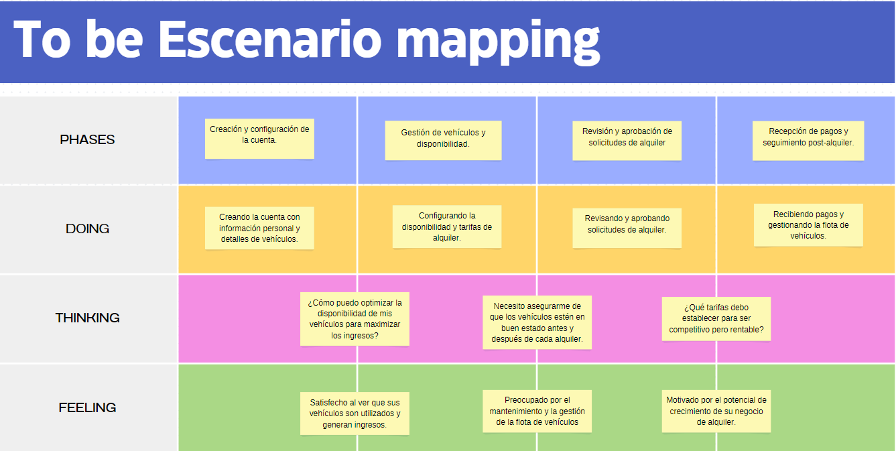
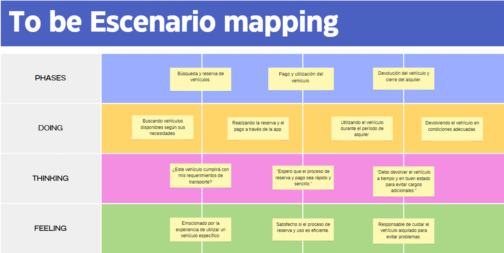
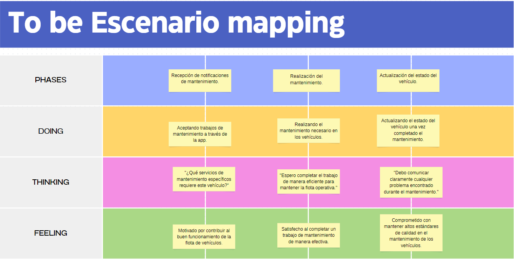

# CAPÍTULO III: Requirements Specification
## 3.1. To-Be Scenario Mapping.
En esta sección se presenta el mapeo de los escenarios, realizando una tabla con la situación a mejorar del segmento objetivo, analizando que pasos se realizarán y cómo se siente.
### Segmento 1:

### Segmento 2:

### Segmento 3:

## 3.2. User Stories.

### Epics

| Nombre                          | Epic# | 
|---------------------------------|-------|
| Gestion de Vehiculos            | EP01  | 
| Monitoreo y Reportes            | EP02  | 
| Clientes y Rentabilidad         | EP03  | 
| Reserva de Vehiculos            | EP04  | 
| Usuario y Navegacion            | EP05  | 
| Registro y Gestion de servicios | EP06  |
| Soporte y Asistencia            | EP07  | 

### User Stories
| Epic / Story ID | Titulo                                     | Descripción                                                                                                                                                   | Criterios de Aceptación                                                                                                                                                                                                                                                                                                                                                                                                                                                                                                                                                                                                                                                                                                                                                                                                                                                                                                                                                                                                                                                                                                                                                                                                                                                                                                                                                                                                                                                                                                                                                                                                                                                                                                     | Relacionado con (Epic ID) |  
|-----------------|--------------------------------------------|---------------------------------------------------------------------------------------------------------------------------------------------------------------|-----------------------------------------------------------------------------------------------------------------------------------------------------------------------------------------------------------------------------------------------------------------------------------------------------------------------------------------------------------------------------------------------------------------------------------------------------------------------------------------------------------------------------------------------------------------------------------------------------------------------------------------------------------------------------------------------------------------------------------------------------------------------------------------------------------------------------------------------------------------------------------------------------------------------------------------------------------------------------------------------------------------------------------------------------------------------------------------------------------------------------------------------------------------------------------------------------------------------------------------------------------------------------------------------------------------------------------------------------------------------------------------------------------------------------------------------------------------------------------------------------------------------------------------------------------------------------------------------------------------------------------------------------------------------------------------------------------------------------|---------------------------|
| US01            | Inscripcion de Vehiculos                   | Cómo Owner quiero inscribir los vehículos a la aplicación para poder ofrecerlos a potenciales usuarios.                                                       | Escenario 1: Inscripción exitosa de vehículos a la aplicación  Given que el Owner de vehículos menores.  When inscribe un nuevo vehículo a la plataforma.  And Ingresa los detalles del vehículo, como marca, modelo, tipo (bicicleta, scooter, moto eléctrica, etc.), disponibilidad, tarifas por uso, ubicación del vehículo, etc.  Then La plataforma procesa la información correctamente y el vehículo queda inscrito y disponible para ser ofrecido a potenciales usuarios. Los usuarios pueden ver el vehículo en la aplicación y realizar reservas.    Escenario 2: Inscripción fallida de vehículos a la aplicación  Given que el owner vehículos menores.  When Intenta inscribir un nuevo vehículo a la plataforma.  And Ingresa los detalles del vehículo, pero comete un error en el ingreso de la información.  Then La plataforma muestra un mensaje de error indicando la razón de la falla en la inscripción del vehículo.                                                                                                                                                                                                                                                                                                                                                                                                                                                                                                                                                                                                                                                                                                                                         | EP01                      | 
| US02            | Establecimiento de Tarifas                 | Cómo Owner quiero establecer tarifas y disponibilidad del vehículo para poder gestionar de manera efectiva la rentabilidad y accesibilidad de los vehículos.  | Escenario 1: Establecimiento exitoso de tarifas y disponibilidad del vehículo  Given que el Owner de vehículos menores.  When Decide establecer las tarifas y la disponibilidad de un vehículo.  And Ingresa las tarifas por hora, por día y por semana, así como la disponibilidad horaria y los días en los que el vehículo estará disponible para alquilar.  Then La plataforma procesa la información correctamente y el vehículo queda configurado con las tarifas y disponibilidad establecidas, permitiéndole gestionar de manera efectiva la rentabilidad y accesibilidad del vehículo para los usuarios.    Escenario 2: Problema al establecer tarifas y disponibilidad del vehículo  Given que el Owner de vehículos menores.  When Intenta establecer las tarifas y la disponibilidad de un vehículo.  And Al ingresar las tarifas o la disponibilidad, comete un error   Then La plataforma muestra un mensaje de error indicando la razón del problema en la configuración de tarifas y disponibilidad del vehículo.                                                                                                                                                                                                                                                                                                                                                                                                                                                                                                                                                                                                                                                  | EP01                      | 
| US03            | Gestionamiento de vehiculos                | Cómo Owner quiero gestionar mis vehículos para gestionar su renta                                                                                             | Escenario 1: Gestión exitosa de vehículos para renta  Given que el Owner de vehículos menores.  When Decide gestionar un vehículo para renta.  And Accede al sistema de gestión de vehículos y selecciona el vehículo que desea gestionar.  Then Puede establecer las tarifas de alquiler, la disponibilidad horaria, los días disponibles y cualquier restricción adicional que desee aplicar.  And El vehículo queda configurado y listo para ser ofrecido a los usuarios para su alquiler, permitiéndome gestionar de manera efectiva la renta del vehículo.     Escenario 2: Problema al gestionar un vehículo para renta  Given que el Owner de vehículos menores.  When Intenta gestionar un vehículo para renta.  And Al intentar configurar las tarifas, la disponibilidad o cualquier otro detalle, comete un error.  Then Debe corregir los datos para poder completar la gestión del vehículo con éxito y ofrecerlo para su renta a los usuarios.                                                                                                                                                                                                                                                                                                                                                                                                                                                                                                                                                                                                                                                                                                                    | EP01                      | 
| US04            | Visualización de tramites                  | Cómo Owner quiero acceder a los estados de trámites de mis vehículos para estar al tanto del progreso de los trámites relacionados.                           | Escenario 1: Acceso exitoso a los estados de trámites de los vehículos  Given que el Owner de vehículos menores.  When Accede al sistema de gestión de trámites de vehículos.  And Selecciona un vehículo específico para revisar su estado de trámite.  Then Puede ver el progreso del trámite, como la renovación de seguros, la inspección técnica, la documentación legal, etc.  And Esta al tanto de cualquier actualización o cambio en el estado del trámite, lo que me permite tomar decisiones informadas y planificar adecuadamente.    Escenario 2: Problema al acceder a los estados de trámites de los vehículos  Given Soy que el Owner de vehículos menores.  When Intenta acceder al sistema de gestión de trámites de vehículos.  And Encuentra un problema técnico que impide la visualización de los estados de trámites.  Then Debe contactar al soporte técnico para obtener asistencia y poder acceder nuevamente a los estados de trámites de sus vehículos.                                                                                                                                                                                                                                                                                                                                                                                                                                                                                                                                                                                                                                                                                             | EP02                      |
| US05            | Visualizacion del recorrido                | Cómo Owner quiero visualizar el recorrido y tiempo de uso de los vehículos a través de la api de google                                                       | Escenario 1: Visualización exitosa del recorrido y tiempo de uso de los vehículos  Given que el Owner de vehículos menores.  When Accede a la API de Google Maps desde el sistema de gestión de vehículos.  And Selecciona un vehículo específico para visualizar su recorrido y tiempo de uso.  Then Puede ver en tiempo real el recorrido que ha realizado el vehículo en el mapa, así como el tiempo total de uso durante un período específico.  And Tiene acceso a información detallada como la distancia recorrida, las paradas realizadas y la duración de cada trayecto, lo que le permite analizar el uso del vehículo y tomar decisiones informadas.    Escenario 2: Problema al visualizar el recorrido y tiempo de uso de los vehículos  Given que el Owner de vehículos menores.  When Intenta acceder a la API de Google Maps desde el sistema de gestión de vehículos.  And Encuentra un problema técnico que impide la visualización del recorrido y tiempo de uso.  Then Debe contactar al soporte técnico para obtener asistencia y poder acceder nuevamente a la información del recorrido y tiempo de uso de mis vehículos.                                                                                                                                                                                                                                                                                                                                                                                                                                                                                                                                | EP02                      | 
| US06            | Historial de reserva                       | Cómo Owner quiero acceder al historial de mis vehículos reservados para monitorear su uso                                                                     | Escenario 1: Acceso exitoso al historial de vehículos reservados  Given que el Owner de vehículos menores.  When Accede al sistema de gestión de reservas desde la plataforma.  And Selecciona un vehículo específico para revisar su historial de reservas.  Then Puede ver el historial completo de todas las reservas realizadas para ese vehículo, incluyendo fechas, duración de la reserva, nombre del cliente, tarifas aplicadas, estado de la reserva, etc.  And Tiene acceso a información detallada sobre cómo se ha utilizado el vehículo a lo largo del tiempo, lo que le permite monitorear su uso de manera efectiva.    Escenario 2: Problema al acceder al historial de vehículos reservados  Given que el Owner de vehículos menores.  When Intenta acceder al sistema de gestión de reservas desde la plataforma.  And Encuentra un problema técnico que impide la visualización del historial de reservas.  Then Debe contactar al soporte técnico de la plataforma para obtener asistencia y poder acceder nuevamente al historial de reservas de sus vehículos.                                                                                                                                                                                                                                                                                                                                                                                                                                                                                                                                                                                            | EP02                      | 
| US07            | Historial de mantenimiento                 | Cómo Owner quiero acceder al historial de mantenimiento y/o reparación realizados a mis vehículos para conocer las condiciones de mis vehículos               | Escenario 1: Acceso exitoso al historial de mantenimiento y reparación  Given que el Owner de vehículos menores.  When Accede al sistema de gestión de mantenimiento y reparaciones desde la plataforma.  And Selecciona un vehículo específico para revisar su historial de mantenimiento y reparaciones.  Then Puede ver el historial completo de todas las actividades de mantenimiento y reparaciones realizadas en el vehículo, incluyendo fechas, tipo de servicio, piezas reemplazadas, costos asociados, notas del mecánico, etc.  And Tiene acceso a información detallada sobre el estado y las condiciones de sus vehículos    Escenario 2: No hay historial de mantenimiento y reparación  Given que el Owner de vehículos menores.  When Intenta acceder al sistema de gestión de mantenimiento y reparaciones desde la plataforma.  Then Visualiza que su vehiculo no tiene historial de mantemimiento.                                                                                                                                                                                                                                                                                                                                                                                                                                                                                                                                                                                                                                                                                                                                                               | EP02                      | 
| US08            | Visualización del perfil de cliente        | Cómo Owner quiero visualizar el perfil del cliente que hace uso de mi vehículo para conocer a mi cliente                                                      | Escenario 1: Visualización exitosa del perfil del cliente  Given que el Owner de vehículos menores.  When Accede al sistema de gestión de clientes desde la plataforma.  And Selecciona el perfil de un cliente que ha hecho uso de su vehículo.  Then Puede ver información detallada del cliente, como nombre, contacto, fotografia y comentarios.    Escenario 2: Error al visualizar el perfil del cliente  Given que el Owner de vehículos menores.  When Intenta acceder al sistema de gestión de clientes desde la plataforma.  And Encuentra un problema técnico que impide la visualización del perfil del cliente.  Then Debe contactar al soporte técnico de la plataforma .                                                                                                                                                                                                                                                                                                                                                                                                                                                                                                                                                                                                                                                                                                                                                                                                                                                                                                                                                                                             | EP03                      | 
| US09            | Retiro de ingresos                         | Cómo Owner quiero retirar los ingresos generados por los vehículos para ampliar mi flota                                                                      | Escenario 1: Retiro exitoso de ingresos generados por los vehículos  Given que el Owner de vehículos menores.  When Accede al sistema de gestión financiera desde la plataforma.  And Selecciona la opción de retirar ingresos generados por los vehículos.  Then Puede ver el monto total de ingresos disponibles para retirar.  And Procede a retirar los ingresos y el sistema confirma la transacción exitosa.    Escenario 2: Problema al retirar los ingresos generados por los vehículos  Given que el Owner de vehículos menores.  When Intenta retirar los ingresos generados por los vehículos desde la plataforma.  And Utiliza un metodo de deposito incorrecto  Then el sistema le arroja un aviso de fallo en el pago.                                                                                                                                                                                                                                                                                                                                                                                                                                                                                                                                                                                                                                                                                                                                                                                                                                                                                                                                            | EP03                      | 
| US10            | Visualización de catalogo de vehiculos     | Como cliente quiero visualizar el catálogo de vehículos disponibles según tipo y disponibilidad para seleccionar el mejor ajuste a mis necesidades            | Escenario 1: Visualización exitosa del catálogo de vehículos disponibles  Given que el cliente de la aplicación de alquiler de vehículos menores.  When Accede al catálogo de vehículos desde la aplicación.  And Selecciona el tipo de vehículo que deseo ver, como bicicletas, scooters, motos eléctricas, etc.  Then Se muestra una lista de vehículos disponibles del tipo seleccionado, con información detallada como modelo, características, tarifas por hora o día, ubicación y disponibilidad.  And Puede navegar por el catálogo, comparar opciones y seleccionar el vehículo que mejor se ajuste a sus necesidades.    Escenario 2: Problema al visualizar el catálogo de vehículos disponibles  Given que el cliente de la aplicación de alquiler de vehículos menores.  When Intenta acceder al catálogo de vehículos desde la aplicación.  And Encuentra un problema técnico que impide cargar o mostrar el catálogo.  Then Debe contactar con el soporte tecnico de la plataforma.                                                                                                                                                                                                                                                                                                                                                                                                                                                                                                                                                                                                                                                                              | EP04                      | 
| US11            | Reserva de vehiculo                        | Como cliente quiero reservar un vehículo para desplazarme por la ciudad                                                                                       | Escenario 1: Reserva exitosa de un vehículo  Given que el cliente de la aplicación de alquiler de vehículos menores.  When Accede al catálogo de vehículos disponibles desde la aplicación.  And Selecciona el vehículo que deseo reservar, considerando la disponibilidad, ubicación y tipo de vehículo que necesita.  And Elije la fecha y hora de inicio de su reserva, así como la duración del alquiler.  Then Confirma la reserva y la aplicación procesa la solicitud con éxito.    Escenario 2: Error de pago al reservar un vehículo  Given que el cliente de la aplicación de alquiler de vehículos menores.  When Intenta reservar un vehículo desde la aplicación.  And Encuentra que su informacion de pago no cuenta con fondos  Then debe utilizar otro metodo de pago.                                                                                                                                                                                                                                                                                                                                                                                                                                                                                                                                                                                                                                                                                                                                                                                                                                                                                          | EP04                      | 
| US12            | Gestion del servicio                       | Como cliente quiero gestionar el servicio para poder finalizarlo cuando lo requiera                                                                           | Escenario 1: Gestión exitosa del servicio  Given que el cliente de la aplicación de alquiler de vehículos menores.  When Accede a su cuenta en la aplicación.  And Selecciona el servicio que desea gestionar, como la reserva de un vehículo.  And Encuentra la opción de finalizar el servicio dentro de la aplicación.  Then Confirma la finalización del servicio y la aplicación procesa la solicitud con éxito.    Escenario 2: Problema al gestionar el servicio  Given Soy que el cliente de la aplicación de alquiler de vehículos menores.  When Intenta gestionar un servicio desde la aplicación.  And Encuentra un error falta de conectividad.  Then Debe intentar nuevamente la gestión del servicio después de verificar su conexión a internet.                                                                                                                                                                                                                                                                                                                                                                                                                                                                                                                                                                                                                                                                                                                                                                                                                                                                                                                | EP04                      | 
| US13            | Visualizar tiempo y distancia de recorrido | Como cliente quiero visualizar en tiempo real la distancia y tiempo recorrido para gestionar mejor mi uso del servicio                                        | Escenario 1: Visualización en tiempo real de la distancia y tiempo recorrido  Given que el cliente de la aplicación de alquiler de vehículos menores.  When Accede al servicio de alquiler de vehículos y comienza su viaje.  And Utiliza la función de seguimiento en tiempo real dentro de la aplicación.  Then Puede ver la distancia recorrida y el tiempo transcurrido en tiempo real mientras usa el vehículo.    Escenario 2: Error visualizacion de la distancia y tiempo recorrido en tiempo real  Given Soy que el cliente de la aplicación de alquiler de vehículos menores.  When Intenta utilizar la función de seguimiento en tiempo real dentro de la aplicación.  And Encuentra un problema técnico que impide la visualización de la distancia y tiempo recorrido en tiempo real.  Then Debe contactar al servicio tecnico de la plataforma                                                                                                                                                                                                                                                                                                                                                                                                                                                                                                                                                                                                                                                                                                                                                                                                                        | EP05                      | 
| US14            | Visualizar restricciones                   | Como cliente quiero visualizar los límites de uso de mi vehículo reservado a través de la API de google maps para asegurarme de cumplir con las restricciones | Escenario 1: Visualización exitosa de los límites de uso del vehículo  Given que el cliente es usuario de la aplicación  When Accedo a mi reserva de vehículo desde la aplicación.  And Utilizo la API de Google Maps integrada en la aplicación.  And La API muestra los límites de uso del vehículo, como zonas restringidas o áreas permitidas.  Then Puedo asegurarme de cumplir con las restricciones y usar el vehículo de manera adecuada dentro de los límites establecidos.    Escenario 2: Problema al visualizar los límites de uso del vehículo  Given Soy un cliente de la aplicación de alquiler de vehículos menores.  When Intento visualizar los límites de uso del vehículo a través de la API de Google Maps.  And Encuentro un problema técnico que impide la visualización de los límites de uso.  Then Debo cerrar y volver a abrir la aplicación para intentar nuevamente.  And Si el problema persiste, debo contactar al soporte técnico de la aplicación para obtener asistencia y resolver el problema.  And Una vez que el problema se soluciona, puedo visualizar los límites de uso del vehículo para asegurarme de cumplir con las restricciones establecidas.                                                                                                                                                                                                      | EP05                      | 
| US15            | Alerta de vias                             | Como cliente quiero recibir alertas del estado de vía a través de la API de google maps para conocer las condiciones de las vías                              | Escenario 1: Recepción exitosa de alertas del estado de vía  Given que el cliente de la aplicación de alquiler de vehículos menores.  When Accede a la API de Google Maps integrada en la aplicación.  And Activa la función de alertas del estado de vía.  And La API envía alertas en tiempo real sobre condiciones de tráfico, accidentes u otros eventos que puedan afectar mi viaje.    Escenario 2: Problema al recibir alertas del estado de vía  Given el cliente de la aplicación de alquiler de vehículos menores.  When Intento recibir alertas del estado de vía a través de la API de Google Maps.  And Encuentro un problema técnico que impide la recepción de alertas.  Then Debo cerrar y volver a abrir la aplicación para intentar nuevamente.  And Si el problema persiste, debo contactar al soporte técnico de la aplicación para obtener asistencia y resolver el problema.  And Una vez que el problema se soluciona, puedo recibir alertas del estado de vía para conocer las condiciones de las vías durante mi viaje.                                                                                                                                                                                                                                                                                                                                                       | EP05                      | 
| US16            | Inscripcion de taller                      | Cómo mecánico quiero inscribir mi taller a la aplicación, para ofrecer mis servicios                                                                          | Escenario 1: Inscripción exitosa del taller a la aplicación  Given que el mecánico quiere ofrecer sus servicios a través de la aplicación  When accede al sistema de registro de talleres  And completa el formulario de inscripción con los datos del taller, como nombre, dirección, servicios que ofrece, horarios de atención e información de contacto.  Then La aplicación procesa la solicitud de inscripción con éxito y el taller queda registrado en la plataforma.   Escenario 2: Problema al inscribir el taller a la aplicación  Given que el mecánico quiere ofrecer sus servicios a través de la aplicación.  When intenta inscribir su taller en la aplicación.  And se da cuenta que la dirección ingresada a su taller no se encuentra en la base de datos de la aplicación   Then debe verificar la dirección ingresada y asegurarse de que esté correctamente escrita  And si la dirección es correcta, pero aún no se encuentra en la base de datos, debe contactar al equipo de soporte de la aplicación para solicitar la adición de la misma.                                                                                                                                                                                                                                                                                                                                      | EP06                      | 
| US17            | Colocación de tarifas                      | Cómo mecánico quiero establecer tarifas según el tipo de servicio y disponibilidad para brindar una estructura de precios clara                               | Escenario 1: Establecimiento exitoso de tarifas según el tipo de servicio y disponibilidad  Given que el mecánico está registrado en la aplicación.  When accede a la gestión de tarifas de la plataforma.  And selecciona el tipo de servicio al que quiere establecer su tarifa, como mantenimiento o reparación  And define las tarifas para cada tipo de servicio, considerando la complejidad, el tiempo requerido, y otros factores relevantes. Then quedan registradas en la aplicación y son mostradas al cliente.   Escenario 2: Problema al establecer tarifas según el tipo de servicio y disponibilidad  Given que el mecánico está registrado en la aplicación.  When intenta establecer sus tarifas según el tipo de servicio y disponibilidad desde la plataforma.  And su solicitud es rechazada por exceder su tarifa al promedio establecido en la aplicación  Then debe intentar nuevamente ingresar la solicitud con una nueva tarifa  And Si el problema persiste, debe contactar al soporte técnico de la aplicación para obtener asistencia y resolver el problema.                                                                                                                                                                                                                                                                                                             | EP06                      | 
| US18            | Visualizar solicitudes de servicio         | Cómo mecánico quiero acceder a las solicitudes de servicio para poder revisar los detalles                                                                    | Escenario 1: Acceso a las solicitudes de servicio  Given de que el mecánico está registrado en la plataforma.  When accede al sistema de gestión de solicitudes desde la plataforma.  Then puede revisar los detalles de cada solicitud, incluyendo la información del cliente, descripción del problema del vehículo, fecha de solicitud y tipo de servicio solicitado.  And esto le permite prepararse para realizar las tareas requeridas de la solicitud recibida.    Escenario 2: Problema al acceder a las solicitudes de servicio  Given Soy un mecánico registrado en la plataforma.  When Intento acceder al sistema de gestión de solicitudes desde la plataforma.  And Encuentro un problema técnico que impide la visualización de las solicitudes.  Then Verifico mi conexión a internet y refresco la página, pero el problema persiste.  And Contacto al soporte técnico de la aplicación para resolver la dificultad técnica.  And Una vez solucionado el problema, puedo acceder nuevamente a las solicitudes de servicio y revisar los detalles de manera efectiva.                                                                                                                                                                                                                                                                                                                  | EP06                      | 
| US19            | Envio de informe del mantenimiento         | Cómo mecánico quiero realizar y enviar un informe del servicio brindado para documentar los trabajos realizados                                               | Escenario 1: Realización y envío del informe  Given de que el mecánico que ha completado un servicio.  When Accedo al sistema de gestión de informes desde la plataforma.  And Creo un informe detallado del servicio realizado.  Then Envío el informe al cliente a través de la plataforma de comunicación.    Escenario 2: Problema al realizar y enviar el informe  Given Soy un mecánico que ha completado un servicio.  When Intento crear y enviar  un informe del servicio desde la plataforma.  And Encuentro un problema técnico que impide la creación o envío del informe.  Then Contacto al soporte técnico para resolver la dificultad técnica.  And Una vez solucionado el problema, envío el informe para documentar el trabajo realizado.                                                                                                                                                                                                                                                                                                                                                                                                                                                                                                                                                                                                                                             | EP06                      | 
| US20            | Notificación de finalización del servicio  | Cómo mecánico quiero finalizar y notificar la culminación del servicio para informar al cliente que su vehículo está listo                                    | Escenario 1: Finalización y notificación del servicio  Given que el mecánico completa un servicio.  When finalize el servicio y lo ingrese al sistema.  Then el sistema envía una notificación al cliente informando que su vehículo está listo.    Escenario 2: Problema al finalizar y notificar el servicio  Given Soy un mecánico que ha completado un servicio.  When Intento finalizar el servicio pero encuentro un problema técnico.  Then Contacto al soporte técnico para resolver la dificultad.  And Una vez solucionado, notifico al cliente sobre la culminación del servicio.                                                                                                                                                                                                                                                                                                                                                                                                                                                                                                                                                                                                                                                                                                                                                                                                                       | EP06                      | 
| US21            | Gestión de ingresos                        | Cómo mecánico quiero gestionar los ingresos generados por el servicio para llevar un registro preciso de los pagos recibidos                                  | Escenario 1: Gestión de ingresos generados por el servicio  Given que el mecánico completa un servicio.  When accede a su billetera virtual desde la plataforma.  And registra el pago recibido por el servicio realizado.  Then El sistema actualiza automáticamente el registro de ingresos para llevar un registro preciso de los pagos recibidos.    Escenario 2: Problema al gestionar los ingresos generados  Given Soy un mecánico que ha completado un servicio.  When Intento registrar el pago pero encuentro un problema técnico.  Then Contacto al soporte técnico para resolver la dificultad.  And Una vez solucionado, registro el pago para mantener un registro preciso de los ingresos generados.                                                                                                                                                                                                                                                                                                                                                                                                                                                                                                                                                                                                                                                                                            | EP06                      | 
| US22            | Visualizar historial de mantenimiento      | Cómo mecánico quiero acceder al historial de mantenimiento realizado a los vehículos para tener un registro de las reparaciones anteriores                    | Escenario 1: Acceso al historial de mantenimiento de vehículos  Given que el mecánico está registrado en la plataforma.  When accede al sistema de historial de mantenimiento desde la plataforma.  And buca el vehículo específico del cual quiere revisar el historial de mantenimiento.  Then puede ver un registro detallado de todas las reparaciones y mantenimientos previos realizados a ese vehículo, incluyendo fechas, trabajos realizados, piezas reemplazadas y notas adicionales.     Escenario 2: Problema al acceder al historial de mantenimiento  Given Soy un mecánico registrado en la plataforma.  When Intento acceder al historial de mantenimiento de un vehículo.  And Encuentro un problema técnico que impide la visualización del historial.  Then Contacto al soporte técnico para resolver la dificultad.  And Una vez solucionado, accedo al historial de mantenimiento para tener un registro completo de las reparaciones anteriores del vehículo.                                                                                                                                                                                                                                                                                                                                                                                                                        | EP06                      | 
| US23            | Comunicación con soporte                   | Cómo Owner quiero comunicarme con alguien de soporte a través del apartado de soporte para solicitar ayuda o presentar algún reclamo.                         | Escenario 1: Comunicación con el soporte a través del apartado de soporte  Given que el Owner está registrado en la plataforma.  When accede al apartado de soporte.  And evia su solicitud de ayuda o reclamo detallando su problema.  Then el equipo de soporte recibe su solicitud y se comunica con el usuario para brindarle asistencia o resolver su reclamo.    Escenario 2: Problema al comunicarme con el soporte  Given Soy un Owner registrado en la plataforma.  When Intento comunicarme con el soporte pero encuentro un problema técnico.  Then Verifico mi conexión a internet y refresco la página.  And Si persiste, busco información de contacto alternativa para comunicarme.  And Una vez establecida la comunicación, presento mi solicitud al equipo de soporte.                                                                                                                                                                                                                                                                                                                                                                                                                                                                                                                                                                                                                   | EP07                      | 
| US24            | Visualizar historial de reservas           | Como cliente quiero ver historial de reservas para llevar un seguimiento de uso                                                                               | Escenario 1: Visualización del historial de reservas  Given que el cliente está registrado.  When accede a su cuenta en la aplicación.  Then ve una lista de reservas anteriores con detalles como fecha, vehículo y duración.    Escenario 2: Problema al ver historial de reservas  Given Soy un cliente registrado.  When Intento ver el historial de reservas pero hay un problema técnico.  Then Refresco la página y vuelvo a intentar.  And Si persiste, contacto al soporte técnico para solucionarlo.                                                                                                                                                                                                                                                                                                                                                                                                                                                                                                                                                                                                                                                                                                                                                                                                                                                                                                     | EP07                      | 
| US25            | Comunicación con soporte                   | Como cliente quiero comunicarme con alguien de soporte a través del apartado de soporte para solicitar ayuda o presentar algún reclamo.                       | Escenario 1: Comunicación con el soporte a través del apartado de soporte  Given que el cliente esá registrado en la plataforma.  When accede al apartado de soporte desde la plataforma.  And envia su solicitud de ayuda o reclamo detallando su problema.  Then el equipo de soporte recibe su solicitud y se comunica con el cliente para brindarle la ayuda necesaria o resolver su reclamo.    Escenario 2: Problema al comunicarme con el soporte  Given Soy un cliente registrado en la plataforma.  When Intento comunicarme con el soporte pero encuentro un problema técnico.  Then Verifico mi conexión a internet y refresco la página.  And Si el problema persiste, busco información de contacto alternativa para comunicarme.  And Una vez establecida la comunicación, presento mi solicitud al equipo de soporte.                                                                                                                                                                                                                                                                                                                                                                                                                                                                                                                                                                       | EP07                      | 
| US26            | Comunicación con soporte                   | Como mecánico quiero comunicarme con alguien de soporte a través del apartado de soporte para solicitar ayuda o presentar algún reclamo.                      | Escenario 1: Comunicación con el soporte a través del apartado de soporte  Given que el mecánico está registrado en la plataforma.  When accede al apartado de soporte desde la plataforma.  And envia su solicitud de ayuda o reclamo detallando su problema.  Then el equipo de soporte recibe su solicitud y se comunica con el cliente para brindar la asistencia necesaria o resolver su reclamo.    Escenario 2: Problema al comunicarme con el soporte  Given Soy un mecánico registrado en la plataforma.  When Intento comunicarme con el soporte pero encuentro un problema técnico.  Then Verifico mi conexión a internet y refresco la página.  And Si persiste, busco información de contacto alternativa para comunicarme.  And Una vez establecida la comunicación, presento mi solicitud al equipo de soporte.                                                                                                                                                                                                                                                                                                                                                                                                                                                                                                                                                                             | EP07                      | 
## 3.3. Impact Mapping.

En esta sección se muestra un gráfico que incluye los business goals del negocio así como tiene un impacto en nuestras user personas.
### Segmento 1:

### Segmento 2:

### Segmento 3:

## 3.4. Product Backlog.

| #Orden | User Story Id | Título                                     | Descripción                                                                                                                                                   | StoryPoints (1/2/3/5/8) |
|--------|---------------|--------------------------------------------|---------------------------------------------------------------------------------------------------------------------------------------------------------------|-------------------------|
| 1      | US01          | Inscripcion de vehiculos                   | Cómo Owner quiero inscribir los vehículos a la aplicación para poder ofrecerlos a potenciales usuarios                                                        | 8                       | 
| 2      | US02          | Establecimiento de Tarifas                 | Cómo Owner quiero establecer tarifas y disponibilidad del vehículo para poder gestionar de manera efectiva la rentabilidad y accesibilidad de los vehículos.  | 5                       |
| 3      | US03          | Gestionamiento de vehiculos                | Cómo Owner quiero gestionar mis vehículos para gestionar su renta                                                                                             | 5                       |
| 4      | US04          | Visualización de tramites                  | Cómo Owner quiero acceder a los estados de trámites de mis vehículos para estar al tanto del progreso de los trámites relacionados                            | 3                       |
| 5      | US05          | Visualización del recorrido                | Cómo Owner quiero visualizar el recorrido y tiempo de uso de los vehículos a través de la API de google                                                       | 5                       |
| 6      | US06          | Historial de reserva                       | Cómo Owner quiero acceder al historial de mis vehículos reservados para monitorear su uso                                                                     | 3                       |
| 7      | US07          | Historial de mantenimiento                 | Cómo Owner quiero acceder al historial de mantenimiento y/o reparación realizados a mis vehículos para conocer las condiciones de mis vehículos               | 3                       |
| 8      | US08          | Visualización del perfil de cliente        | Cómo Owner quiero visualizar el perfil del cliente que hace uso de mi vehículo para conocer a mi cliente                                                      | 5                       |
| 9      | US09          | Retiro de ingresos                         | Cómo Owner quiero retirar los ingresos generados por los vehículos para ampliar mi flota                                                                      | 5                       |
| 10     | US10          | Visualización de catalogo de vehiculos     | Como cliente quiero visualizar el catálogo de vehículos disponibles según tipo y disponibilidad para seleccionar el mejor ajuste a mis necesidades            | 3                       |
| 11     | US11          | Reserva de vehiculo                        | Como cliente quiero reservar un vehículo para desplazarme por la ciudad.                                                                                      | 8                       |
| 12     | US12          | Gestion del servicio                       | Como cliente quiero gestionar el servicio para poder finalizarlo cuando lo requiera                                                                           | 8                       |
| 13     | US13          | Visualizar tiempo y distancia de recorrido | Como cliente quiero visualizar en tiempo real la distancia y tiempo recorrido para gestionar mejor mi uso del servicio                                        | 5                       |
| 14     | US14          | Visualizar restricciones                   | Como cliente quiero visualizar los límites de uso de mi vehículo reservado a través de la API de google maps para asegurarme de cumplir con las restricciones | 5                       |
| 15     | US15          | Alerta de vias                             | Como cliente quiero recibir alertas del estado de vía a través de la API de google maps para conocer las condiciones de las vías                              | 5                       |
| 16     | US16          | Inscripcion de taller                      | Cómo mecánico quiero inscribir mi taller a la aplicación, para ofrecer mis servicios                                                                          | 8                       |
| 17     | US17          | Colocación de tarifas                      | Cómo mecánico quiero establecer tarifas según el tipo de servicio y disponibilidad para brindar una estructura de precios clara                               | 5                       |
| 18     | US18          | Visualizar solicitudes de servicio         | Cómo mecánico quiero acceder a las solicitudes de servicio para poder revisar los detalles                                                                    | 5                       |
| 19     | US19          | Envio de informe del mantenimiento         | Cómo mecánico quiero realizar y enviar un informe del servicio brindado para documentar los trabajos realizados                                               | 5                       |
| 20     | US20          | Notificación de finalización del servicio  | Cómo mecánico quiero finalizar y notificar la culminación del servicio para informar al cliente que su vehículo está listo                                    | 3                       |
| 21     | US21          | Gestión de ingresos                        | Cómo mecánico quiero gestionar los ingresos generados por el servicio para llevar un registro preciso de los pagos recibidos                                  | 5                       |
| 22     | US22          | Visualizar historial de mantenimiento      | Cómo mecánico quiero acceder al historial de mantenimiento realizado a los vehículos para tener un registro de las reparaciones anteriores                    | 3                       |
| 23     | US23          | Comunicación con soporte                   | Cómo Owner quiero comunicarme con alguien de soporte a través del apartado de soporte para solicitar ayuda o presentar algún reclamo                          | 3                       |
| 24     | US24          | Visualizar historial de reservas           | Como cliente quiero ver historial de reservas para llevar un seguimiento de uso                                                                               | 3                       |
| 25     | US25          | Comunicación con soporte                   | Como cliente quiero comunicarme con alguien de soporte a través del apartado de soporte para solicitar ayuda o presentar algún reclamo.                       | 3                       |
| 26     | US26          | Comunicación con soporte                   | Como mecánico quiero comunicarme con alguien de soporte a través del apartado de soporte para solicitar ayuda o presentar algún reclamo.                      | 3                       |
