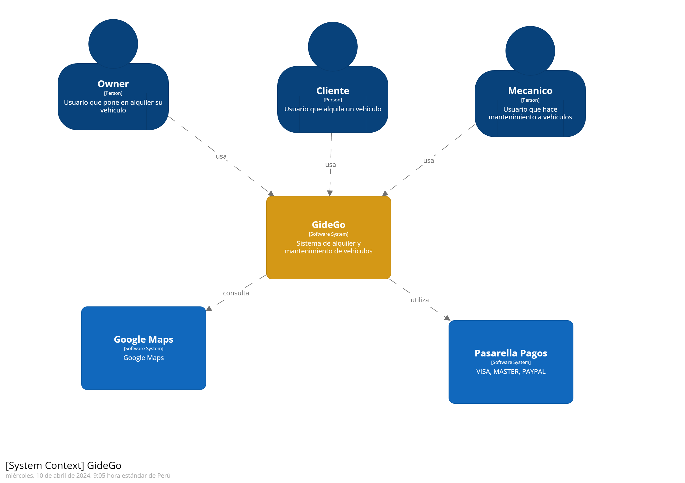
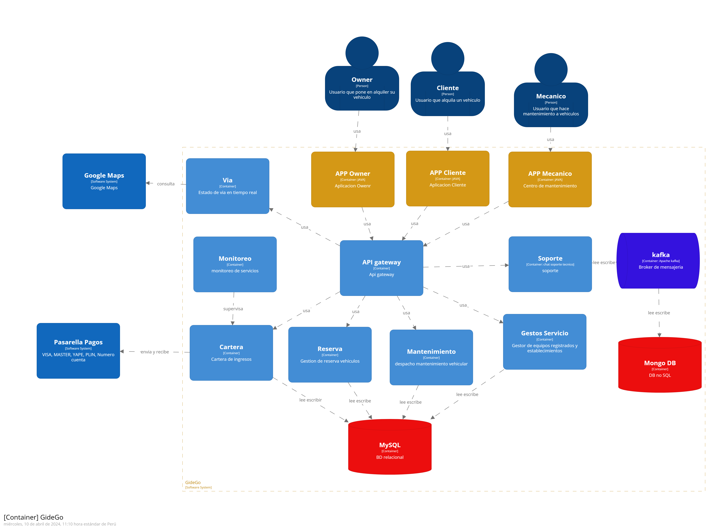

# Capítulo IV: Product Design
## 4.1. Style Guidelines.
### 4.1.1. General Style Guidelines.

### 4.1.2. Web Style Guidelines.

 

## 4.2. Information Architecture.
### 4.2.1. Organization Systems.
### 4.2.2. Labeling Systems.

### 4.2.3. SEO Tags and Meta Tags

### 4.2.4. Searching Systems.

### 4.2.5. Navigation Systems.

## 4.3. Landing Page UI Design.
### 4.3.1. Landing Page Wireframe.

### 4.3.2. Landing Page Mock-up.

## 4.4. Web Applications UX/UI Design.
### 4.4.1. Web Applications Wireframes.

### 4.4.2. Web Applications Wireflow Diagrams.

### 4.4.3. Web Applications Mock-ups.

### 4.4.4. Web Applications User Flow Diagrams.

## 4.5. Web Applications Prototyping.
[URL del Prototipo (Hecho en figma)](https://www.example.com)
## 4.6. Domain-Driven Software Architecture.
### 4.6.1. Software Architecture Context Diagram.

### 4.6.2. Software Architecture Container Diagrams.
 

### 4.6.3. Software Architecture Components Diagrams.
## 4.7. Software Object-Oriented Design.
### 4.7.1. Class Diagrams.
### 4.7.2. Class Dictionary.

## 4.8. Database Design.
### 4.8.1. Database Diagram.
