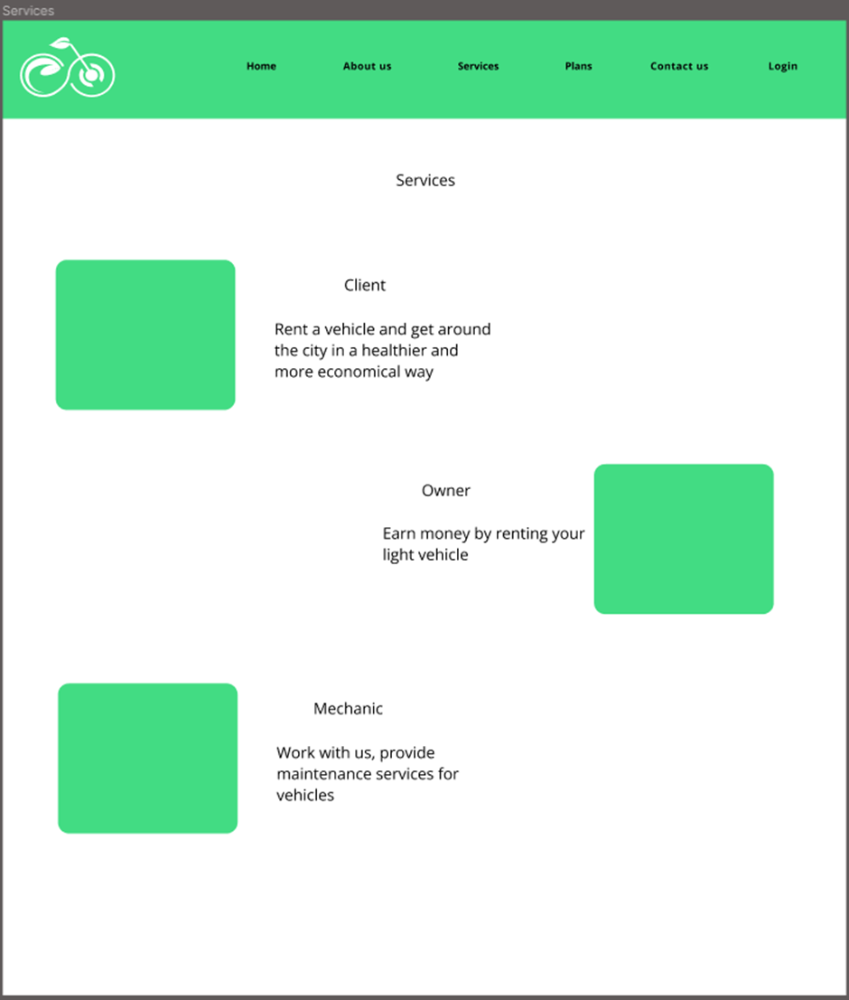

# Capitulo IV: Product Design

## 4.1. Style Guidelines.

En esta sección se especifican los estilos generales de la aplicación web para el proceso de Front-End.

### 4.1.1. General Style Guidelines.

Nuestro prototipo web integrará ciertos ajustes de colores, fuente de letra o tipografía
y creación de un diseño estructural de la plataforma.
El color verde brillante de nuestro logo y nuestros interfaces anima a las personas a tomar otras alternativas 
de deciones en su transporte diarío, ya que dicho color representa la naturaleza y frescura.
La tipografía que aplicamos en nuestro prototipo es Open Sans, ya que, ayuda a darle un estilo
amigable a nuestra aplicación web, gracias a la tipografía cierta información que se encuentre en
el sitio web se verá ordenada y entendible por nuestros segmentos objetivos.

#### Paleta de colores

- **Verde Brillante:** #ADE366 (Es el color primario que se aplicará a nuestro aplicación web en la mayor parte)
- **Gris Azulado:** #5D6D7E (Color que se aplicará de manera simultanea en los botones)
- **Blanco:** #E4E4E4 (Dicho color se aplicará en textos o fondo de aplicación web)

#### Tipografía

Se define el tipo de tipografía que se utilizará en todo el proyecto.

#### Logo de GlideGo:
Nuestro logo representa un tono de verde con el código hexadecimal #ADE366, combina una bicicleta y 
una hoja de planta. La bicicleta simboliza movilidad, libertad y sostenibilidad, por otro lado la 
hoja representa la naturaleza y el compromiso con el medio ambiente. Esta combinación refleja nuestra 
visión de ofrecer soluciones de movilidad ecológica y sostenible. 

#### Logo vertical:

#### Logo horizontal:

### 4.1.2. Web Style Guidelines.
Nuestra web utiliza el Patrón Z, una estructura diseñada para guiar al usuario por la página de manera natural y efectiva. En la parte superior se encontrará la barra de navegación con un tono verde grisáceo, que brinda un aspecto serio y confiable. Esta barra contiene el logo y secciones como “Conocenos”, “Servicios”, “Planes” y “Obtener”. El boton de obtener es de color naranja que añade un toque de energia y atencion al diseño, contrasta con el resto de la página para invitar al usuario a descargar y probar la aplicación. 

Las tipografías que se aplicarán para el desarrollo de la web son:
Open Sans

## 4.2. information architecture.

### 4.2.1. Organization Systems.
Para el caso de organización visual utilizaremos el sistema jerárquico, lo que nos permitirá resaltar los componentes a los que deseamos que el usuario preste mayor atención. Esto dirigirá la atención del usuario a componentes de suma importancia como son: “About us”, “Services”, “Plans”, “Contact” y “Register”.

Para el proceso de reservas de vehículos haremos uso de la organización secuencial:
- Solicitud de reserva(clientes):
1. Búsqueda de vehículos
2. Elección del tipo de vehículo
3. Solicitud de reserva
4. Entrega del vehículo
5. Devolución del vehículo
- Solicitud de la inscripción de vehículos(owner):
1. Inscripción de vehículo a la plataforma
2. Establecer tarifa y disponibilidad del vehículo
3. Publicar disponibilidad del vehículo

Para los esquemas de organización utilizaremos los siguientes tipos:

- Organización por orden cronológico para el historial de reservas y las reseñas a los clientes
- Organización por segmentos(uso/tipo) para la sección de “Mis vehículos” del Owner.
- Organización por orden alfabético para la sección “Mis vehículos” del Owner y la sección “Mantenimiento” del mecánico.

### 4.2.2. Labeling Systems.
Para el uso de etiquetas de nuestro landing page, se ha elegido un lenguaje sencillo lo que permite a los usuarios familiarizarse con facilidad a las opciones proporcionadas. Esto logrará que los usuarios puedan navegar de manera intuitiva.

En el Landing Page:

| Etiqueta       | Descripcion                                                                              | 
|----------------|------------------------------------------------------------------------------------------|
| Inicio         | Apartado donde se muestra la información de la aplicación explicando sus características | 
| Sobre nosotros | Apartado donde se informa al usuario sobre el equipo y el propósito.                     |
| Servicios      | Apartado donde se muestra el tipo de usuario que puede ser y sus ventajas.               |
| Planes         | Apartado donde se muestran todos los planes de suscripción                               |
| Contactanos    | Apartado donde el usuario puede comunicarse con nosotros.                                |
| Iniciar Sesion | Apartado para ingresar a la cuenta de usuario.                                           |

Para la página es importante, un sistema de etiquetado efectivo para permitir que los usuarios encuentren fácilmente la información y los servicios que necesitan. Nuestro sistema de etiquetado considera cuidadosamente cómo presentar la información en el sitio web. Después de establecer la organización visual y los esquemas de categorización del contenido, se elegirá etiquetas claras y concisas que reflejan el lenguaje común y la comprensión del usuario con palabras comunes no pasan de tres palabras.  Nos aseguraremos de utilizar etiquetas intuitivas y fáciles de recordar para representar los diferentes conjuntos de información y asociaciones entre ellos. También se utilizarán diferentes colores y diseños para resaltar y diferenciar las etiquetas y conjuntos de información en mi sitio web.  Para evitar confusiones y asegurar la coherencia visual en todo el sitio web, se mantendrá un sistema de etiquetado consistente y se evitará el uso de términos técnicos o jerga que podría ser confuso para los usuarios. Usaremos un botón de “más información”. Dirige a los usuarios a visualizar más detalles de preguntas y respuestas a sus problemas mediante correo por la cual nos brindaras tu nombre, correo y número.  En el parte superior derecho del home page contando con cuatro botones
- Conócenos: Muestra quiénes somos, nuestro propósito y equipo.
- Servicios: Muestra lo que ofrecemos al usuario para mejorar financieramente.
- Planes: Muestra el plan que quiere adquirir lo cual le llevará a registrarse.
- Obtener: Muestra las opciones de descarga para Android y IOS. 

### 4.2.3. SEO Tags and Meta Tags

Title:

### 4.2.4. Searching Systems.
En esta sección implementaremos dos métodos para facilitar la experiencia de búsqueda a nuestros usuarios.
Se utilizará un sistema de búsqueda por texto para que nuestros usuarios puedan buscar su vehículo y tener una elección más personalizada.

Además, se incluirá filtros de la siguiente manera:
- Filtros por tipo de vehículo
- Filtros por marca de vehiculo
- Filtros por color de vehículo
- Filtros por disponibilidad de ubicación

### 4.2.5. Navigation Systems.
Como sistema de navegación optamos emplear una barra de menú horizontal que guiará al usuario por las diferentes secciones con títulos claves y estáticos, esto facilitará al usuario a tener todas las herramientas a la mano y así disfrutar de una mejor navegación.
Nuestra barra de menú contará con las siguientes secciones:

- **About us:** El usuario podrá visualizar a qué se dedica la empresa, su misión y visión, y el equipo detrás de esta aplicación
- **Services:** El usuario podrá visualizar los servicios que estamos ofreciendo, si en caso quiera ser un Owner, un cliente o un mecanico.
- **Plans:** Aquí podrá obtener toda la información de los planes semanales, mensuales y trimestrales que la aplicación le ofrece y además de poder registrarse.
- **Contact us:** Donde los usuarios a través de un formulario podrán ponerse en contacto con nosotros .

## 4.3. Landing Page UI Design.
### 4.3.1. Landing Page Wireframe.
Link de figma: https://www.figma.com/file/zI2Ms3m44qqaav0cmkBFEp/INNOVATECH?type=design&node-id=0-1&mode=design&t=QeMym2oXpQQRRkGe-0 

-

### 4.3.2 Landing Page Mock-up.
Link Figma: https://www.figma.com/file/zI2Ms3m44qqaav0cmkBFEp/INNOVATECH?type=design&node-id=75%3A2&mode=design&t=vmMKxEV2F816IZC1-1

## 4.4. Web Applications UX/UI Design
### 4.4.1. Web Applications Wireframes

### 4.4.2. Web Applications Wireflow Diagram

### 4.4.3. Web Applications Mock-ups

### 4.4.4. Web Applications User Flow Diagrams

## 4.5. Web Applications Prototyping
Link del prototipo: https://www.figma.com/proto/zI2Ms3m44qqaav0cmkBFEp/INNOVATECH?type=design&node-id=200-1238&t=aAU6xJx7nPHgsRyD
Link del video: https://upcedupe-my.sharepoint.com/:v:/g/personal/

## 4.6. Domain-Driven Software Architecture
### 4.6.1. Software Architecture Context Diagram

### 4.6.2. Software Architecture Container Diagrams

## 4.7. Software Object-Oriented Design
### 4.7.1. Class Diagrams
Para desarrollar el diagrama de clases para nuestro proyecto, se usó la herramienta de Lucidchart.

Fuente: Imagen propia
Link: https://lucid.app/lucidchart/0f72fb11-fe3b-4ad5-8b62-a201354f531b/edit?viewport_loc=-2533%2C-2114%2C5817%2C2432%2C0_0&invitationId=inv_31b6a745-b508-40b3-92e3-08ec5e032b70

### 4.7.2. Class Dictionary
**Usuario**

|Atributo|Tipo de dato|Descripción|
|-|-|-|
|id_usuario|int|Código de 4 dígitos para identificar al usuario.|
|nombres|string|Nombre y apellidos completos del usuario.|
|edad|int|Edad de la persona, principalmente para validar al usuario que es mayor de edad.|
|direccion|string|Dirección de la persona donde vive actualmente.|
|numero_telefono|string|Número telefónico de la persona asociado a whatsapp.|
|usuario|string|Usuario de la persona para acceder a la aplicación web.|
|contraseña|string|Clave personal de la persona|

**Owner**

|Atributo|Tipo de dato|Descripción|
|-|-|-|
|id_usuario|int|Código de 4 dígitos para identificar al usuario.|
|nombres|string|Nombre y apellidos completos del usuario.|
|edad|int|Edad de la persona, principalmente para validar al usuario que es mayor de edad.|
|direccion|string|Dirección de la persona donde vive actualmente.|
|numero_telefono|string|Número telefónico de la persona asociado a whatsapp.|
|vehiculo|string|Vehiculo que dispone para poner en alquiler.|
|usuario|string|Usuario de la persona para acceder a la aplicación web.|
|contraseña|string|Clave personal de la persona.|

## 4.8. Database Design
### 4.8.1. Database Diagram
Para desarrollar la estructura de diagrama de base de datos usamos la herramienta de Vertabelo. A continuación, muestra las tabla de diseño de base de datos.
