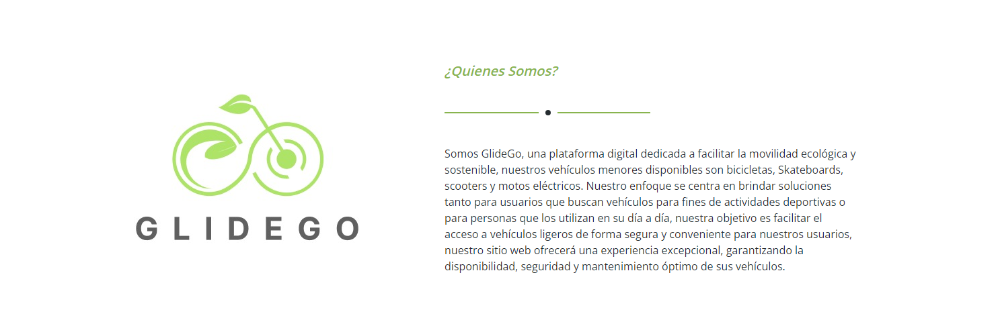
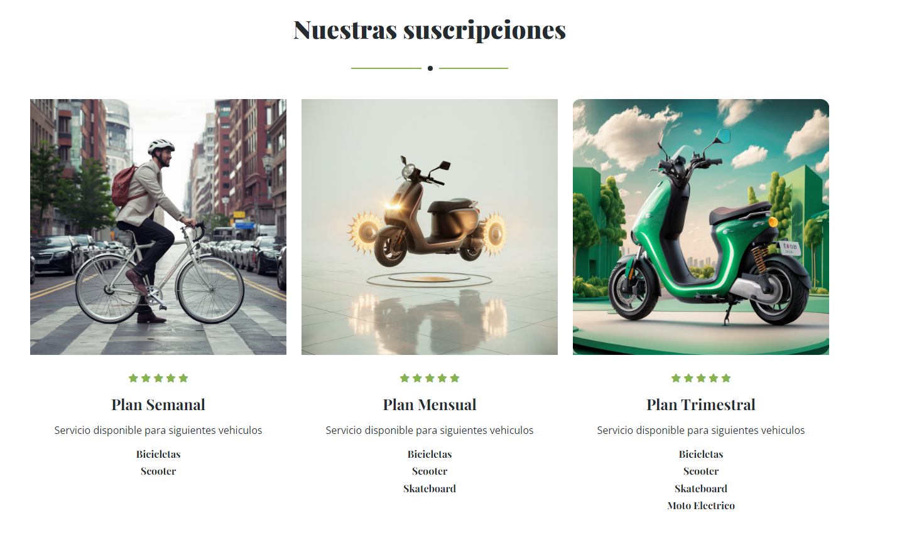
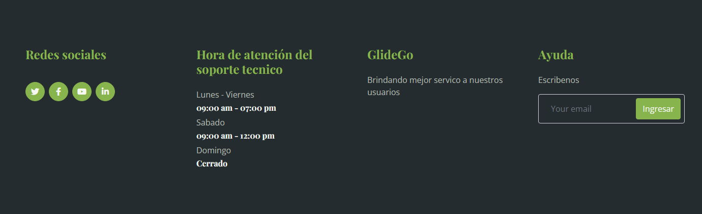
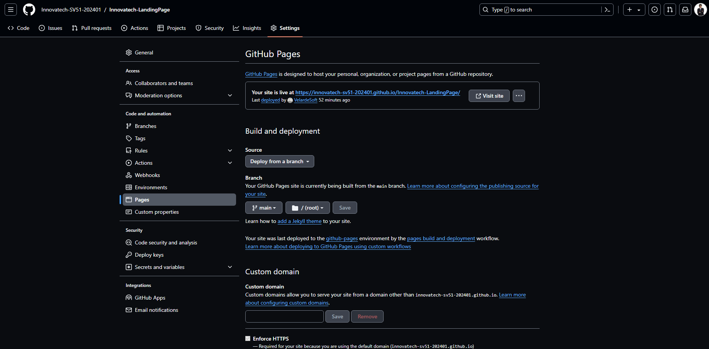
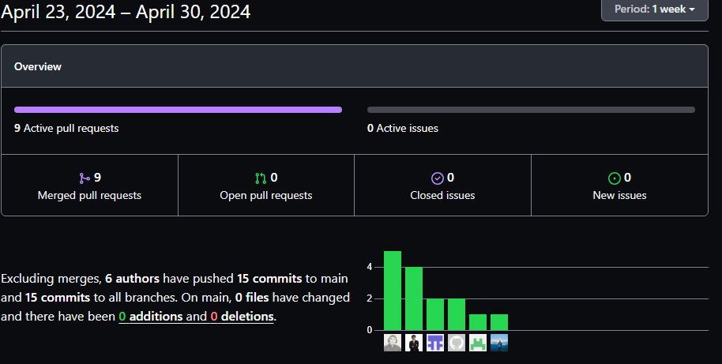
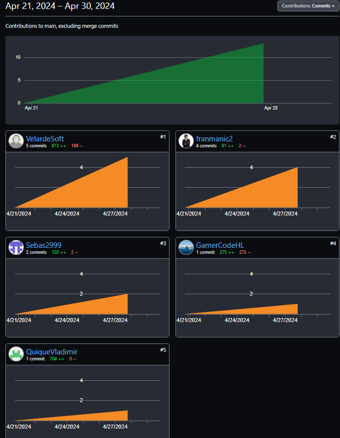
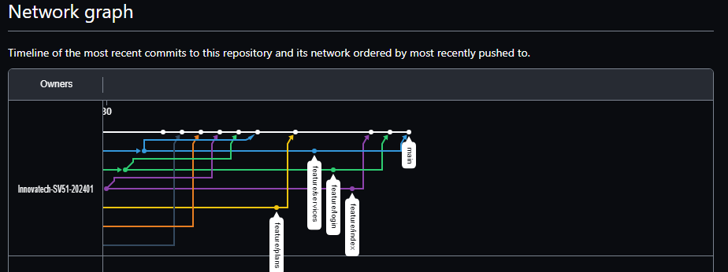

# Capítulo V: Product Implementation, Validation & Deployment.

## 5.1. Software Configuration Management.

**Project Management**

- Google Drive

Plataforma gratuita que te permite almacenar archivos y acceder a ellos desde 
cualquier lugar utilizando la nube. 

Propósito en el proyecto: El equipo ha utilizado Google 
Drive como centro de organización principal para llevar un registro de los puntos pendientes
realizados y por realizar. También han utilizado la herramienta Trello para establecer hitos 
y plazos. En cuanto a las consultas y dudas, se han resuelto mediante reuniones grupales por meet.

**Requirements Management**

El trabajo asignado a cada estudiante ha sido revisado y evaluado por todo el equipo Innovatech para
asegurar que cumpla con los criterios y para sugerir posibles cambios que eviten errores al
presentar el proyecto en la entrega del trabajo. 

**Product UX/UI Design**

- Figma:

Descripción: Un programa de edición gráfica y prototipado. Una plataforma que se utiliza
principalmente para el diseño digital de Wireframe y Mock-Up, es decir, para diseñar los interfaces 
de nuestra aplicación web.
Propósito en el proyecto: Para el diseño del proyecto, nuestro equipo ha utilizado Figma para la
creación de los wireframes de alta fidelidad, así como para la elaboración de los prototipos
de la aplicación web.

Ruta: 

- Lucidchart:
Descripción: Permite que los usuarios creen borradores y compartan diagramas de flujo
profesionales, proporcionando diseños para todo, desde procesos de lluvia de ideas hasta
administración de proyectos.

Propósito en el proyecto: Para los wireflows, user flows y diagramas de clases.

Ruta:

**Software Development**
- VUE: 

- HTML:
Descripción: Código que se usó para estructurar nuestra landing page y tambien en nuestra aplicación 
web, los estándares de desarrollo web, modificando el código existente para solucionar problemas y
actualizándolo a las nuevas necesidades de hoy en día.

**Software Deployment**

- GitHub:

Descripción: Permite subir tus repositorios de código para que sean almacenados en la
nube a través del sistema de control de versiones de Git y participar en los avancen de sprint 
de código en nuestro equipo.
Propósito en el proyecto: Para alojar y desplegar el landing page y frontend, asi como
poder visualizar e interactuar con el trabajo presentado. Git para poder realizar el control de
versions.

Ruta: <td>https://github.com/</td>

Github: Es la herramienta de control de versiones que permite que alojemos nuestro
código en un repositorio, agilizando el trabajo en grupo. Para el desarrollo usaremos el
flujo de trabajo Git Flow.
Webstorm: Un entorno de desarrollo que permite trabajar con una variedad de lenguajes 
de programación. Al igual que otros IDE de JetBrains, hace que el desarrollo sea más 
fácil y divertido, ayudándole a automatizar tareas repetitivas y gestionar tareas 
complejas con facilidad.
Structurizr:Es una colección de herramientas que nos permitirá diagramar modelos C4 de 
nuestros productos de manera colaborativa. 
#### 5.1.1. Software Development Environment Configuration.
#### 5.1.2. Source Code Management.
repositorio GitHub: https://github.com/Innovatech-SV51-202401/ReportTF.git
WorkFlow:

<table>
	<tbody>
		<tr>
			<td>Tecnologías</td>
			<td>Ruta de referencia</td>
		</tr>
		<tr>
			<td>Github</td>
			<td>https://github.com/</td>
		</tr>
		<tr>
			<td>Webstorm</td>
			<td>https://www.jetbrains.com/webstorm/</td>
		</tr>

	</tbody>
</table>

#### 5.1.3. Source code Style Guide & Conventions.
Convenciones de idiomas:
Nomenclatura:
tecnologia:
Herramientas:
#### 5.1.4. Software Deployment Configuration.
Se utilizaron las siguiente tecnologías para el Landing Page:
HTML: Con este lenguaje de etiquetas, logramos realizar la estructura de la landing page
CSS: Con este lenguaje manejaremos el diseño y la presentación de la landing page
JS: Con este lenguaje de programación añadiremos ciertas funcionalidades a la landing page
Booststrap: Nos apoyaremos del framework para facilitar el desarrollo de landing page
WebStorm: Ide que nos permite la elaboración del landing page

## 5.2. Landing Page, Services & Applications Implementation.

#### 5.2.1. Sprint 1

En este primer sprint, el equipo desarrollo una landing page estatica para la visita de potenciales clientes, para el desarrollo de se utilizaron los lengUajes de HTML, CSS Y JavaScript

Link del Repositorio: https://github.com/Innovatech-SV51-202401/Innovatech-LandingPage

Link de la LandingPage desplegada: https://innovatech-sv51-202401.github.io/Innovatech-LandingPage/

#### 5.2.1.1. Sprint Planning 1.

<table>
	<tbody>
		<tr>
			<td>  Sprint #  </td>
			<td>Sprint 1</td>
		</tr>
		<tr>
			<td colspan="2">
Sprint Planning Background
</td>
		</tr>
		<tr>
			<td>Date</td>
			<td>17 de Abril del 2024</td>
		</tr>
		<tr>
			<td>Time</td>
			<td>10 horas</td>
		</tr>
		<tr>
			<td>Location</td>
			<td>Reunión virtual mediante la plataforma de Meet.</td>
		</tr>
		<tr>
			<td>Prepared By</td>
			<td>Vladimir Jara Benites</td>
		</tr>
		<tr>
        <td>Attendees (to planning meeting)</td>
            <td>
                <ul>
                    <li>Flores Manrique, Sebastian</li>
                    <li>Hurtado Palomino, Francisco</li>
                    <li>Aru Acevedo, Yair</li>
                    <li>Velarde Gonzales, Néstor</li>
                </ul>
            </td>
        </tr>
		<tr>
			<td>Sprint 1 Review Summary</td>
			<td>Primer Sprint desarrollado por el team</td>
		</tr>
		<tr>
			<td>Sprint 1 Retrospective Summary</td>
			<td>Implementación de la Landing Page </td>
		</tr>
		<tr>
			<td colspan="2">
Sprint Goal & User Stories
</td>
		</tr>
		<tr>
			<td>Sprint 1 Goal</td>
			<td>Desarrollar una landing page usando HTML, CSS y ayuda de Bootstarp V5
            </td>
		</tr>
		<tr>
			<td>Sprint 1 Velocity</td>
			<td>10</td>
		</tr>
		<tr>
			<td>Sum of Story Points</td>
			<td>10</td>
		</tr>
	</tbody>
</table>

#### 5.2.1.2. Sprint Backlog 1.

<table>
	<tbody>
		<tr>
			<td>Sprint #</td>
			<td colspan="7">Sprint 1</td>
		</tr>
		<tr>
			<td colspan="2">User Story</td>
			<td colspan="6">Work-Item / Task</td>
		</tr>
		<tr>
			<td>Id</td>
			<td>Title</td>
			<td>Id</td>
			<td>Title</td>
			<td>Description</td>
			<td>Estimation (Hours)</td>
			<td>Assigned To</td>
			<td>Status (To-Do / In-Progress / To-Review / Done)</td>
		</tr>
		<tr>
			<td>US25</td>
			<td>Comunicación con soporte</td>
			<td>TA1</td>
			<td>Comunicación con soporte</td>
			<td>Como cliente quiero comunicarme con alguien de soporte a través del apartado de soporte para solicitar ayuda o presentar algún reclamo.</td>
			<td>1</td>
			<td>Sebastian Flores</td>
			<td>Done</td>
		</tr>
		<tr>
			<td>US26</td>
			<td>Comunicación con soporte</td>
			<td>TA2</td>
			<td>Comunicación con soporte</td>
			<td>Como mecánico quiero comunicarme con alguien de soporte a través del apartado de soporte para solicitar ayuda o presentar algún reclamo.</td>
			<td>1</td>
			<td>Sebastian Flores</td>
			<td>Done</td>
		</tr>
		<tr>
			<td>US27</td>
			<td>Visualizacion de planes</td>
			<td>TA3</td>
			<td>Visualizacion de planes</td>
			<td>Como cliente quiero ver los planes del servicio para elegir uno adecuado.</td>
			<td>2</td>
			<td>Vladimir</td>
			<td>Done</td>
		</tr>
		<tr>
			<td>US28</td>
			<td>Servicio</td>
			<td>TA4</td>
			<td>Servicio</td>
			<td>Como cliente quiero saber los beneficios del servicio para elegir un plan de suscripción.</td>
			<td>2</td>
			<td>Nestor Velarde</td>
			<td>Done</td>
		</tr>
		<tr>
			<td>US29</td>
			<td>Conocer al equipo</td>
			<td>TA5</td>
			<td>Conocer al equipo</td>
			<td>Como cliente quiero informarme sobre el equipo a cargo del proyecto para conocer sus objetivos.</td>
			<td>2</td>
			<td>Francisco Hurtado</td>
			<td>Done</td>
		</tr>
        <tr>
			<td>US30</td>
			<td>Información del producto</td>
			<td>TA6</td>
			<td>Información del producto</td>
			<td>Como cliente quiero ver informacion general sobre el servicio.</td>
			<td>2</td>
			<td>Yair Aru</td>
			<td>Done</td>
		</tr>
        <tr>
			<td>US31</td>
			<td>Ingreso de cuenta</td>
			<td>TA7</td>
			<td>Ingreso de cuenta</td>
			<td>Como cliente quiero ingresar a una cuenta para ver mi suscripción, mi información y la disponibilidad de vehiculos.</td>
			<td>2</td>
			<td>Nestor Velarde</td>
			<td>Done</td>
		</tr>
	</tbody>
</table>

#### 5.2.1.3. Development Evidence for Sprint Review.

<table>
	<tbody>
		<tr>
			<td>Repository</td>
			<td>Branch</td>
			<td>Commit ID</td>
			<td>Commit message</td>
			<td>Commit Message Body</td>
			<td>Commit on (date)</td>
		</tr>
		<tr>
			<td rowspan="9">https://github.com/Innovatech-SV51-202401/Innovatech-LandingPage</td>
			<td>main</td>
			<td>53df2dc4a80008ebed6805398d5a6f3071ef958e</td>
			<td>Initial commit</td>
			<td>-</td>
			<td>29/04/2024</td>
		</tr>
		<tr>
			<td>develop</td>
			<td>1b7c1edf7a1559e90fee86cc945112e20076a3c9</td>
			<td>Merge pull request #9 from Innovatech-SV51-202401/feature/services</td>
			<td>-</td>
			<td>29/04/2024</td>
		</tr>
		<tr>
			<td>feature/about</td>
			<td>c6853a35ff8d8355abff2e0e3d39a605d6ae7461</td>
			<td>feat(about): added about section</td>
			<td>-</td>
			<td>29/04/2024</td>
		</tr>
		<tr>
			<td>feature/contact</td>
			<td>88fcbfef58c3736738fdff51dc584b03c7774bf2</td>
			<td>feat(contact): add contact section.</td>
			<td>-</td>
			<td>29/04/2024</td>
		</tr>
		<tr>
			<td>feature/index</td>
			<td>2339a1ca5588aebdefef0b84c92f9eb604d2a311</td>
			<td>feat(index.html): We add the code of the index section.</td>
			<td>-</td>
			<td>29/04/2024</td>
		</tr>
		<tr>
			<td>feature/login</td>
			<td>53915934db932a460989d10a4b2a3ee0150efb25</td>
			<td>feat: File update login.html</td>
			<td>-</td>
			<td>29/04/2024</td>
		</tr>
		<tr>
			<td>feature/plans</td>
			<td>146d62fd9e0819460b084beff1c70d8c6c0cc030</td>
			<td>feat(landing-page): added plans for landing apge</td>
			<td>-</td>
			<td>29/04/2024</td>
		</tr>
		<tr>
			<td>feature/services</td>
			<td>4441a2a91eff88b056091f3dc8798971859c118f</td>
			<td>feat(services): We add the code from the service section.</td>
			<td>-</td>
			<td>29/04/2024</td>
		</tr>
	</tbody>
</table>

#### 5.2.1.4. Testing Suite Evidence for Sprint Review.

La landing page es un sitio web estatico desplegado en el siguiente enlace: https://innovatech-sv51-202401.github.io/Innovatech-LandingPage/

#### 5.2.1.5. Execution Evidence for Sprint Review.

Despues de realizar el spirnt 1, finalizamos con la creacion de nuestra landing page statica, implementando diversos elementos que podrian llamar la atencion de potenciales usuarios. Asimismo, hemos implementado botones de navegacion para la facil transicion entre secciones.

Seccion de navbar:

Seccion de presentacion:

Seccion de about:

Seccion de planes:

Seccion de footer adicional:

#### 5.2.1.6. Services Documentation Evidence for Sprint Review.

En el primer sprint hemos realizado el diseño de nuestro landing page, desplegado como glide go, donde se presentara nuestra plataforma

| End Point                                                        | Funciones                         |
|------------------------------------------------------------------|-----------------------------------|
| https://innovatech-sv51-202401.github.io/Innovatech-LandingPage/ | Desplegar Landing Page de GlideGo |
#### 5.2.1.7. Software Deployment Evidence for Sprint Review.

Para el desarrollo de nuestra landing page, optamos por trabajar en un repositorio de github y divirlo en ramas para su facil desarrollo. Finalmente elegimos la rama main para desplegar nuestro Laing Page

Link del Repositorio: https://github.com/Innovatech-SV51-202401/Innovatech-LandingPage

#### 5.2.1.8. Team Collaboration Insights during Sprint.

La meta del sprint fue el despliegue de nuestro landing page, para su realizacion hicimos uso de diversas herramientas como Github, HTML, CSS, Javascript y Bootstrap v5. Como evidencia del trabajo se mostraran los commits de los integrantes.

En la siguiente imagen, se muestra el uso de las ramas.

#### 5.2.2. Sprint 2

En este segundo sprint, el equipo desarrollo una version temprana de nuestro FrontEnd para la visita de potenciales clientes, para el desarrollo de se utilizaron las herramientas de Vue, PrimeVue, PrimeFlex, PrimeIcons, Axios e Internationalization.

Link del Repositorio: https://github.com/Innovatech-SV51-202401/innovatech-front-end

#### 5.2.2.1.Sprint Planning 2.

<table>
	<tbody>
		<tr>
			<td>  Sprint #  </td>
			<td>Sprint 2</td>
		</tr>
		<tr>
			<td colspan="2">
Sprint Planning Background
</td>
		</tr>
		<tr>
			<td>Date</td>
			<td>25 de Abril del 2024</td>
		</tr>
		<tr>
			<td>Time</td>
			<td>10 horas</td>
		</tr>
		<tr>
			<td>Location</td>
			<td>Reunión virtual mediante la plataforma de Discord.</td>
		</tr>
		<tr>
			<td>Prepared By</td>
			<td>Vladimir Jara Benites</td>
		</tr>
		<tr>
        <td>Attendees (to planning meeting)</td>
            <td>
                <ul>
                    <li>Flores Manrique, Sebastian</li>
                    <li>Hurtado Palomino, Francisco</li>
                    <li>Aru Acevedo, Yair</li>
                    <li>Velarde Gonzales, Néstor</li>
                </ul>
            </td>
        </tr>
		<tr>
			<td>Sprint 2 Review Summary</td>
			<td>Segundo Sprint desarrollado por el team</td>
		</tr>
		<tr>
			<td>Sprint 2 Retrospective Summary</td>
			<td>Desarrollar una Version temprana del FrontEnd </td>
		</tr>
		<tr>
			<td colspan="2">
Sprint Goal & User Stories
</td>
		</tr>
		<tr>
			<td>Sprint 2 Goal</td>
			<td>Desarrollar una Version temprana del FrontEnd utilizando las herramientas de Vue, PrimeVue, PrimeFlex, PrimeIcons, Axios e Internationalization.
            </td>
		</tr>
		<tr>
			<td>Sprint 2 Velocity</td>
			<td>10</td>
		</tr>
		<tr>
			<td>Sum of Story Points</td>
			<td>10</td>
		</tr>
	</tbody>
</table>

#### 5.2.2.2.Sprint Backlog 2.

<table>
	<tbody>
		<tr>
			<td>Sprint #</td>
			<td colspan="7">Sprint 2</td>
		</tr>
		<tr>
			<td colspan="2">User Story</td>
			<td colspan="6">Work-Item / Task</td>
		</tr>
		<tr>
			<td>Id</td>
			<td>Title</td>
			<td>Id</td>
			<td>Title</td>
			<td>Description</td>
			<td>Estimation (Hours)</td>
			<td>Assigned To</td>
			<td>Status (To-Do / In-Progress / To-Review / Done)</td>
		</tr>
		<tr>
			<td>US01</td>
			<td>Inscripcion de vehiculos</td>
			<td>TA1</td>
			<td>Inscripcion de vehiculos</td>
			<td>Cómo Owner quiero inscribir los vehículos a la aplicación para poder ofrecerlos a potenciales usuarios.</td>
			<td>2</td>
			<td>Vladimir</td>
			<td>Done</td>
		</tr>
		<tr>
			<td>US02</td>
			<td>Establecer Tarifas</td>
			<td>TA2</td>
			<td>Establecer Tarifas</td>
			<td>Cómo Owner quiero establecer tarifas y disponibilidad del vehículo para poder gestionar de manera efectiva la rentabilidad y accesibilidad de los vehículos.</td>
			<td>2</td>
			<td>Sebastian</td>
			<td>Done</td>
		</tr>
		<tr>
			<td>US08</td>
			<td>Perfil del cliente</td>
			<td>TA3</td>
			<td>Visualizacion del perfil del cliente</td>
			<td>Cómo Owner quiero visualizar el perfil del cliente que hace uso de mi vehículo para conocer a mi cliente</td>
			<td>2</td>
			<td>Servicios</td>
			<td>Done</td>
		</tr>
		<tr>
			<td>US10</td>
			<td>Visualizacion del catalogo de vehiculos</td>
			<td>TA4</td>
			<td>Visualizacion del catalogo de vehiculos</td>
			<td>Como cliente quiero visualizar el catálogo de vehículos disponibles según tipo y disponibilidad para seleccionar el mejor ajuste a mis necesidades.</td>
			<td>2</td>
			<td>Francisco</td>
			<td>Done</td>
		</tr>
		<tr>
			<td>US11</td>
			<td>Reserva de vehiculo</td>
			<td>TA5</td>
			<td>Reserva de vehiculo</td>
			<td>Como cliente quiero reservar un vehículo para desplazarme por la ciudad.</td>
			<td>2</td>
			<td>Yair</td>
			<td>Done</td>
		</tr>
		<tr>
			<td>US16</td>
			<td>Inscripcion de Taller</td>
			<td>TA6</td>
			<td>Inscripcion de Taller</td>
			<td>Cómo mecánico quiero inscribir mi taller a la aplicación, para ofrecer mis servicios.</td>
			<td>2</td>
			<td>Nestor</td>
			<td>Done</td>
		</tr>
	</tbody>
</table>

#### 5.2.2.3.Development Evidence for Sprint Review.

#### 5.2.2.4.Testing Suite Evidence for Sprint Review.

#### 5.2.2.5.Execution Evidence for Sprint Review.

#### 5.2.2.6.Services Documentation Evidence for Sprint Review.

#### 5.2.2.7.Software Deployment Evidence for Sprint Review.

#### 5.2.2.8.Team Collaboration Insights during Sprint.

## Conclusiones
Nuestro equipo Innovatech ha identificado un nicho de mercado específico dentro del sector de transporte, centrándose en vehículos menores o ligeros como bicicletas, skateboards, scooters y motos eléctricas. Esta especialización puede ayudarles a diferenciarse y destacar en un mercado cada vez más competitivo y nuestra propuesta está orientada hacia la innovación y la calidad en el transporte.

La misión de Innovatech es transformar la movilidad urbana y recreativa, mientras que su visión es convertirse en líderes en el mercado de movilidad sostenible. Estas declaraciones proporcionan una dirección clara y un propósito definido para nuestra startup, lo que puede ayudar a alinear a los miembros del equipo y a mantener el enfoque en los objetivos a largo plazo. Al centrarse en la movilidad sostenible y ofrecer una amplia gama de opciones de vehículos menores, Innovatech demuestra su compromiso con la sostenibilidad ambiental. Este enfoque puede atraer a consumidores conscientes del medio ambiente y respaldar la imagen de la empresa como una marca responsable.

### Conclusiones preliminares:
TB1:
Concluimos que para desarrollar este proyecto de software vamos a necesitar hacer uso de nuevos conocimientos que adquiriremos a lo largo del curso. • Concluimos que el diseño de la base de datos, software y la UI que se implemente será fundamental para que cumpla con los estándares planteados para la plataforma LifeTravel. 

