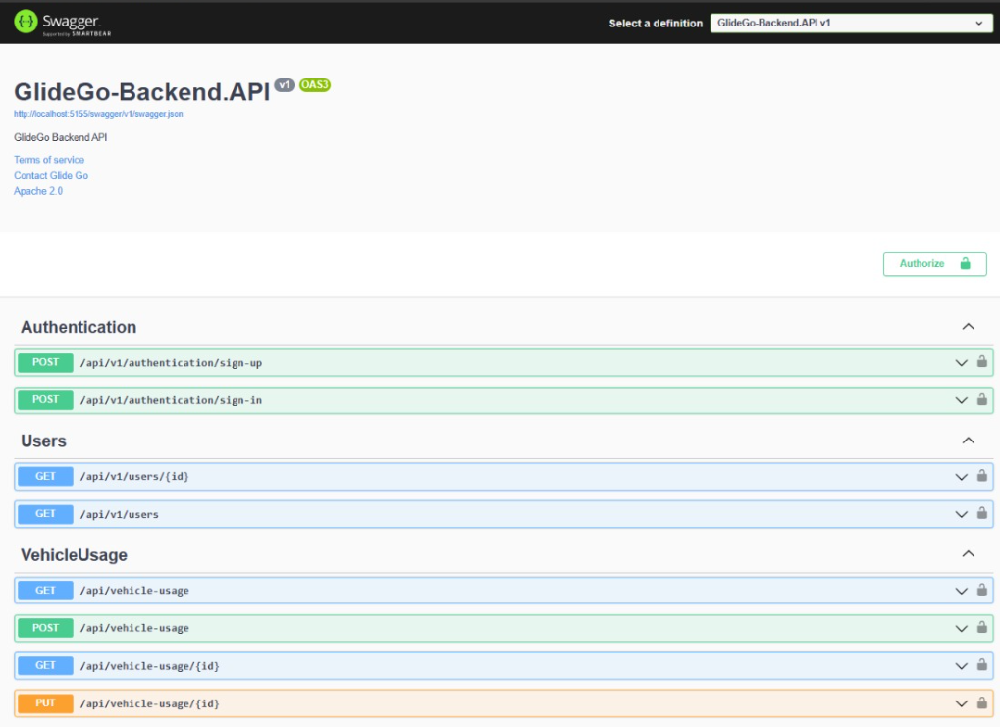

# Capítulo V: Product Implementation, Validation & Deployment.

## 5.1. Software Configuration Management.

**Project Management**

- Google Drive

Plataforma gratuita que te permite almacenar archivos y acceder a ellos desde cualquier lugar utilizando la nube. 

Propósito en el proyecto: El equipo ha utilizado Google Drive como centro de organización principal para llevar un registro de los puntos pendientes realizados y por realizar. También han utilizado la herramienta Trello para establecer hitos y plazos. En cuanto a las consultas y dudas, se han resuelto mediante reuniones grupales por meet.

**Requirements Management**


El trabajo asignado a cada estudiante ha sido revisado y evaluado por todo el equipo Innovatech para asegurar que cumpla con los criterios y para sugerir posibles cambios que eviten errores al presentar el proyecto en la entrega del trabajo. 


**Product UX/UI Design**


- Figma:

Descripción: Un programa de edición gráfica y prototipado. Una plataforma que se utiliza principalmente para el diseño digital de Wireframe y Mock-Up, es decir, para diseñar los interfaces de nuestra aplicación web.
Propósito en el proyecto: Para el diseño del proyecto, nuestro equipo ha utilizado Figma para la creación de los wireframes de alta fidelidad, así como para la elaboración de los prototipos de la aplicación web.

- Lucidchart:
Descripción: Permite que los usuarios creen borradores y compartan diagramas de flujo profesionales, proporcionando diseños para todo, desde procesos de lluvia de ideas hasta administración de proyectos.

Propósito en el proyecto: Para los wireflows, user flows y diagramas de clases.

**Software Development**
- VUE: 
- HTML:
- CSS:
Descripción: Tecnologías que se usó para estructurar nuestra landing page y tambien en nuestra aplicación web, los estándares de desarrollo web, modificando el código existente para solucionar problemas yactualizándolo a las nuevas necesidades de hoy en día.


**Software Deployment**


- GitHub:


Descripción: Permite subir tus repositorios de código para que sean almacenados en la  nube a través del sistema de control de versiones de Git y participar en los avancen de sprint de código en nuestro equipo.
Propósito en el proyecto: Para alojar y desplegar el landing page y frontend, asi como poder visualizar e interactuar con el trabajo presentado. Git para poder realizar el control de versions.

Ruta: <td>https://github.com/</td>


Github: Es la herramienta de control de versiones que permite que alojemos nuestro código en un repositorio, agilizando el trabajo en grupo. Para el desarrollo usaremos el flujo de trabajo Git Flow.
Webstorm: Un entorno de desarrollo que permite trabajar con una variedad de lenguajes de programación. Al igual que otros IDE de JetBrains, hace que el desarrollo sea más fácil y divertido, ayudándole a automatizar tareas repetitivas y gestionar tareas complejas con facilidad.
Structurizr:Es una colección de herramientas que nos permitirá diagramar modelos C4 de nuestros productos de manera colaborativa.

#### 5.1.1. Software Development Environment Configuration.

En este apartado se indicará los nombres de todos los productos de software a utilizar durante el desarrollo del proyecto, así como las rutas de referencia o descarga de estas. 

Para ello, se organizará la información considerando el tipo de actividades realizadas durante el ciclo de vida del proyecto, siendo la estructura de esta forma:

**Project Management**

* **Scrum Framework:** Este es un marco de trabajo para gestionar proyectos enfocados en el desarrollo ágil de productos software. Implementar este framework en nuestro proyecto nos ayudará a coordinar eficientemente el trabajo en equipo. Puedes obtener más información sobre Scrum mediante [este enlace](https://aws.amazon.com/es/what-is/scrum/).

**Requirements Management**

* **Pivotal Tracker:** Esta es una herramienta online que nos permite gestionar fácilmente nuestras historias de usuarios, mediante la creación de Epics. Además, nos permitió desarrollar el Product Backlog asignando puntos de priorización de cada historia de usuario, para que durante el desarrollo de la aplicación, nos enfoquemos primero en las mejor puntuadas y dejar las más sencillas para el final. Puedes utilizar la herramienta Pivotal Tracker mediante [este enlace](https://www.pivotaltracker.com).

**Product UX/UI Design**

* **UXpressia:** Esta es una plataforma digital que nos ofrece plantillas para crear artefactos de nuestros segmentos objetivos como User Personas, Empathy Maps, Impact Maps y Journey Maps. Puedes utilizar las herramientas que ofrece UXpressia mediante [este enlace](https://uxpressia.com).

* **Miro**: Esta es una plataforma digital que ofrece un entorno para realizar trabajos colaborativos, como lluvia de ideas, tablas y diagramas. Se utilizó esta plataforma para diseñar los cuadros As-Is y To-Be Scenary Map de nuestros segmentos objetivos. Para acceder a las herramientas que ofrece Miro [este enlace](https://miro.com/es/).

* **Figma**: Esta es una herramienta online que ofrece el servicio de maquetación y prototipado de Landing pages,  aplicaciones web, móviles y de escritorio. Esto nos permite tener una estimación de cómo debería funcionar nuestro proyecto. Puedes acceder al servicio que ofrece Figma mediante [este enlace](https://www.figma.com).

* **LucidChart:** Esta es una herramienta de diagramación online que nos permite trabajar colaborativamente en tiempo real. La herramienta ofrece plantillas para crear diagramas de flujo, diagramas UML, etc. En nuestro caso, utilizamos esta herramienta para realizar los Wireflow Diagrams y Userflow Diagrams. Puedes utilizar la herramienta LucidChart mediante [este enlace](https://lucid.app/pricing/lucidchart#/pricing/chart)


**Software Development**

* **GitHub:** Esta es una plataforma digital donde se pueden alojar proyectos mediante repositorios, los cuales utilizan un sistema de control de versiones llamado Git. GitHub nos permite trabajar colaborativamente y tener un seguimiento detallado de los avances en el proyecto. Para acceder a nuestro repositorio utiliza [este enlace](https://github.com/Cyber-Savants).

* **Git:** Este es un software de control de versiones el cual se instala localmente y nos permite tener un historial de cambios que se realizan en el proyecto mediante commits. También se utiliza para trabajar colaborativamente en repositorios que se encuentran subidos en GitHub. Para descargar Git utiliza [este enlace](https://git-scm.com).

* **WebStorm:** Este es un entorno de desarrollo, el cual nos permite trabajar con HTML, CSS, Javascript y con frameworks como Vue y Angular. Para obtener WebStorm utiliza [este enlace](https://www.jetbrains.com/es-es/webstorm/).

* **Rider:** Este es un entorno de desarrollo, el cual nos permite trabajar con el lenguaje C# y la plataforma .NET que nos permite crear diferentes tipos de aplicaciones, ya sean móvil, web o de escritorio. En nuestro caso, usaremos ASP .NET para crear un Web Service para nuestro proyecto. Para obtener Rider utiliza [este enlace](https://www.jetbrains.com/es-es/rider/).

**Software Testing**

* **Gherkin:** Este es un lenguaje DSL (Domain Specific Language), que nos permite abordar problemas específicos. Esto lo utilizamos para los criterios de aceptación de las historias de usuario de nuestro proyecto. Puedes conocer más sobre Gherkin mediante [este enlace](https://profile.es/blog/que-es-gherkin/).

**Software Deployment**

* **GitHub Pages:** Este es un servicio que ofrece GitHub para publicar un sitio web a partir de un repositorio, cabe destacar que solo permite alojar sitios web estáticos con archivos HTML, CSS y JavaScript. Puedes aprender a como usar este servicio mediante [este enlace](https://pages.github.com).

**Software Documentation**

* **Markdown:** Este es un lenguaje de marcado ligero, el cual nos permite documentar proyectos. En cuanto a nosotros, utilizamos este lenguaje para redactar el informe de nuestro proyecto y en los archivos README en el repositorio de la organización. Puedes aprender Markdown mediante [este enlace](https://markdown.es/sintaxis-markdown/).

#### 5.1.2. Source Code Management.

En esta sección se detalla qué medios se utilizaron para el seguimiento de las modificaciones, así como la semántica y nomenclatura que se usará para los commits y releases que se implementarán durante el avance del proyecto.

Antes que nada, hay que mencionar que se utilizará GitHub como sistema de control de versiones del informe, landing page, web service y frontend de nuestro proyecto. Para ello se crearon sus respectivos repositorios:

* Url de la organización: [github.com/Innovatech-SV51-202401](https://github.com/Innovatech-SV51-202401)
**GitFlow:**

Git Flow es un modelo de trabajo el cual consta de ramas principales y ramas de apoyo. Decidimos utilizar este modelo ya que nos permite mantener el código de nuestro proyecto limpio y ordenado al dividirlo en ramas, de tal forma que nos facilita trabajar colaborativamente. Además, lo que hace eficiente a GitFlow es que presenta una gran variedad de ramas, las cuales son:

* **Ramas Principales:**
    * **Main:** Esta es la rama principal desde donde se ramifican todas las demás. Además, contiene el código fuente que está listo para producción y cada cambio que se realice en esta se consideraría como una nueva versión del proyecto
    * **Develop:** Esta rama surge a partir de la rama Main y se utiliza para integrar las funcionalidades trabajadas en las ramas posteriores. Aquí se acopla todo el código que está listo para pasar a la rama Main y crear una nueva versión (Release) de nuestro proyecto.

* **Ramas de Apoyo:**

    * **Feature:** Estas son ramas creadas a partir Develop y se crean tantas como funcionalidades presenta nuestro proyecto. Una vez se termina de trabajar en estas ramas, deben fusionarse con la rama Develop para posteriormente ser eliminada. La nomenclatura que se utiliza es la siguiente:

            feature/benefits
            feature/profile
            feature/memberships

    * **Release:** Estas son ramas creadas a partir de Develop y sirven para preparar una nueva versión de nuestro proyecto que está listo para publicar. Cabe destacar que, en caso se requiera agregar nuevas funcionalidades, se tendrá que crear otra rama Release siguiendo las normas del Semantic Versioning 2.0.0, la cual se explicará más adelante.

    * **Hotfix:** Estas ramas son creadas a partir del Main y sirven para corregir rápidamente los errores que se presentan en el código publicado en esa rama (Main). Cabe destacar que una vez corregido el error, las ramas Hotfix deben fusionarse con las ramas Main y Develop.


**Semantic Versioning**

Este es un conjunto de reglas que nos permitirán gestionar correctamente la numeración de versiones de nuestro proyecto, para ello lo implementaremos en las ramas Release siguiendo el formato X.Y.Z (Major, Minor, Patch)

* **Versión de Parche (Z):** Se incrementa solo si se implementan correcciones compatibles con versiones anteriores.

* **Versión Secundaria (Y):** Se incrementa cuando se agregan nuevas funcionalidades que son compatibles con versiones anteriores.

* **Versión Principal (X):** Se incrementa cuando los cambios agregados no son compatibles con las versiones anteriores. Cabe destacar que al incrementar este parámetro, la enumeración de los parámetros Y y Z se inicializan en 0.

        release-1.0.5
        release-2.1.3
        release-2.2.1

**Conventional Commits**

Este es un conjunto de reglas, las cuales deben seguir nuestros commits para crear un historial explícito de los cambios realizados en el proyecto, haciéndolo más sencillo de comprender para el equipo de desarrollo. Los conventional commits siguen la siguiente estructura: 

    <type> [opcional scope]: <description>
    [optional body]
    [optional footer]

* **type:** Dependiendo del cambio que se realicen en el proyecto, los commits pueden ser:
    * **feat:** Cuando se agrega una nueva funcionalidad (feature)
    * **docs:** Cuando se realizan cambios en la documentación del proyecto
    * **fix:** Cuando se corrige un error en el código
    * **chore**: Cuando se realizan cambios que no afectan al código
    * **refactor:** Cuando se realizan cambios es la estructura del código, sin afectar al comportamiento del proyecto
    * **build**: Cuando se realizan cambios en los componentes del proyecto, como dependencias externas.
    * **perf:** Cuando se realizan cambio que mejoran el rendimiento del proyecto
* **scope:** Este es un campo opcional, que nos permite especificar el alcance que tiene el commit.
* **description:** Este es un campo obligatorio, ya que proporciona información breve y concisa de los cambios que se han realizado. Además debe ser escrito en minúsculas y de modo imperativo
* **body:** Este es un campo opcional en el cual se detalla más información sobre el commit, como el motivo del cambio. 
* **footer:** Este es un campo opcion y se utiliza para informar respecto a cambios importantes en el proyecto


#### 5.1.3. Source code Style Guide & Conventions.

**Nomenclatura General**

Para los nombres de variables, objetos, elementos y funciones no se utilizarán mayúsculas en estos nombres, ya que, de acuerdo con W3Schools (sin fecha), puesto que la combinación entre mayúsculas y minúsculas puede dificultar la legibilidad del código.

Ejemplos de nomenclatura estándar, siguiendo las recomendaciones de Google (s.f.):

```
.gallery {}
.video {}
.login {}
```

**Sangría**

Al trabajar con HTML, CSS y/o JavaScript, se aplicará un espaciado de dos espacios antes de cada línea que se encuentre dentro de un bloque. Según W3Schools (sin fecha), no se recomienda el uso de la tecla "Tabulación". 

Ejemplo de nomenclatura estándar de la sangría HTML según W3Schools(s.f):
``` html
<!DOCTYPE html>
<html>
  <head>
    <title>Título</title>
  </head>
  <body>
    <h1>Encabezado</h1>
    <p>Párrafo.</p>
  </body>
</html>
```


Ejemplo de formato estándar de sangría en CSS según W3Schools (s.f):

``` CSS
html {
  background: #fff; /* Fondo blanco */
  color: #404;     /* Color de texto gris */
}
```

Ejemplo de nomenclatura estándar de la sangría en JavaScript según W3School (s.f.):

``` JavaScript
function toCelsius(fahrenheit) {
  return (5 / 9) * (fahrenheit - 32);
}
```

**HTML:**


HTML, acrónimo de HyperText Markup Language en inglés, es un lenguaje de marcado que se utiliza para definir la estructura de una página web. También incluye funcionalidades que permiten controlar el comportamiento de diferentes elementos del contenido de la página, como cambiar el tamaño del texto o aplicar formato cursiva, entre otros. En nuestro proyecto, emplearemos HTML5, y las pautas a seguir para utilizar este lenguaje de la siguiente manera:

* **Declare Document Type**
La declaración del tipo de documento debe realizarse en la primera línea del código. Según Google (s.f.), se prefiere la sintaxis de HTML5 para todos los documentos HTML. Para declararla, simplemente copia lo siguiente:

``` html
<!DOCTYPE html>
```

* **Blank**
Cada vez que comienza un nuevo bloque, lista o tabla de gran longitud, es recomendable dejar una línea en blanco después del elemento anterior para mejorar la legibilidad y la presentación del código, de acuerdo con las pautas de W3Schools (s.f.).
Ejemplo:

``` html
<body>

<h1>Famous Cities</h1>

<h2>Tokyo</h2>
<p>Tokyo is the capital of Japan, the center of the Greater Tokyo Area, and the most populous metropolitan area in the world.</p>

<h2>London</h2>
<p>London is the capital city of England. It is the most populous city in the United Kingdom.</p>

<h2>Paris</h2>
<p>Paris is the capital of France. The Paris area is one of the largest population centers in Europe.</p>

</body>
```

Esta práctica de dejar una línea en blanco mejora la estructura y legibilidad del código HTML.

* **Quote attribute Values**
Para los valores de los atributos, aunque no sea una caractística obligatoria,es común utilizar comillas dobles alrededor de ellos. Según W3Schools (s.f), esto hace el código más legible y es una práctica común entre los desarrolladores. 
Ejemplo:

``` html
<table class="striped">
```

Este enfoque de usar comillas dobles alrededor de los valores de los atributos es ampliamente aceptado y recomendado en la comunidad de desarrollo web.

* **Never Skip the \<title> Element**
El elemento `<title>` permite que las páginas aparezcan en la lista de resultados al realizar búsquedas en un navegador web. Además, este elemento es responsable de proporcionar el nombre de la página cuando se agrega a marcadores o favoritos.
Ejemplo:

``` html
<title>HTML Style Guide and Coding Conventions</title>
```

Este elemento es esencial para mejorar la identificación y accesibilidad de una página web.

* **HTML Line-Wrapping**
A pesar de que  no exista un límite de palabras por línea en un documento HTML, no se recomienda generar líneas de código excesivamente largas. Para la siguiente línea, se deben utilizar al menos cuatro espacios para distinguir elementos secundarios.
Ejemplo según Google (s.f):

``` html
<button mat-icon-button color='primary' class="menu-button"
(click)="openMenu()">
<mat-icon>menu</mat-icon>
</button>
```


**CSS:**

Conocido así por el acrónimo de su nombre en inglés, Cascading Style Sheets, es un lenguaje que se enfoca en definir y mejorar la presentación de un documento basado en HTML. Las pautas a seguir al utilizar CSS son:

* **Shorthand Properties**
Se debe declarar los campos de los elementos en la menor cantidad de líneas posible, según Google (s.f). esto mejora la eficiencia del código y lo hace más legible. Además, se debe evitar agregar unidades después del valor cero.

Ejemplo segpun Google (s.f):

``` css
border-top: 0;
font: 100%/1.6 palatino, georgia, serif;
padding: 0 1em 2em;
```

* **Declaration**
Es importante incluir un espacio entre el nombre del selector del elemento y la llave que inicia el bloque de CSS. Tambien es necesario incluir un espacio entre los dos puntos que siguen del nombre de una propiedad y su valor correspondiente. Como en la mayoría de lenguajes de programación, debe colocarse punto y coma al final de cada declaración en CSS, según Google (s.f), esta práctica contribuye a mantener la coherencia en el código.

Ejemplo según Google (s.f)

``` css
html {
  background: #fff;
  color: #404;
}
```

* **CSS quotation Marks**
No se deben utilizar comillas dobles (`"`) en el código CSS; en su lugar, se permiten y deben emplearse comillas simples (`'`) únicamente para selectores de atributos y valores de propiedades.
Ejemplo conforme a las pautas estándar de Google (sin fecha):

``` css
html {
  font-family: 'open sans', arial, sans-serif;
}
```

Este ejemplo demuestra el uso de comillas simples para encerrar el valor del atributo `font-family` en CSS, lo cual es una práctica común y aceptada.

**JavaScript**

JavaScript es un lenguaje de programación que permite especificar de manera precisa las acciones que debe realizar el navegador web, incluyendo el orden de ejecución de tareas y la frecuencia con la que se deben llevar a cabo. A continuación, se presentan las pautas para el uso de JavaScript en nuestro proyecto:

* **Spaces around operators**
Se debe colocar un espacio alrededor de cada operador matemático y tambien dcomas que se usen en el código JavaScript. 
Ejemplo estándar de W3Schools (s.f):

``` javascript
let x = y + z;
const myArray = ['Volvo', 'Saab', 'Fiat'];
```

El uso consistente de espacios alrededor de operadores y comas mejora la legibilidad del código JavaScript.

* **Simple Statement's End**
Como en el caso de muchos otros lenguajes de programación, se debe terminar una declaración con punto y coma.
Ejemplo estándar según W3Schools (s.f):

``` javascript
const cars = ['Volvo', 'Saab', 'Fiat'];

const person = {
  firstName: "John",
  lastName: "Doe",
  age: 50,
  eyeColor: "blue"
};
```

* **Beginning and End of Function**
Un bloque de función debe incluir una llave al final de la primera línea, de modo que el cierre de la función esté en la última línea, sin necesidad de un punto y coma. Esto mismo se aplica a las estructuras condicionales y los bucles. 
Ejemplo estándar según W3Schools (s.f):

``` javascript
function toCelsius(fahrenheit) {
  return (5 / 9) * (fahrenheit - 32);
}
```

* **Object Rules**
Para la creación de un objeto, al igual que en una función, se comienza con una llave al final de la primera línea, pero en este caso, la llave de cierre debe ir seguida de un punto y coma. Para definir las propiedades del objeto, coloque dos puntos y un espacio para indicar su valor. Si el valor es un string, se debe encerrar entre comillas dobles.
Ejemplo estándar según W3Schools (s.f):

``` javascript
const person = {
  firstName: "John",
  lastName: "Doe",
  age: 50,
  eyeColor: "blue"
};
```

**Gherkin:**

Gherkin es un Lenguaje Específico de Dominio (DSL) que se utiliza para resolver problemas específicos mediante la generación de casos de prueba que validan una característica en diversos escenarios. Gherkin incluye varios elementos, entre los cuales los más conocidos y utilizados son Feature, Scenario, Example, Given, When y Then. A continuación, se presentan las pautas que debemos seguir al utilizar Gherkin en nuestro código:

* **Discernible Given-When-Then Blocks**
Es importante aplicar sangría a los elementos que representan los pasos a seguir en un escenario. En el caso de "And", se debe aplicar una sangría adicional. Siguiendo la recomendación de Keiblinger (2021), este enfoque ayuda a identificar rápidamente las partes que componen un escenario. A continuación, se muestra un ejemplo:

``` gherkin
Scenario: Administrador accedde al catálogo de menús diarios
  Given que el administrador está autenticado en la plataforma de administración
  When el administrador navega a la sección de "Catálogo de Menús" o "Menúes diarios"
    Then el sistema debería mostrar una lista de menús diarios proporcionados por los restaurantes afiliados
      And proporcionar opciones de filtrado y búsqueda para facilitar la selección
      And permitir al administrador ver los detalles de cada menú, como nombre, descripción y precio
```


* **Step with Tables**
Según Keiblinger (2021), cuando sea necesario introducir valores en partes del escenario, se debe emplear una tabla o crear un formulario que refleje esa parte del escenario. Antes de esta representación, se deben colocar dos puntos.
Ejemplo:

``` gherkin
Then se mostrará el mensaje:
  | Mensaje |
  | Se completaron los requisitos adecuadamente |
```

* **Reducing Noise**
Con el propósito de reducir la acumulación de líneas de código excesivas en un escenario, los valores predeterminados deben colocarse en pasos para campos que no están muy relacionados con el escenario. Los valores "estándar" que coloquemos deben ir entre comillas simples. Según Keiblinger (2021), esta operación reduce considerablemente el tamaño del código.
Ejemplo:

``` gherkin
When escribo claramente los requisitos 'dominio en C'
```

* **Scenarios Separator**
Para separar dos escenarios, se debe insertar un salto de línea y, según Keiblinger (2021), de ser posible, agregar una línea de comentario para facilitar la legibilidad de estos. De esta manera, se identifica rápidamente el inicio y el fin de un escenario. 
Ejemplo:

``` gherkin
Scenario: Administrador recibe notificación sobre estado del pedido
Given que el administrador está autenticado en la plataforma de administración
When el estado de un pedido cambia, por ejemplo, de "Pendiente" a "En Preparación" o "Entregado"
  Then el sistema debería enviar una notificación al administrador sobre el cambio de estado del pedido
    And la notificación debería incluir detalles relevantes del pedido, como número de pedido, estado actual, fecha y hora estimada de entrega

# --------------------------

Scenario: Otro escenario
Given que en otro contexto
When ocurre algo diferente
  Then se muestra otro resultado
```

#### 5.1.4. Software Deployment Configuration.
Se utilizaron las siguiente tecnologías para el Landing Page:
HTML: Con este lenguaje de etiquetas, logramos realizar la estructura de la landing page
CSS: Con este lenguaje manejaremos el diseño y la presentación de la landing page
JS: Con este lenguaje de programación añadiremos ciertas funcionalidades a la landing page
Booststrap: Nos apoyaremos del framework para facilitar el desarrollo de landing page
WebStorm: Ide que nos permite la elaboración del landing page


## 5.2. Landing Page, Services & Applications Implementation.


#### 5.2.1. Sprint 1

En este primer sprint, el equipo desarrollo una landing page estatica para la visita de potenciales clientes, para el desarrollo de se utilizaron los lengUajes de HTML, CSS Y JavaScript

Link del Repositorio: https://github.com/Innovatech-SV51-202401/Innovatech-LandingPage

Link de la LandingPage desplegada: https://innovatech-sv51-202401.github.io/Innovatech-LandingPage/


#### 5.2.1.1. Sprint Planning 1.

<table>
	<tbody>
		<tr>
			<td>  Sprint #  </td>
			<td>Sprint 1</td>
		</tr>
		<tr>
			<td colspan="2"><center>Sprint Planning Background</center></td>
		</tr>
		<tr>
			<td>Date</td>
			<td>17 de Abril del 2024</td>
		</tr>
		<tr>
			<td>Time</td>
			<td>10 horas</td>
		</tr>
		<tr>
			<td>Location</td>
			<td>Reunión virtual mediante la plataforma de Meet.</td>
		</tr>
		<tr>
			<td>Prepared By</td>
			<td>Vladimir Jara Benites</td>
		</tr>
		<tr>
        <td>Attendees (to planning meeting)</td>
            <td>
                <ul>
                    <li>Flores Manrique, Sebastian</li>
                    <li>Hurtado Palomino, Francisco</li>
                    <li>Aru Acevedo, Yair</li>
                    <li>Velarde Gonzales, Néstor</li>
                </ul>
            </td>
        </tr>
		<tr>
			<td>Sprint 1 Review Summary</td>
			<td>Primer Sprint desarrollado por el team</td>
		</tr>
		<tr>
			<td>Sprint 1 Retrospective Summary</td>
			<td>Implementación de la Landing Page </td>
		</tr>
		<tr>
			<td colspan="2"><center>Sprint Goal & User Stories</center></td>
		</tr>
		<tr>
			<td>Sprint 1 Goal</td>
			<td>Desarrollar una landing page usando HTML, CSS y ayuda de Bootstarp V5
            </td>
		</tr>
		<tr>
			<td>Sprint 1 Velocity</td>
			<td>10</td>
		</tr>
		<tr>
			<td>Sum of Story Points</td>
			<td>10</td>
		</tr>
	</tbody>
</table>


#### 5.2.1.2. Sprint Backlog 1.

<table>
	<tbody>
		<tr>
			<td>Sprint #</td>
			<td colspan="7">Sprint 1</td>
		</tr>
		<tr>
			<td colspan="2">User Story</td>
			<td colspan="6">Work-Item / Task</td>
		</tr>
		<tr>
			<td>Id</td>
			<td>Title</td>
			<td>Id</td>
			<td>Title</td>
			<td>Description</td>
			<td>Estimation (Hours)</td>
			<td>Assigned To</td>
			<td>Status (To-Do / In-Progress / To-Review / Done)</td>
		</tr>
		<tr>
			<td>US25</td>
			<td>Comunicación con soporte</td>
			<td>TA1</td>
			<td>Comunicación con soporte</td>
			<td>Como cliente quiero comunicarme con alguien de soporte a través del apartado de soporte para solicitar ayuda o presentar algún reclamo.</td>
			<td>1</td>
			<td>Sebastian Flores</td>
			<td>Done</td>
		</tr>
		<tr>
			<td>US26</td>
			<td>Comunicación con soporte</td>
			<td>TA2</td>
			<td>Comunicación con soporte</td>
			<td>Como mecánico quiero comunicarme con alguien de soporte a través del apartado de soporte para solicitar ayuda o presentar algún reclamo.</td>
			<td>1</td>
			<td>Sebastian Flores</td>
			<td>Done</td>
		</tr>
		<tr>
			<td>US27</td>
			<td>Visualizacion de planes</td>
			<td>TA3</td>
			<td>Visualizacion de planes</td>
			<td>Como cliente quiero ver los planes del servicio para elegir uno adecuado.</td>
			<td>2</td>
			<td>Vladimir</td>
			<td>Done</td>
		</tr>
		<tr>
			<td>US28</td>
			<td>Servicio</td>
			<td>TA4</td>
			<td>Servicio</td>
			<td>Como cliente quiero saber los beneficios del servicio para elegir un plan de suscripción.</td>
			<td>2</td>
			<td>Nestor Velarde</td>
			<td>Done</td>
		</tr>
		<tr>
			<td>US29</td>
			<td>Conocer al equipo</td>
			<td>TA5</td>
			<td>Conocer al equipo</td>
			<td>Como cliente quiero informarme sobre el equipo a cargo del proyecto para conocer sus objetivos.</td>
			<td>2</td>
			<td>Francisco Hurtado</td>
			<td>Done</td>
		</tr>
        <tr>
			<td>US30</td>
			<td>Información del producto</td>
			<td>TA6</td>
			<td>Información del producto</td>
			<td>Como cliente quiero ver informacion general sobre el servicio.</td>
			<td>2</td>
			<td>Yair Aru</td>
			<td>Done</td>
		</tr>
        <tr>
			<td>US31</td>
			<td>Ingreso de cuenta</td>
			<td>TA7</td>
			<td>Ingreso de cuenta</td>
			<td>Como cliente quiero ingresar a una cuenta para ver mi suscripción, mi información y la disponibilidad de vehiculos.</td>
			<td>2</td>
			<td>Nestor Velarde</td>
			<td>Done</td>
		</tr>
	</tbody>
</table>

#### 5.2.1.3. Development Evidence for Sprint Review.

<table>
	<tbody>
		<tr>
			<td>Repository</td>
			<td>Branch</td>
			<td>Commit ID</td>
			<td>Commit message</td>
			<td>Commit Message Body</td>
			<td>Commit on (date)</td>
		</tr>
		<tr>
			<td rowspan="9">https://github.com/Innovatech-SV51-202401/Innovatech-LandingPage</td>
			<td>main</td>
			<td>53df2dc4a80008ebed6805398d5a6f3071ef958e</td>
			<td>Initial commit</td>
			<td>-</td>
			<td>29/04/2024</td>
		</tr>
		<tr>
			<td>develop</td>
			<td>1b7c1edf7a1559e90fee86cc945112e20076a3c9</td>
			<td>Merge pull request #9 from Innovatech-SV51-202401/feature/services</td>
			<td>-</td>
			<td>29/04/2024</td>
		</tr>
		<tr>
			<td>feature/about</td>
			<td>c6853a35ff8d8355abff2e0e3d39a605d6ae7461</td>
			<td>feat(about): added about section</td>
			<td>-</td>
			<td>29/04/2024</td>
		</tr>
		<tr>
			<td>feature/contact</td>
			<td>88fcbfef58c3736738fdff51dc584b03c7774bf2</td>
			<td>feat(contact): add contact section.</td>
			<td>-</td>
			<td>29/04/2024</td>
		</tr>
		<tr>
			<td>feature/index</td>
			<td>2339a1ca5588aebdefef0b84c92f9eb604d2a311</td>
			<td>feat(index.html): We add the code of the index section.</td>
			<td>-</td>
			<td>29/04/2024</td>
		</tr>
		<tr>
			<td>feature/login</td>
			<td>53915934db932a460989d10a4b2a3ee0150efb25</td>
			<td>feat: File update login.html</td>
			<td>-</td>
			<td>29/04/2024</td>
		</tr>
		<tr>
			<td>feature/plans</td>
			<td>146d62fd9e0819460b084beff1c70d8c6c0cc030</td>
			<td>feat(landing-page): added plans for landing apge</td>
			<td>-</td>
			<td>29/04/2024</td>
		</tr>
		<tr>
			<td>feature/services</td>
			<td>4441a2a91eff88b056091f3dc8798971859c118f</td>
			<td>feat(services): We add the code from the service section.</td>
			<td>-</td>
			<td>29/04/2024</td>
		</tr>
	</tbody>
</table>

#### 5.2.1.4. Testing Suite Evidence for Sprint Review.

La landing page es un sitio web estatico desplegado en el siguiente enlace: https://innovatech-sv51-202401.github.io/Innovatech-LandingPage/

#### 5.2.1.5. Execution Evidence for Sprint Review.

Despues de realizar el spirnt 1, finalizamos con la creacion de nuestra landing page statica, implementando diversos elementos que podrian llamar la atencion de potenciales usuarios. Asimismo, hemos implementado botones de navegacion para la facil transicion entre secciones.

Seccion de navbar:

Seccion de presentacion:

Seccion de about:

Seccion de planes:

Seccion de footer adicional:

#### 5.2.1.6. Services Documentation Evidence for Sprint Review.

En el primer sprint hemos realizado el diseño de nuestro landing page, desplegado como glide go, donde se presentara nuestra plataforma

| End Point                                                        | Funciones                         |
|------------------------------------------------------------------|-----------------------------------|
| https://innovatech-sv51-202401.github.io/Innovatech-LandingPage/ | Desplegar Landing Page de GlideGo |
#### 5.2.1.7. Software Deployment Evidence for Sprint Review.

Para el desarrollo de nuestra landing page, optamos por trabajar en un repositorio de github y divirlo en ramas para su facil desarrollo. Finalmente elegimos la rama main para desplegar nuestro Laing Page

Link del Repositorio: https://github.com/Innovatech-SV51-202401/Innovatech-LandingPage

#### 5.2.1.8. Team Collaboration Insights during Sprint.

La meta del sprint fue el despliegue de nuestro landing page, para su realizacion hicimos uso de diversas herramientas como Github, HTML, CSS, Javascript y Bootstrap v5. Como evidencia del trabajo se mostraran los commits de los integrantes.


En la siguiente imagen, se muestra el uso de las ramas.


#### 5.2.2. Sprint 2

En este segundo sprint, el equipo desarrollo una version temprana de nuestro FrontEnd para la visita de potenciales clientes, para el desarrollo de se utilizaron las herramientas de Vue, PrimeVue, PrimeFlex, PrimeIcons, Axios e Internationalization.

Link del Repositorio: https://github.com/Innovatech-SV51-202401/innovatech-front-end

#### 5.2.2.1.Sprint Planning 2.

<table>
	<tbody>
		<tr>
			<td>  Sprint #  </td>
			<td>Sprint 2</td>
		</tr>
		<tr>
			<td colspan="2"><center>Sprint Planning Background</center></td>
		</tr>
		<tr>
			<td>Date</td>
			<td>25 de Abril del 2024</td>
		</tr>
		<tr>
			<td>Time</td>
			<td>10 horas</td>
		</tr>
		<tr>
			<td>Location</td>
			<td>Reunión virtual mediante la plataforma de Discord.</td>
		</tr>
		<tr>
			<td>Prepared By</td>
			<td>Vladimir Jara Benites</td>
		</tr>
		<tr>
        <td>Attendees (to planning meeting)</td>
            <td>
                <ul>
                    <li>Flores Manrique, Sebastian</li>
                    <li>Hurtado Palomino, Francisco</li>
                    <li>Aru Acevedo, Yair</li>
                    <li>Velarde Gonzales, Néstor</li>
                </ul>
            </td>
        </tr>
		<tr>
			<td>Sprint 2 Review Summary</td>
			<td>Segundo Sprint desarrollado por el team</td>
		</tr>
		<tr>
			<td>Sprint 2 Retrospective Summary</td>
			<td>Desarrollar una Version temprana del FrontEnd </td>
		</tr>
		<tr>
			<td colspan="2"><center>Sprint Goal & User Stories</center></td>
		</tr>
		<tr>
			<td>Sprint 2 Goal</td>
			<td>Desarrollar una Version temprana del FrontEnd utilizando las herramientas de Vue, PrimeVue, PrimeFlex, PrimeIcons, Axios e Internationalization.
            </td>
		</tr>
		<tr>
			<td>Sprint 2 Velocity</td>
			<td>10</td>
		</tr>
		<tr>
			<td>Sum of Story Points</td>
			<td>10</td>
		</tr>
	</tbody>
</table>

#### 5.2.2.2.Sprint Backlog 2.

<table>
	<tbody>
		<tr>
			<td>Sprint #</td>
			<td colspan="7">Sprint 2</td>
		</tr>
		<tr>
			<td colspan="2">User Story</td>
			<td colspan="6">Work-Item / Task</td>
		</tr>
		<tr>
			<td>Id</td>
			<td>Title</td>
			<td>Id</td>
			<td>Title</td>
			<td>Description</td>
			<td>Estimation (Hours)</td>
			<td>Assigned To</td>
			<td>Status (To-Do / In-Progress / To-Review / Done)</td>
		</tr>
		<tr>
			<td>US01</td>
			<td>Inscripcion de vehiculos</td>
			<td>TA1</td>
			<td>Inscripcion de vehiculos</td>
			<td>Cómo Owner quiero inscribir los vehículos a la aplicación para poder ofrecerlos a potenciales usuarios.</td>
			<td>2</td>
			<td>Vladimir</td>
			<td>To-Review</td>
		</tr>
		<tr>
			<td>US02</td>
			<td>Establecer Tarifas</td>
			<td>TA2</td>
			<td>Establecer Tarifas</td>
			<td>Cómo Owner quiero establecer tarifas y disponibilidad del vehículo para poder gestionar de manera efectiva la rentabilidad y accesibilidad de los vehículos.</td>
			<td>2</td>
			<td>Sebastian</td>
			<td>To-Review</td>
		</tr>
		<tr>
			<td>US08</td>
			<td>Perfil del cliente</td>
			<td>TA3</td>
			<td>Visualizacion del perfil del cliente</td>
			<td>Cómo Owner quiero visualizar el perfil del cliente que hace uso de mi vehículo para conocer a mi cliente</td>
			<td>2</td>
			<td>Servicios</td>
			<td>To-Review</td>
		</tr>
		<tr>
			<td>US10</td>
			<td>Visualizacion del catalogo de vehiculos</td>
			<td>TA4</td>
			<td>Visualizacion del catalogo de vehiculos</td>
			<td>Como cliente quiero visualizar el catálogo de vehículos disponibles según tipo y disponibilidad para seleccionar el mejor ajuste a mis necesidades.</td>
			<td>2</td>
			<td>Francisco</td>
			<td>To-Review</td>
		</tr>
		<tr>
			<td>US11</td>
			<td>Reserva de vehiculo</td>
			<td>TA5</td>
			<td>Reserva de vehiculo</td>
			<td>Como cliente quiero reservar un vehículo para desplazarme por la ciudad.</td>
			<td>2</td>
			<td>Yair</td>
			<td>To-Review</td>
		</tr>
		<tr>
			<td>US16</td>
			<td>Inscripcion de Taller</td>
			<td>TA6</td>
			<td>Inscripcion de Taller</td>
			<td>Cómo mecánico quiero inscribir mi taller a la aplicación, para ofrecer mis servicios.</td>
			<td>2</td>
			<td>Nestor</td>
			<td>To-Review</td>
		</tr>
	</tbody>
</table>


#### 5.2.2.3.Development Evidence for Sprint Review.
<table>
	<tbody>
		<tr>
			<td>Repository</td>
			<td>Branch</td>
			<td>Commit ID</td>
			<td>Commit message</td>
			<td>Commit Message Body</td>
			<td>Commit on (date)</td>
		</tr>
		<tr>
			<td rowspan="9">https://github.com/Innovatech-SV51-202401/innovatech-front-end</td>
			<td>feature/registration-management</td>
			<td>008c9d66f26e1417581e23bab4701f4ca65b4bfe</td>
			<td>feat(registration-management): add workshop card and list.</td>
			<td>-</td>
			<td>29/04/2024</td>
		</tr>
		<tr>
			<td>feature/registration-management</td>
			<td>8b2227fe6607b078f43507878282b86d00ca9636</td>
			<td>feat(registration-management): visualization vehicle componentices</td>
			<td>-</td>
			<td>29/04/2024</td>
		</tr>
		<tr>
			<td>feature/registration-management</td>
			<td>c9049f7622e6179476839d1fd3acf3c317729715</td>
			<td>feat(app): added navbar in app.vue</td>
			<td>-</td>
			<td>29/04/2024</td>
		</tr>
		<tr>
			<td>feature/registration-management</td>
			<td>ad27a20cd9013fb31b91b390b38fe30ad74e00fa</td>
			<td>feat(created-users): added content for main view</td>
			<td>-</td>
			<td>29/04/2024</td>
		</tr>
		<tr>
			<td>feature/registration-management</td>
			<td>c942686d4fe4cf939109f1e4b81347845dee57bd</td>
			<td>feat(registration-management): implemented vehicle visualization.</td>
			<td>-</td>
			<td>29/04/2024</td>
		</tr>
	</tbody>
</table>

#### 5.2.2.4.Testing Suite Evidence for Sprint Review.

Se desarrollo la visualizacion del perfil, home, wallet e historial de reservas para el cada tipo de usuario.

#### 5.2.2.5.Execution Evidence for Sprint Review.

Para este sprint, logramos desplegar una nueva navbar interactiva para el uso del usuario, a continuacion se mostrara lo implementado.


Se desarrollo una ventana de home


Se desarrollo una visualizacion de perfil dependiendo del tipo de usuario


Se desarrollo una seccion de wallet dependiendo del tipo de usuario


Se desarrollo una seccion de historial de reservas dependiendo del tipo de usuario


#### 5.2.2.6.Services Documentation Evidence for Sprint Review.


| End Point                                                        | Funciones                        |
|------------------------------------------------------------------|----------------------------------|
| https://innovatech-sv51-202401.github.io/innovatech-front-end/   | Desplegar el FrontEnd de GlideGo |

#### 5.2.2.7.Software Deployment Evidence for Sprint Review.

Link del respositorio: https://github.com/Innovatech-SV51-202401/innovatech-front-end

Link del Video-About-The-Product: https://drive.google.com/file/d/1al-rBu5sTOb-3kSTQ2HDWBGIJ2dEblbA/view?usp=sharing

#### 5.2.2.8.Team Collaboration Insights during Sprint.

La meta del sprint fue presentar una verison temprana del front end, el equipo utilizo las herramientas de Vue, PrimeVue, PrimeFlex, PrimeIcons y Axios


#### 5.2.3. Sprint 3

#### 5.2.3.1 Sprint Planning 3.

<table>
	<tbody>
		<tr>
			<td>  Sprint #  </td>
			<td>Sprint 3</td>
		</tr>
		<tr>
			<td colspan="2"><center>Sprint Planning Background</center></td>
		</tr>
		<tr>
			<td>Date</td>
			<td>25 de Mayo del 2024</td>
		</tr>
		<tr>
			<td>Time</td>
			<td>10 horas</td>
		</tr>
		<tr>
			<td>Location</td>
			<td>Reunión virtual mediante la plataforma de Discord.</td>
		</tr>
		<tr>
			<td>Prepared By</td>
			<td>Vladimir Jara Benites</td>
		</tr>
		<tr>
        <td>Attendees (to planning meeting)</td>
            <td>
                <ul>
                    <li>Flores Manrique, Sebastian</li>
                    <li>Hurtado Palomino, Francisco</li>
                    <li>Aru Acevedo, Yair</li>
                    <li>Velarde Gonzales, Néstor</li>
                    <li>Berrocal Ramirez, Omar</li>
                </ul>
            </td>
        </tr>
		<tr>
			<td>Sprint 3 Review Summary</td>
			<td>Tercer Sprint desarrollado por el team</td>
		</tr>
		<tr>
			<td>Sprint 3 Retrospective Summary</td>
			<td>Desarrollar una Version temprana del BackEnd </td>
		</tr>
		<tr>
			<td colspan="2"><center>Sprint Goal & User Stories</center></td>
		</tr>
		<tr>
			<td>Sprint 3 Goal</td>
			<td>Desarrollar  el BackEnd utilizando las herramientas brindadas en clase.
            </td>
		</tr>
		<tr>
			<td>Sprint 3 Velocity</td>
			<td>10</td>
		</tr>
		<tr>
			<td>Sum of Story Points</td>
			<td>10</td>
		</tr>
	</tbody>
</table>

#### 5.2.3.2 Sprint Backlog 3.

<table>
	<tbody>
		<tr>
			<td>Sprint #</td>
			<td colspan="7">Sprint 3</td>
		</tr>
		<tr>
			<td colspan="2">User Story</td>
			<td colspan="6">Work-Item / Task</td>
		</tr>
		<tr>
			<td>Id</td>
			<td>Tittle</td>
			<td>Id</td>
			<td>Title</td>
			<td>Description</td>
			<td>Estimation(Hours)</td>
			<td>Assigned To</td>
			<td>Status(To-Do / In-Progress / To-Review / Done)</td>
		</tr>
		<tr>
			<td>US31</td>
			<td>Reserva de vehiculo</td>
			<td>TA1</td>
			<td>Registro vehiculo</td>
			<td>Como desarrollador,quiero permitir que un propietario registre un vehículo a través de una API para que el vehículo esté disponible para ser alquilado por los clientes</td>
			<td>2</td>
			<td>Vladimir</td>
			<td>To-Review</td>
		</tr>
		<tr>
			<td>US32</td>
			<td>Obtener lista de vehiculos disponibles para alquilar</td>
			<td>TA2</td>
			<td>Lista vehiculo</td>
			<td>Como desarrollador,quiero permitir que un cliente obtenga una lista de vehículos registrados a través de una API para que el cliente pueda elegir uno para alquilar</td>
			<td>2</td>
			<td>Omar</td>
			<td>To-Review</td>
		</tr>
		<tr>
			<td>US33</td>
			<td>Obtener historial de servicios de un cliente</td>
			<td>TA3</td>
			<td>Obtener historial de servicios</td>
			<td>Como desarrollador, quiero permitir que un cliente obtenga su historial de servicios a través de una API para que el cliente pueda revisar sus alquileres pasados</td>
			<td>2</td>
			<td>Vladimir, Nestor, Sebastian</td>
			<td>To-Review</td>
		</tr>
		<tr>
			<td>US34</td>
			<td>Obtener tiempo de uso, distancia recorrida y dinero ganado por el propietario</td>
			<td>TA4</td>
			<td>Tiempo de uso</td>
			<td>Como desarrollador, quiero permitir que un propietario obtenga el tiempo de uso, distancia recorrida y dinero ganado a través de una API para que el propietario pueda ver el rendimiento de sus vehículos alquilados</td>
			<td>2</td>
			<td>Vladimir, Nestor, Sebastian</td>
			<td>To-Review</td>
		</tr>
		<tr>
			<td>US35</td>
			<td>Obtener el servicio actual del vehiculo que esta siendo usado</td>
			<td>TA5</td>
			<td>Servicio activo</td>
			<td>Como desarrollador, quiero permitir que un cliente obtenga el servicio actual del vehículo que está utilizando a través de una API para que el cliente pueda ver los detalles del alquiler en curso</td>
			<td>4</td>
			<td>Omar</td>
			<td>To-Review</td>
		</tr>

	</tbody>
</table>

#### 5.2.3.3 Development Evidence for Sprint Review.

| Repository                             | Branch | Commit ID                                | Commit Message                                                                         | Commit Message body | Committed on(date) |
|----------------------------------------|--------|------------------------------------------|----------------------------------------------------------------------------------------|---------------------|--------------------|
| Innovatech-SV51-202401/GlideGo-Backend | main   | a7ada4f7654b99369533f810e5221f2e54d12662 | Merge pull request #3 from Innovatech-SV51-202401/feature/execution-monitor            |                     | 05/06/24           |
| Innovatech-SV51-202401/GlideGo-Backend | main   | 0bdafde0b8c3373bc9816047c0b80ef22cd31be5 | Merge branch 'user-profile-system' into development                                    |                     | 04/06/24           |
| Innovatech-SV51-202401/GlideGo-Backend | main   | 5fe20b8d2677051252100ace1f3635bf61e3fde7 | fix: fix vehicleusage files                                                            |                     | 04/06/24           |
| Innovatech-SV51-202401/GlideGo-Backend | main   | 5a443378483931e3150944ab3170360f31552269 | feat: added vehicleid, distancetousem durationtouse and location in ActiveServices.cs. |                     | 04/06/24           |
| Innovatech-SV51-202401/GlideGo-Backend | main   | af1551c84c2fc65039a878564273699c47c6816e | feat: add base configuration.                                                          |                     | 04/06/24           |
| Innovatech-SV51-202401/GlideGo-Backend | main   | 9ee77642c3d1d355ad316ec79a8c300784a9f824 | feat: configuration of the program.cs and appsettings.json files.                      |                     | 04/06/24           |
| Innovatech-SV51-202401/GlideGo-Backend | main   | 4d4e6616f62a47a110fac13bc4157ccef9935d2a | feat: add vehicle usage functionalities.                                               |                     | 04/06/24           |


#### 5.2.3.4.Testing Suite Evidence for Sprint Review.


| Repository                             | Branch      | Commit ID                                | Commit Message                                                                                 | Committed on(date) |
|----------------------------------------|-------------|------------------------------------------|------------------------------------------------------------------------------------------------|--------------------|
| Innovatech-SV51-202401/GlideGo-Backend | development | 33338b11ff7edc75726ebf687ef8f706b56ef966 | Merge pull request #6 from Innovatech-SV51-202401/feature/identify-access                      | 06/06/24           |
| Innovatech-SV51-202401/GlideGo-Backend | development | 8d0c02f1c01306fe3c70f6d80a59c725c921adb2 | fix: fixing the files.                                                                         | 06/06/24           |
| Innovatech-SV51-202401/GlideGo-Backend | development | 73a3a8e5a4d22029d6bde52c134134a88365560d | feat(iam): added resource and controller.                                                      | 06/06/24           |
| Innovatech-SV51-202401/GlideGo-Backend | development | 5a379b22804ff60f286daf0799502362ff93d329 | feat(iam): added hashing, persistence, pipeline and tokens                                     | 06/06/24           |
| Innovatech-SV51-202401/GlideGo-Backend | development | 96288e0b7c3146d92757ba0d2e1cbdeb46ed9f0d | feat(iam): added command, outbound and query services.                                         | 06/06/24           |
| Innovatech-SV51-202401/GlideGo-Backend | development | 83dd47777403a5d506fba50c943aa01b44122222 | feat(iam): added aggregates, queries, services and commands.                                   | 06/06/24           |
| Innovatech-SV51-202401/GlideGo-Backend | development | c3b4b261d899d13d6da87302f506b6f98fb07d7c | feat: add dependencies.                                                                        | 06/06/24           |
| Innovatech-SV51-202401/GlideGo-Backend | development | 00f8939a8fbf0f733f3b9447bf759d179ed7e221 | Merge pull request #4 from Innovatech-SV51-202401/feature/execution-monitor                    | 06/06/24           |
| Innovatech-SV51-202401/GlideGo-Backend | development | 1ae80f02d8ee61beed579f943c95b04bea8e7217 | fix: fixing the files.                                                                         | 06/06/24           |
| Innovatech-SV51-202401/GlideGo-Backend | development | c9f65d3a25fdacb74c803b196f5ce2af20c112b8 | feat(Execution&Monitor): added active services dto and active services command service.        | 06/06/24           |
| Innovatech-SV51-202401/GlideGo-Backend | development | a7ada4f7654b99369533f810e5221f2e54d12662 | fix: fix vehicle usage id                                                                      | 05/06/24           |
| Innovatech-SV51-202401/GlideGo-Backend | development | 0bdafde0b8c3373bc9816047c0b80ef22cd31be5 | Merge pull request #3 from Innovatech-SV51-202401/feature/execution-monitor                    | 05/06/24           |
| Innovatech-SV51-202401/GlideGo-Backend | development | 5fe20b8d2677051252100ace1f3635bf61e3fde7 | Merge remote-tracking branch 'origin/feature/execution-monitor' into feature/execution-monitor | 05/06/24           |
| Innovatech-SV51-202401/GlideGo-Backend | development | 5a443378483931e3150944ab3170360f31552269 | fix: fix vehicleusage files                                                                    | 05/06/24           |
| Innovatech-SV51-202401/GlideGo-Backend | development | af1551c84c2fc65039a878564273699c47c6816e | feat: added vehicleid, distancetousem durationtouse and location in ActiveServices.cs.         | 05/06/24           |
| Innovatech-SV51-202401/GlideGo-Backend | development | 9ee77642c3d1d355ad316ec79a8c300784a9f824 | feat: add base configuration.                                                                  | 05/06/24           |
| Innovatech-SV51-202401/GlideGo-Backend | development | 69de7abdf1b66f8ee20ed3bfe153377fcf707ced | feat: configuration of the program.cs and appsettings.json files.                              | 05/06/24           |
| Innovatech-SV51-202401/GlideGo-Backend | development | ede1d93495a6036cf2d9b09963a071dbc90e4191 | feat(Profiles): Added base table for profiles                                                  | 05/06/24           |
| Innovatech-SV51-202401/GlideGo-Backend | development | 4d4e6616f62a47a110fac13bc4157ccef9935d2a | feat: add vehicle usage functionalities.                                                       | 05/06/24           |

#### 5.2.3.5.Execution Evidence for Sprint Review.

Para el sprint 3 se ha presentado el back-end y se optó por varias herramientas para su desarrollo:

- *Git*: Se utilizó para el control de versiones del código fuente.
- *GitFlow*: Se utilizó para ver el avance de los integrantes del equipo.
- *GitHub*: Se utilizó para crear el repositorio del back-end, donde se subió el código fuente.
- *Swagger*: Se utilizó para documentar la API RESTful.
- *MySQL*: Se utilizó para la base de datos.

<div style="display:flex;justify-content:center,align-items: center; width:100%">

</div>


#### 5.2.3.6.Services Documentation Evidence for Sprint Review.

Se presentaron problemas al desplegar esta version del backend.

| End Point | Funciones                       |
|-----------|---------------------------------|
| -         | Desplegar el BackEnd de GlideGo |

#### 5.2.3.7.Software Deployment Evidence for Sprint Review.

Link del respositorio: https://github.com/Innovatech-SV51-202401/GlideGo-Backend

Link del Video-About-The-Product: https://drive.google.com/file/d/1JYJvPQa7Vl5Yj8GnTHJ8YdK9NnsJ4NYm/view?usp=sharing


#### 5.2.3.8.Team Collaboration Insights during Sprint.

La meta del sprint fue presentar una verison temprana del Backend, el equipo utilizo las herramientas de C#, .NET, Entity Framework, SQL Server y Swagger


#### 5.2.4. Sprint 4

#### 5.2.4.1 Sprint Planning 4.

<table>
	<tbody>
		<tr>
			<td>  Sprint #  </td>
			<td>Sprint 4</td>
		</tr>
		<tr>
			<td colspan="2"><center>Sprint Planning Background</center></td>
		</tr>
		<tr>
			<td>Date</td>
			<td>22 de Junio del 2024</td>
		</tr>
		<tr>
			<td>Time</td>
			<td>10 horas</td>
		</tr>
		<tr>
			<td>Location</td>
			<td>Reunión virtual mediante la plataforma de Discord.</td>
		</tr>
		<tr>
			<td>Prepared By</td>
			<td>Vladimir Jara Benites</td>
		</tr>
		<tr>
        <td>Attendees (to planning meeting)</td>
            <td>
                <ul>
                    <li>Flores Manrique, Sebastian</li>
                    <li>Velarde Gonzales, Néstor</li>
                    <li>Berrocal Ramirez, Omar</li>
                    <li>Benites Jara, Vladimir</li>
                </ul>
            </td>
        </tr>
		<tr>
			<td>Sprint 4 Review Summary</td>
			<td>Cuarto Sprint desarrollado por el team</td>
		</tr>
		<tr>
			<td>Sprint 4 Retrospective Summary</td>
			<td>Desarrollar y corregir los elementos del Landing Page, FrontEnd y BackEnd </td>
		</tr>
		<tr>
			<td colspan="2"><center>Sprint Goal & User Stories</center></td>
		</tr>
		<tr>
			<td>Sprint 4 Goal</td>
			<td>Se desplegó las versiones finales de los elementos del Landing Page, FrontEnd y BackEnd</td>
		</tr>
		<tr>
			<td>Sprint 4 Velocity</td>
			<td>10</td>
		</tr>
		<tr>
			<td>Sum of Story Points</td>
			<td>10</td>
		</tr>
	</tbody>
</table>

#### 5.2.4.2 Sprint Backlog 4.

<table>
	<tbody>
		<tr>
			<td>Sprint #</td>
			<td colspan="7">Sprint 4</td>
		</tr>
		<tr>
			<td colspan="2">User Story</td>
			<td colspan="6">Work-Item / Task</td>
		</tr>
		<tr>
			<td>Id</td>
			<td>Tittle</td>
			<td>Id</td>
			<td>Title</td>
			<td>Description</td>
			<td>Estimation(Hours)</td>
			<td>Assigned To</td>
			<td>Status(To-Do / In-Progress / To-Review / Done)</td>
		</tr>
		<tr>
			<td>US31</td>
			<td>Reserva de vehiculo</td>
			<td>TA1</td>
			<td>Implementar Endpoint POST - Registar vehículo</td>
			<td>Crear el endpoint POST para la sección de registrar vehículo, donde el owner podrá registrar su vehículo</td>
			<td>6</td>
			<td>Omar Berrocal Ramirez</td>
			<td>Done</td>
		</tr>
		<tr>
			<td>US32</td>
			<td>Obtener lista de vehiculos disponibles para alquilar</td>
			<td>TA2</td>
			<td>Implementar Endpoint GET - Lista de vehículos</td>
			<td>Implementar el endpoint GET para la sección de vehículos, donde el cliente podrá obtener y visualizar la lista de vehículos que ofrecen los propietarios</td>
			<td>4</td>
			<td>Vladimir Jara Benites</td>
			<td>Done</td>
		</tr>
		<tr>
			<td>US33</td>
			<td>Obtener historial de servicios de un cliente</td>
			<td>TA3</td>
			<td>Implementar Endpoint GET - Historial de servicios </td>
			<td>Implementar el endpoint GET para la sección de servicios, donde el cliente podrá obtener y visualizar el historial de servicios de sus alquileres pasados.</td>
			<td>4</td>
			<td>Néstor Velarde Gonzales</td>
			<td>Done</td>
		</tr>
		<tr>
			<td>US34</td>
			<td>Obtener tiempo de uso, distancia recorrida y dinero ganado por el propietario</td>
			<td>TA4</td>
			<td>Tiempo de uso</td>
			<td>Crear el endpoint GET para la sección de vehículos, donde el owner podrá obtener y visualizar el tiempo de uso, distancia recorrido y dinero generado por su vehículo.</td>
			<td>4</td>
			<td>Sebastian Flores Manrique</td>
			<td>To-Review</td>
		</tr>
		<tr>
			<td>US35</td>
			<td>Obtener el servicio actual del vehiculo que esta siendo usado</td>
			<td>TA5</td>
			<td>Servicio activo</td>
			<td>Crear el endpoint GET para la sección de mis servicios, donde el cliente podrá visualizar los detalles de su alquiler</td>
			<td>4</td>
			<td>Sebastian Flores Manrique</td>
			<td>Done</td>
		</tr>

	</tbody>
</table>


#### 5.2.4.3 Development Evidence for Sprint Review.

| Repository                             | Branch | Commit ID                                | Commit Message                                                                         | Commit Message body | Committed on(date) |
|----------------------------------------|--------|------------------------------------------|----------------------------------------------------------------------------------------|---------------------|--------------------|
| Innovatech-SV51-202401/GlideGo-Backend | main   | a7ada4f7654b99369533f810e5221f2e54d12662 | Merge pull request #3 from Innovatech-SV51-202401/feature/execution-monitor            |                     | 05/06/24           |
| Innovatech-SV51-202401/GlideGo-Backend | main   | 0bdafde0b8c3373bc9816047c0b80ef22cd31be5 | Merge branch 'user-profile-system' into development                                    |                     | 04/06/24           |
| Innovatech-SV51-202401/GlideGo-Backend | main   | 5fe20b8d2677051252100ace1f3635bf61e3fde7 | fix: fix vehicleusage files                                                            |                     | 04/06/24           |
| Innovatech-SV51-202401/GlideGo-Backend | main   | 5a443378483931e3150944ab3170360f31552269 | feat: added vehicleid, distancetousem durationtouse and location in ActiveServices.cs. |                     | 04/06/24           |
| Innovatech-SV51-202401/GlideGo-Backend | main   | af1551c84c2fc65039a878564273699c47c6816e | feat: add base configuration.                                                          |                     | 04/06/24           |
| Innovatech-SV51-202401/GlideGo-Backend | main   | 9ee77642c3d1d355ad316ec79a8c300784a9f824 | feat: configuration of the program.cs and appsettings.json files.                      |                     | 04/06/24           |
| Innovatech-SV51-202401/GlideGo-Backend | main   | 4d4e6616f62a47a110fac13bc4157ccef9935d2a | feat: add vehicle usage functionalities.                                               |                     | 04/06/24           |


#### 5.2.4.4.Testing Suite Evidence for Sprint Review.


| Repository                             | Branch      | Commit ID                                | Commit Message                                                                                 | Committed on(date) |
|----------------------------------------|-------------|------------------------------------------|------------------------------------------------------------------------------------------------|--------------------|
| Innovatech-SV51-202401/GlideGo-Backend | development | 33338b11ff7edc75726ebf687ef8f706b56ef966 | Merge pull request #6 from Innovatech-SV51-202401/feature/identify-access                      | 06/06/24           |
| Innovatech-SV51-202401/GlideGo-Backend | development | 8d0c02f1c01306fe3c70f6d80a59c725c921adb2 | fix: fixing the files.                                                                         | 06/06/24           |
| Innovatech-SV51-202401/GlideGo-Backend | development | 73a3a8e5a4d22029d6bde52c134134a88365560d | feat(iam): added resource and controller.                                                      | 06/06/24           |
| Innovatech-SV51-202401/GlideGo-Backend | development | 5a379b22804ff60f286daf0799502362ff93d329 | feat(iam): added hashing, persistence, pipeline and tokens                                     | 06/06/24           |
| Innovatech-SV51-202401/GlideGo-Backend | development | 96288e0b7c3146d92757ba0d2e1cbdeb46ed9f0d | feat(iam): added command, outbound and query services.                                         | 06/06/24           |
| Innovatech-SV51-202401/GlideGo-Backend | development | 83dd47777403a5d506fba50c943aa01b44122222 | feat(iam): added aggregates, queries, services and commands.                                   | 06/06/24           |
| Innovatech-SV51-202401/GlideGo-Backend | development | c3b4b261d899d13d6da87302f506b6f98fb07d7c | feat: add dependencies.                                                                        | 06/06/24           |
| Innovatech-SV51-202401/GlideGo-Backend | development | 00f8939a8fbf0f733f3b9447bf759d179ed7e221 | Merge pull request #4 from Innovatech-SV51-202401/feature/execution-monitor                    | 06/06/24           |
| Innovatech-SV51-202401/GlideGo-Backend | development | 1ae80f02d8ee61beed579f943c95b04bea8e7217 | fix: fixing the files.                                                                         | 06/06/24           |
| Innovatech-SV51-202401/GlideGo-Backend | development | c9f65d3a25fdacb74c803b196f5ce2af20c112b8 | feat(Execution&Monitor): added active services dto and active services command service.        | 06/06/24           |
| Innovatech-SV51-202401/GlideGo-Backend | development | a7ada4f7654b99369533f810e5221f2e54d12662 | fix: fix vehicle usage id                                                                      | 05/06/24           |
| Innovatech-SV51-202401/GlideGo-Backend | development | 0bdafde0b8c3373bc9816047c0b80ef22cd31be5 | Merge pull request #3 from Innovatech-SV51-202401/feature/execution-monitor                    | 05/06/24           |
| Innovatech-SV51-202401/GlideGo-Backend | development | 5fe20b8d2677051252100ace1f3635bf61e3fde7 | Merge remote-tracking branch 'origin/feature/execution-monitor' into feature/execution-monitor | 05/06/24           |
| Innovatech-SV51-202401/GlideGo-Backend | development | 5a443378483931e3150944ab3170360f31552269 | fix: fix vehicleusage files                                                                    | 05/06/24           |
| Innovatech-SV51-202401/GlideGo-Backend | development | af1551c84c2fc65039a878564273699c47c6816e | feat: added vehicleid, distancetousem durationtouse and location in ActiveServices.cs.         | 05/06/24           |
| Innovatech-SV51-202401/GlideGo-Backend | development | 9ee77642c3d1d355ad316ec79a8c300784a9f824 | feat: add base configuration.                                                                  | 05/06/24           |
| Innovatech-SV51-202401/GlideGo-Backend | development | 69de7abdf1b66f8ee20ed3bfe153377fcf707ced | feat: configuration of the program.cs and appsettings.json files.                              | 05/06/24           |
| Innovatech-SV51-202401/GlideGo-Backend | development | ede1d93495a6036cf2d9b09963a071dbc90e4191 | feat(Profiles): Added base table for profiles                                                  | 05/06/24           |
| Innovatech-SV51-202401/GlideGo-Backend | development | 4d4e6616f62a47a110fac13bc4157ccef9935d2a | feat: add vehicle usage functionalities.                                                       | 05/06/24           |


#### 5.2.4.7.Software Deployment Evidence for Sprint Review.

Link del respositorio: https://github.com/Innovatech-SV51-202401/GlideGo-Backend

Link del Video-About-The-Product: https://drive.google.com/file/d/1JYJvPQa7Vl5Yj8GnTHJ8YdK9NnsJ4NYm/view?usp=sharing


#### 5.2.4.8.Team Collaboration Insights during Sprint.

La meta del sprint fue presentar una verison final del Backend, el equipo utilizo las herramientas de C#, .NET, Entity Framework, SQL Server y Swagger


## Conclusiones
Nuestro equipo Innovatech ha identificado un nicho de mercado específico dentro del sector de transporte, centrándose en vehículos menores o ligeros como bicicletas, skateboards, scooters y motos eléctricas. Esta especialización puede ayudarles a diferenciarse y destacar en un mercado cada vez más competitivo y nuestra propuesta está orientada hacia la innovación y la calidad en el transporte.

La misión de Innovatech es transformar la movilidad urbana y recreativa, mientras que su visión es convertirse en líderes en el mercado de movilidad sostenible. Estas declaraciones proporcionan una dirección clara y un propósito definido para nuestra startup, lo que puede ayudar a alinear a los miembros del equipo y a mantener el enfoque en los objetivos a largo plazo. Al centrarse en la movilidad sostenible y ofrecer una amplia gama de opciones de vehículos menores, Innovatech demuestra su compromiso con la sostenibilidad ambiental. Este enfoque puede atraer a consumidores conscientes del medio ambiente y respaldar la imagen de la empresa como una marca responsable.

